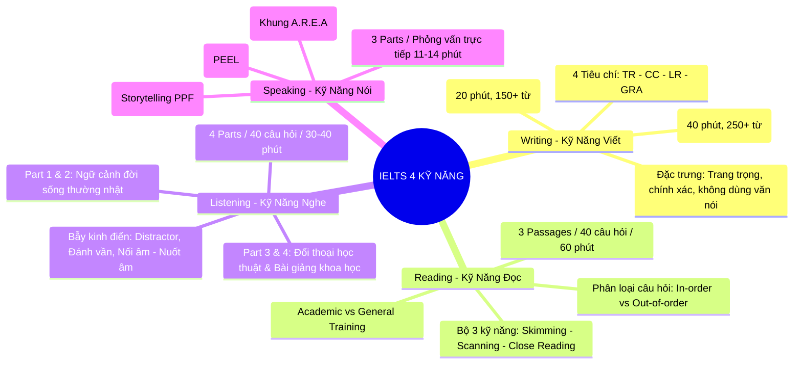

# Bản Đồ Cẩm Nang 4 Kỹ Năng: Writing – Reading – Listening – Speaking

Chào mừng bạn đến với chuyên mục phân chia và định vị cẩm nang lý thuyết toàn diện của **IELTS Master Handbook**. 

Để đạt được mục tiêu chứng chỉ IELTS (từ mốc nền tảng Band 5.0 đến bứt phá xuất sắc Band 7.5 – 8.5+), người học cần có cái nhìn tổng quan, phân định rành mạch phương pháp luận và cách tiếp cận riêng biệt cho từng kỹ năng trong 4 kỹ năng trụ cột: **Writing (Viết)**, **Reading (Đọc)**, **Listening (Nghe)** và **Speaking (Nói)**.

---

## 1. ✍️ IELTS Writing: Tư Duy Logic & Diễn Đạt Học Thuật

IELTS Writing là kỹ năng kiểm tra khả năng lập luận, phân tích số liệu và diễn đạt ngôn ngữ học thuật chuẩn mực trong vòng **60 phút**.

### Cấu trúc bài thi Writing:
* **Writing Task 1 (Chiếm 1/3 tổng điểm - Khuyên làm trong 20 phút):**
  * Yêu cầu viết bài báo cáo tối thiểu **150 từ** mô tả, tóm tắt dữ liệu khách quan từ biểu đồ hoặc quy trình mà **tuyệt đối không đưa ý kiến cá nhân**.
  * **Hệ thống dạng bài:**
    * *Biểu đồ biến động theo thời gian:* [Line Graph](writing/task1-line-graph.md), [Bar Chart](writing/task1-bar-chart.md).
    * *Biểu đồ so sánh tĩnh / Tỷ lệ phần trăm:* [Pie Chart](writing/task1-pie-chart.md), [Table](writing/task1-table.md), [Mixed Chart](writing/task1-mixed.md).
    * *Hình vẽ quy trình & Không gian:* [Process (Chu trình sản xuất & Tự nhiên)](writing/task1-process.md), [Map (Bản đồ thay đổi qua các năm)](writing/task1-map.md), [Floor Plans (Mặt bằng kiến trúc)](writing/writing-task1-floor-plans-processes.md).
    * *Chiến lược cốt lõi:* [Master Chiến Lược Toàn Diện Task 1](writing/task1-mastery.md), [Ngôn ngữ biến động số liệu](writing/writing-task1-data-proportions.md), [Mốc thời gian dự báo tương lai](writing/writing-task1-future-projections.md).

* **Writing Task 2 (Chiếm 2/3 tổng điểm - Khuyên làm trong 40 phút):**
  * Yêu cầu viết bài luận học thuật tối thiểu **250 từ** phản hồi lại một quan điểm hoặc vấn đề xã hội.
  * **5 Dạng đề kinh điển:**
    * [Opinion (Agree or Disagree)](writing/task2-opinion.md): Khẳng định lập trường rõ ràng xuyên suốt bài.
    * [Discuss Both Views](writing/task2-discussion.md): Phân tích công bằng 2 góc nhìn trước khi đưa ra quan điểm cá nhân.
    * [Advantages and Disadvantages](writing/task2-advantages-disadvantages.md): Cân đo lợi ích và tác hại (Outweigh).
    * [Problem and Solution](writing/task2-problem-solution.md): Phân tích nguyên nhân và đề xuất giải pháp khả thi.
    * [Two-Part Question](writing/task2-two-part.md): Trả lời trực diện cả 2 câu hỏi trong đề bài.
  * **Kỹ thuật phát triển ý & Ngữ pháp nâng cao:**
    * [Cấu trúc đoạn văn chuẩn PEEL](writing/task2-peel-structure.md) (Point - Explanation - Example - Link).
    * [Công thức Paraphrase Mở bài & Thesis Statement](writing/writing-paraphrase-thesis-intro.md).
    * [Academic Hedging & Ngôn ngữ cẩn trọng 8.0+](writing/academic-hedging.md).
    * [Đoạn Phản biện & Bác bỏ (Counter-argument & Refutation)](writing/writing-counter-argument-refutation.md).
    * [Khung tìm ý tưởng PESTLE](writing/writing-ideation-pestle.md) & [Nghệ thuật liên kết ẩn Cohesion](writing/writing-cc-thematic-progression.md).

* **Lộ trình học Writing:**
  * [Chặng 1: Nền tảng Band 4.0 – 5.0 (Xóa mất gốc)](writing/foundation-band4-to-5-survival-guide.md)
  * [Chặng 2: Nâng band 5.5 – 6.0 & Khắc phục lỗi chí mạng](writing/band-55-foundation-guide.md)
  * [Chặng 3: Bứt phá chuyên sâu Band 7.0 – 8.5+](writing/band-7plus-secrets.md)

---

## 2. 📖 IELTS Reading: Chiến Lược Quản Lý Thời Gian & Bẻ Khóa Dạng Bài

IELTS Reading kiểm tra khả năng đọc hiểu nhanh, phân tích ngữ nghĩa, bắt từ khóa paraphrase và suy luận logic qua **40 câu hỏi** trong **60 phút**.

### Cấu trúc bài thi Reading:
* **Passage 1 (Câu 1 – 13):** Sự kiện thực tế, tiểu sử, mô tả lịch sử đời thường (Dễ nhất).
* **Passage 2 (Câu 14 – 26):** Khảo cứu khoa học, giải pháp công nghệ, quy trình tự nhiên (Trung bình).
* **Passage 3 (Câu 27 – 40):** Luận điểm triết học, tâm lý học, tranh biện trừu tượng (Khó nhất).

### Hệ thống lý thuyết & Kỹ năng cốt lõi:
* **Nền tảng & Kỹ năng cốt lõi:**
  * [Tổng quan đề thi Reading: Academic vs General Training & Bảng quy đổi điểm](reading/reading-overview-academic-vs-general-conversion.md).
  * [Bộ ba kỹ năng cốt lõi: Skimming – Scanning – Close Reading](reading/reading-core-skills-skimming-scanning-close-reading.md).
  * [Phân loại từ khóa: Keywords Loại 1 (Định vị) vs Loại 2 (Đối chiếu nghĩa)](reading/reading-keyword-classification-locating-micro.md).
  * [Chiến thuật Reading Band 4.5 – 5.0: Ăn chắc Passage 1](reading/foundation-reading-band4-to-5-strategy.md).
  * [Bộ quy tắc Paraphrasing kinh điển](reading/reading-academic-paraphrasing.md).

* **Làm chủ 8 dạng câu hỏi thực chiến:**
  * [True / False / Not Given & Yes / No / Not Given](reading/true-false-not-given.md) & [Chiến lược chuyên sâu TFNG chuẩn Cam](reading/reading-tfng-strategy.md).
  * [Điền từ: Summary, Note, Table & Flow-chart](reading/reading-completion-forms.md) & [Summary có khung từ chọn sẵn](reading/reading-summary-box-options.md).
  * [Tuyệt chiêu Matching Headings (Nối tiêu đề đoạn văn)](reading/matching-headings.md).
  * [Matching Names / Researchers & Theories (Nối tên học giả)](reading/reading-matching-names-researchers.md).
  * [Chiến thuật Multiple Choice (Đơn và đa lựa chọn)](reading/reading-multiple-choice.md).
  * [Matching Information & Matching Features](reading/reading-matching-info-features.md).
  * [Short-Answer Questions (Câu hỏi trả lời ngắn)](reading/reading-short-answer-questions.md).
  * [Diagram & Flow-Chart Labelling](reading/reading-diagram-flowchart.md).

* **Chiến thuật phòng thi & Nâng cao:**
  * [Chiến lược thứ tự làm bài (In-order vs Out-of-order) & 6 Lưu ý sống còn](reading/reading-order-strategy-and-golden-rules.md).
  * [Quản trị thời gian 15 – 20 – 25 phút](reading/time-management.md) & [Quy tắc 90 giây buông bỏ câu hỏi khó](reading/reading-strategic-time-management.md).
  * [Cấp cứu 5 phút cuối: Đoán mò có căn cứ khoa học](reading/reading-last-5-minutes-rescue.md).
  * [Kỹ thuật đọc phân cụm nghĩa Chunking (300+ từ/phút)](reading/reading-chunking-speed.md).
  * [Kỹ thuật Highlight & Split-screen thi máy CDI](reading/computer-delivered-reading-techniques.md).

---

## 3. 🎧 IELTS Listening: Phản Xạ Âm Học & Bẫy Chuyển Ý

IELTS Listening kiểm tra năng lực nhận diện âm học, bắt thông tin chi tiết và theo dõi bài giảng học thuật qua **4 phần thi (Parts)** với độ khó tăng dần.

### Cấu trúc bài thi Listening:
* **Part 1:** Cuộc hội thoại đời thường giữa 2 người (đặt phòng khách sạn, đăng ký khóa học, thuê nhà). Trọng tâm: Tên riêng, con số, ngày tháng, mã bưu điện.
* **Part 2:** Độc thoại ngữ cảnh xã hội (hướng dẫn viên du lịch, ban quản lý giới thiệu công viên). Trọng tâm: Bản đồ (Map Labelling), sơ đồ phương hướng.
* **Part 3:** Thảo luận học thuật giữa 2 – 4 sinh viên và giảng viên về đề tài nghiên cứu. Trọng tâm: Trắc nghiệm Multiple Choice, bẫy đổi ý và đối kháng ngầm.
* **Part 4:** Bài giảng đại học của một giáo sư chuyên ngành (Monologue). Trọng tâm: Nghe liên tục không ngừng nghỉ, bắt từ điền vào Notes Completion.

### Hệ thống lý thuyết & Chiến thuật:
* **Chặng 1: Nền tảng âm học & Xóa bẫy cơ bản (Band 4.0 – 5.0):**
  * [Luyện Listening Band 4.0 – 5.0: Ăn trọn điểm Part 1 & Bẫy chữ cái](listening/foundation-listening-band4-to-5-part1-mastery.md).
  * [Part 1: Bẫy đánh vần tên riêng, con số & mã bưu chính](listening/listening-part1-spelling-numbers.md).
  * [Chính tả, Con số & Đơn vị đo lường quốc tế](listening/spelling-and-units.md) & [Bẫy tiền tệ](listening/listening-units-currency-traps.md).
  * [Top từ sát thủ dễ sai chính tả (Spelling Demons)](listening/listening-spelling-demons-100.md).
  * [Phương pháp Chép chính tả (Dictation) & Nhại giọng (Shadowing)](listening/listening-dictation-shadowing-method.md).

* **Chặng 2: Làm chủ 4 phần thi & Bẫy kinh điển (Band 5.5 – 6.5):**
  * [Bẫy Distractor & Đổi ý trong Listening](listening/distractor-traps.md).
  * [Bản đồ Map Labelling & Tín hiệu chuyển ý Signposting](listening/map-and-signposting.md) & [Định hướng không gian](listening/listening-part2-map-directions.md).
  * [Chiến thuật đoán đuôi danh từ số nhiều (-s)](listening/listening-plural-s-grammar-rule.md).
  * [Quy trình 30 giây đọc trước đề thi chuẩn](listening/listening-pre-prediction-protocol.md).
  * [Cẩm nang nhận diện các giọng Accent (Anh, Úc, Mỹ, Canada, New Zealand)](listening/listening-accents-guide.md).

* **Chặng 3: Bẻ khóa đối thoại & Bài giảng học thuật (Band 7.0 – 9.0):**
  * [Part 3: Trắc nghiệm học thuật & Bẫy đối kháng](listening/listening-part3-academic-discussion.md).
  * [Part 3: Nhận diện cảm xúc, thái độ ngầm & mỉa mai](listening/listening-part3-tone-attitude-sarcasm.md).
  * [Bẻ khóa bẫy Đồng thuận ảo & Đối kháng ngầm Part 3](listening/cambridge-part3-consensus-traps.md).
  * [Part 4: Bắt tín hiệu chuyển ý bài giảng học thuật](listening/listening-part4-lecture-signposting.md).
  * [Cẩm nang âm học: Nối âm, Nuốt âm & Giảm âm](listening/listening-connected-speech-phonetics.md).
  * [Bí kíp thi máy CD-IELTS: Phím tắt & Phục hồi khi lạc trôi](listening/listening-cd-ielts-hacks-and-focus.md).

---

## 4. 🗣️ IELTS Speaking: Phản Xạ Tự Nhiên & Tư Duy Phản Biện

IELTS Speaking là cuộc phỏng vấn trực tiếp 1-1 với giám khảo bản xứ trong **11 – 14 phút**, đánh giá năng lực giao tiếp, độ lưu loát, ngữ âm và tư duy phản biện.

### 4 Tiêu chí chấm điểm Speaking chính thức:
1. **Fluency and Coherence (FC - Độ lưu loát & Mạch lạc):** Tốc độ nói đều đặn, không ngắc ngứ kéo dài, phát triển ý có logic.
2. **Lexical Resource (LR - Vốn từ vựng):** Dùng từ đa dạng, chính xác ngữ cảnh, kết hợp Collocations C1/C2 và Idioms tự nhiên.
3. **Grammatical Range and Accuracy (GRA - Ngữ pháp):** Phối hợp câu đơn, câu ghép, câu phức, mệnh đề quan hệ và đảo ngữ chính xác.
4. **Pronunciation (PR - Phát âm):** Phát âm chuẩn từng âm tiết, nối âm tự nhiên, ngữ điệu (Intonation) và trọng âm câu (Sentence Stress).

### Cấu trúc 3 Parts & Chiến thuật làm chủ:
* **Part 1 (4 – 5 phút): Phản xạ các chủ đề đời thường quen thuộc:**
  * [Xóa nỗi sợ nói & Khung phản xạ 2 câu cho người mới bắt đầu](speaking/foundation-speaking-band4-to-5-fluency.md).
  * [Khung A.R.E.A trả lời tự nhiên Part 1](speaking/area-framework-part1.md) (Answer - Reason - Example - Alternative).
  * [Cẩm nang 10 chủ đề Part 1 kinh điển & Bộ Collocations tự nhiên](speaking/speaking-part1-top-topics-and-collocations.md).
  * [Khắc phục lỗi nuốt âm đuôi, sai trọng âm & ngữ điệu đều đều](speaking/speaking-pronunciation-intonation.md).

* **Part 2 (3 – 4 phút): Thuyết trình độc thoại 2 phút về trải nghiệm cá nhân:**
  * [Khung Kể Chuyện STAR (Situation – Task – Action – Result) Làm Chủ 2 Phút](speaking/speaking-part2-star-storytelling-method.md).
  * [Kỹ thuật Storytelling Dòng Thời Gian PPF (Past – Present – Future)](speaking/storytelling-part2.md).
  * [Tuyệt chiêu căn chuẩn nhịp độ 2 phút (Pacing)](speaking/speaking-part2-pacing-timing.md).
  * [5 Câu chuyện mẫu vạn năng ứng dụng cho mọi chủ đề Part 2](speaking/speaking-5-universal-archetypes.md).
  * [Giữ giọng tự nhiên & Né bẫy học thuộc lòng (Memorization Trap)](speaking/speaking-avoiding-memorization-trap.md).

* **Part 3 (4 – 5 phút): Thảo luận chiều sâu & Phản biện xã hội:**
  * [Tư duy phản biện & Ma trận PEEL trong Part 3](speaking/critical-thinking-part3.md).
  * [Kỹ thuật chuyển dịch từ cá nhân sang vĩ mô Micro-to-Macro Shift](speaking/speaking-part3-micro-to-macro-social-expansion.md).
  * [Ma trận khung trả lời so sánh đa chiều Part 3](speaking/speaking-part3-comparison-frameworks.md) (So sánh Quá khứ vs Tương lai, Nhóm tuổi, Giới tính).
  * [Bộ Phrasal Verbs & Cụm từ tự nhiên C1/C2 thay thế Idioms sáo rỗng](speaking/speaking-natural-phrasal-verbs-collocations.md).
  * [Cờ đỏ phòng thi & 30 Collocations C1/C2 học thuật](speaking/examiner-red-flags-and-c1-collocations.md).
  * [Top 35+ Thành ngữ Idiomatic tự nhiên Band 8.0+](speaking/speaking-idiomatic-lexicon-c1-c2.md).

* **Kỹ năng ứng phó phòng thi:**
  * [50 Natural Fillers & Kỹ thuật câu giờ tự nhiên khi bí ý](speaking/natural-fillers.md).
  * [Mẹo câu giờ & Xử lý tình huống khẩn cấp phòng thi](speaking/speaking-emergency-buying-time.md).
  * [Tâm lý phòng thi & Chiến thuật khi bị giám khảo ngắt lời](speaking/speaking-examiner-interruption.md).

---

## 5. Bảng Ma Trận Tương Tác Giữa 4 Kỹ Năng (Cross-Skill Synergies)

Học IELTS thông minh là **học 1 mà áp dụng cho cả 4 kỹ năng**:

| Kỹ Năng Đóng Góp (Input) | Áp Dụng Sang Kỹ Năng Đầu Ra (Output) | Cách Thực Hiện Thực Tế |
| :--- | :--- | :--- |
| **Reading ➡️ Writing Task 2** | Từ vựng học thuật & Cấu trúc câu phản biện | Trích xuất các cụm Collocations và cấu trúc nhượng bộ (*While it is true that...*) từ Reading Passage 3 để viết thân bài Task 2. |
| **Reading ➡️ Writing Task 1** | Ngôn ngữ mô tả số liệu & xu hướng | Học các cụm từ mô tả sự biến động (*surpass, plummet, plateau*) từ các bài đọc khoa học để miêu tả biểu đồ Task 1. |
| **Listening ➡️ Speaking** | Ngữ điệu, Nối âm & Tín hiệu chuyển ý | Luyện nhại giọng (Shadowing) theo lời thoại người bản xứ trong Listening Part 3 để có ngữ điệu tự nhiên trong Speaking Part 3. |
| **Writing Task 2 ➡️ Speaking Part 3** | Khung tư duy phản biện PEEL | Sử dụng trực tiếp cấu trúc triển khai luận điểm 4 bước PEEL của Writing Task 2 để trả lời trôi chảy các câu hỏi trừu tượng trong Speaking Part 3. |

---

> [!TIP]
> **Khám phá chi tiết từng bài học:**
> Chọn trực tiếp kỹ năng bạn muốn nâng band từ menu bên trái của GitBook hoặc bắt đầu với [Mục Lục Tổng Hợp Toàn Thư](../docs/SUMMARY.md).
