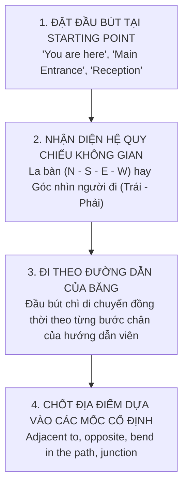

# Bản Đồ Map Labelling & Tín Hiệu Chuyển Ý Signposting Trong Listening

Dạng bài **Bản đồ (Map & Plan Labelling)** trong **Part 2** và bài giảng học thuật liên tục với **Tín hiệu chuyển ý (Signposting Language)** trong **Part 4** là hai "nút thắt cổ chai" khiến rất nhiều thí sinh bị mất phương hướng và rơi vào tình trạng "lạc trôi" (lost in the audio).

Hiểu rõ ngôn ngữ định vị không gian và hệ thống biển chỉ đường bằng lời nói (Signposts) sẽ giúp bạn theo sát mạch băng và bắt trọn từng câu trả lời.

---

## 1. Chiến Thuật Bẻ Khóa Map & Plan Labelling (Part 2)

### Bước 1: Khóa chặt điểm xuất phát (The Starting Point)
Trước khi đoạn audio phát, trong 30 giây chuẩn bị, việc quan trọng nhất là dùng mắt tìm ngay:
* Biểu tượng dấu nhân kèm dòng chữ: `You are here`.
* Các lối vào chính: `Main Entrance`, `Reception Desk`, `Ticket Office`, `Car Park`.
* **Hành động sống còn:** Đặt ngay **đầu ngòi bút chì** lên điểm xuất phát đó trên tờ đề thi! Khi người nói bắt đầu bước đi, đầu bút chì của bạn phải di chuyển theo lộ trình mà họ miêu tả.

### Bước 2: Phân loại hệ quy chiếu không gian
1. **Bản đồ có biểu tượng La bàn (Compass Rose) mũi tên 4 hướng:**
   * Người nói chắc chắn sẽ dùng hệ quy chiếu địa lý: *North (Bắc), South (Nam), East (Đông), West (Tây), North-East (Đông Bắc), South-West (Tây Nam)*.
   * *Ví dụ:* *"The souvenir shop is located in the northern corner of the compound, just to the east of the duck pond."*
2. **Bản đồ KHÔNG có la bàn (Góc nhìn của người đang bước đi):**
   * Người nói sẽ điều hướng theo cơ thể của bạn: *Turn left (Rẽ trái), Take the right-hand path (Đi theo lối bên phải), On your immediate left (Ngay bên tay trái của bạn)*.

### Bộ từ vựng không gian cốt lõi cần thuộc lòng:
* **Giao lộ / Điểm rẽ:**
  * `Junction / Intersection`: Ngã ba, ngã tư đường.
  * `Fork in the road`: Chỗ đường chia làm hai nhánh hình chữ Y.
  * `Bend in the path / Sharp turn`: Khúc cua ngoằn ngoèo, chỗ rẽ gấp khúc.
  * `Roundabout`: Vòng xuyến, bùng binh giao thông.
* **Vị trí tương đối:**
  * `Directly opposite`: Nằm đối diện trực tiếp qua bên kia đường.
  * `Adjacent to / Next to / Flanked by`: Nằm ngay sát vách, liền kề.
  * `In the far corner / At the dead end`: Ở góc xa nhất / Nằm ở cuối đường cụt.
  * `Within walking distance`: Trong khoảng cách đi bộ rất gần.

---

## 2. Bắt Trọn Bài Giảng Học Thuật Bằng Tín Hiệu Chuyển Ý (Part 4)

Trong **Part 4**, một giáo sư sẽ thuyết giảng liên tục trong 5 – 6 phút về một đề tài khoa học hoặc lịch sử mà **hoàn toàn không có quãng nghỉ 30 giây ở giữa bài**. 

Rất nhiều thí sinh khi mải loay hoay tìm đáp án cho một câu hỏi khó đã bị lỡ mất nhịp và không biết người nói đã chuyển sang câu nào. Để không bị "lạc trôi", bạn phải dựa vào **Ngôn ngữ biển báo (Signposting Language)**:

| Tín Hiệu Chuyển Ý (Signposts) | Người Nói Sắp Trình Bày Điều Gì? | Tín Hiệu Âm Thanh Điển Hình Trong Băng |
| :--- | :--- | :--- |
| **Bắt đầu một luận điểm mới** | Người nói chuyển sang đề mục / đoạn tiếp theo trên bài thi | *"Now, let’s turn our attention to...", "Moving on to the secondary factor..."* |
| **Đưa ra ví dụ minh họa** | Chuẩn bị nhắc đến tên riêng, số liệu để chứng minh | *"To illustrate this phenomenon...", "Take the case of...", "For instance..."* |
| **Báo hiệu sự tương phản / Bất ngờ** | **Bẫy đổi ý hoặc phát hiện quan trọng!** | *"However, contrary to traditional beliefs...", "What surprised researchers was..."* |
| **Nhấn mạnh bản chất cốt lõi** | **Câu trả lời cho chỗ trống nằm ở đây!** | *"The key takeaway here is...", "What is crucial to understand is that..."* |
| **Quy trình theo trình tự thời gian** | Thứ tự các bước thí nghiệm hoặc dòng lịch sử | *"Initially...", "The subsequent phase involved...", "Following this..."* |
| **Tổng kết & Kết luận** | Báo hiệu sắp kết thúc bài giảng | *"To sum up...", "Ultimately, the research demonstrated that..."* |

---

## 3. Trích Đoạn Phân Tích Thực Chiến (Audio Transcript vs Question)

> **Câu hỏi trong đề thi:**  
> *The ancient temple was primarily built to honour the _________ of the local kingdom.*

### Băng audio thực tế (Transcript):
> *"Now, moving on to the architectural layout of the sanctuary... Historians previously assumed that the complex served as a military fortification. However, recent archaeological excavations have revealed something quite different. The central chamber was erected not for defense, but to celebrate the **ancestors** of the royal dynasty..."*

### Phân tích cách bắt tín hiệu:
1. **Bắt biển báo chuyển đoạn:** *"Now, moving on to the architectural layout..."* ➡️ Báo hiệu chuẩn bị đến câu hỏi về ngôi đền cổ.
2. **Loại bỏ bẫy giả định ban đầu:** *"Historians previously assumed that... served as a military fortification"* ➡️ Đây là quan điểm cũ trong quá khứ, không phải mục đích thực sự!
3. **Bắt tín hiệu tương phản & Khóa đáp án:** *"However, recent excavations revealed... not for defense, but to celebrate the ancestors..."*  
   * `built to honour` được paraphrase từ `erected to celebrate`.
   * Đối tượng được tôn vinh: **ancestors** (tổ tiên).
   * ➡️ Điền chính xác: `ancestors` (có đuôi số nhiều `-s`).

---

## 4. Checklist Thực Hành Phòng Thi

> [!TIP]
> 1. **Đối với Map Labelling:** Luôn luôn di chuyển đầu ngòi bút chì theo lộ trình người nói miêu tả, không được để ngòi bút rời khỏi mặt giấy!
> 2. **Đối với Part 4:** Khi bị lỡ mất 1 câu, **bỏ qua ngay lập tức**! Nhìn ngay xuống từ khóa của câu tiếp theo và lắng nghe các tín hiệu chuyển ý (*Now, Moving on to*) để bắt lại nhịp bài giảng.

---

| ← Bài trước | Mục Lục | Bài tiếp theo → |
| :--- | :---: | ---: |
| [8. Bẫy Distractor & Đổi Ý Trong Listening](distractor-traps.md) | [Mục Lục Cẩm Nang](../README.md) | [10. Part 2: Định hướng không gian & Bản đồ](listening-part2-map-directions.md) |
