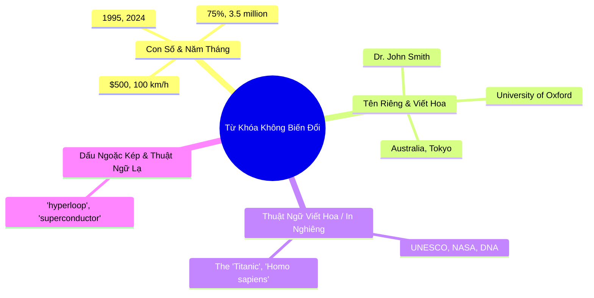

# 📖 Chiến Thuật Reading Đạt Band 4.5 – 5.0: "Ăn Chắc" Passage 1 & Kỹ Thuật Dò Tìm Từ Khóa

Rất nhiều bạn ở trình độ **Band 4.0** khi làm đề Reading cảm thấy choáng ngợp vì bài đọc quá dài (3 bài đọc khoảng 2500 từ) và có hàng trăm từ vựng chuyên ngành y khoa, lịch sử, khảo cổ học mà bạn chưa từng thấy bao giờ.

Sai lầm lớn nhất của thí sinh mức này là **cố gắng đọc hiểu từ đầu đến cuối cả 3 Passage** như đọc báo. Kết quả là làm hết giờ mà mới chỉ làm được một nửa Passage 2, đoán mò toàn bộ Passage 3 và chỉ đúng 10 – 12 câu (tương đương Band 3.5 – 4.0).

Cẩm nang này sẽ chỉ cho bạn chiến lược phân bổ năng lượng thực tế để **đạt chắc chắn Band 5.0 Reading** (tương đương **16 – 19 câu đúng / 40 câu**).

---

## 🎯 1. Bản Đồ Mục Tiêu Điểm Số Band 5.0 Reading

Để đạt được Band 5.0, bạn **không cần làm đúng hết 40 câu**, bạn chỉ cần **đúng tối thiểu 16 câu**:

| Phân Vùng Bài Thi | Số Câu | Mục Tiêu Số Câu Đúng Cho Band 5.0 | Chiến Thuật Năng Lượng |
| :--- | :--- | :--- | :--- |
| **Passage 1** (Dễ nhất - Văn phong đời thường, sự kiện khoa học nhẹ) | 13 câu | **9 – 11 câu đúng** (Ăn trọn điểm ở đây) | Dành **35 phút** làm kỹ từng câu |
| **Passage 2** (Độ khó trung bình) | 13 câu | **5 – 6 câu đúng** (Chỉ làm dạng điền từ và T/F/NG) | Dành **18 phút** |
| **Passage 3** (Rất khó - Triết học, phân tích chuyên sâu) | 14 câu | **2 – 3 câu đúng** (Nhắm các câu điền từ dễ + Lụi đều 1 đáp án cho trắc nghiệm) | Dành **7 phút** cuối |
| **TỔNG CỘNG** | **40 câu** | **16 – 20 CÂU ĐÚNG ➡️ ĐẠT BAND 5.0 VỮNG VÀNG!** | **60 phút** |

---

## 🔍 2. Kỹ Thuật Định Vị "Từ Khóa Không Biến Đổi" (Unchangeable Keywords)

Ở trình độ Band 4.0 - 5.0, vốn từ vựng đồng nghĩa (Paraphrasing) của bạn chưa phong phú. Vì vậy, **tuyệt đối không đi tìm các từ chung chung** như *"important"*, *"increase"*, *"problem"*, vì trong bài đọc chúng sẽ bị đổi thành *"crucial"*, *"surge"*, *"obstacle"*.

Thay vào đó, hãy dùng mắt quét tìm **4 loại từ khóa không thể bị viết khác đi**:

### 💡 Ví dụ thực tế:
> **Câu hỏi trong đề:** *In **1992**, researcher **Thomas Green** discovered a rare species of frog in **Madagascar**.*
> 
> 👉 **Cách làm của bạn:**
> 1. Đừng dịch nghĩa câu! Mắt chỉ lướt tìm con số `1992`, tên viết hoa `Thomas Green` và địa danh `Madagascar` trong bài đọc.
> 2. Các từ này nổi bật như ngọn đèn trên trang giấy, bạn sẽ tìm thấy vị trí đoạn văn chỉ trong vòng **5 – 10 giây**.
> 3. Đọc 1 câu phía trước và 1 câu chứa từ khóa để tìm đáp án.

---

## 📝 3. Tuyệt Chiêu "Ăn Trọn" Điểm Dạng Điền Từ (Completion)

Dạng bài **Điền từ vào chỗ trống (Notes, Table, Form Completion)** là dạng bài dễ nhất trong IELTS Reading và luôn xuất hiện ở Passage 1.

### Quy trình 3 bước xác định loại từ trước khi đọc:

1. **Bước 1: Đọc kỹ giới hạn từ cho phép (Word Limit):**
   - *NO MORE THAN TWO WORDS AND/OR A NUMBER* ➡️ Điền tối đa 2 từ và/hoặc 1 số.
   - Điền 3 từ là bị gạch sai 0 điểm ngay lập tức dù đúng nghĩa!
2. **Bước 2: Đoán loại từ ngữ pháp vào ô trống:**
   - Đằng trước có `a / an / the` ➡️ Chắc chắn cần một **Danh từ số ít** (ví dụ: *a computer, the engine*).
   - Đằng trước có giới từ chỉ nơi chốn `in / at / on` ➡️ Cần một **Địa danh / Vị trí** (ví dụ: *in London, at school*).
   - Đằng trước có chữ `born in...` ➡️ Cần một **Năm sinh** (ví dụ: *born in 1985*).
   - Đằng sau có danh từ ➡️ Cần một **Tính từ** bổ nghĩa.
3. **Bước 3: Lấy đúng từ nguyên gốc trong bài đọc:**
   - Không được tự ý thay đổi đuôi `-ing` hay `-ed` hay đổi số nhiều/số ít của từ trong bài đọc. Nhấc nguyên vẹn từ đó điền vào đáp án.

---

## 🎲 4. Chiến Thuật "Cứu Hộ" 7 Phút Cuối: Đoán Mò Có Khoa Học Cho Passage 3

Khi đã dành 35 phút cho Passage 1 và 18 phút cho Passage 2, bạn chỉ còn 7 phút cho Passage 3. **Lúc này tuyệt đối không được ngồi đọc bài!**

### Chiến lược ghi thêm 3 - 4 điểm:
- **Đối với dạng câu hỏi Trắc nghiệm Multiple Choice (A, B, C, D):**
  - Hãy chọn **duy nhất 1 chữ cái** cho tất cả các câu chưa kịp làm (ví dụ: chọn toàn bộ **B** hoặc toàn bộ **C**).
  - Xác suất thống kê đảm bảo bạn sẽ đúng ít nhất **25% – 30%** số câu này (ăn thêm 1 – 2 câu đúng).
  - Tuyệt đối không chọn zíc-zắc (A rồi B rồi D rồi C) vì xác suất trật lất 100% là rất cao!
- **Đối với dạng True / False / Not Given:**
  - Nếu câu hỏi chứa các từ tuyệt đối hóa như: `always`, `never`, `all`, `only`, `completely` ➡️ Khả năng rất cao là **FALSE**.
  - Nếu câu hỏi nói về một giả định tương lai hoặc cảm xúc mà bài đọc không đề cập ➡️ Chọn **NOT GIVEN**.
