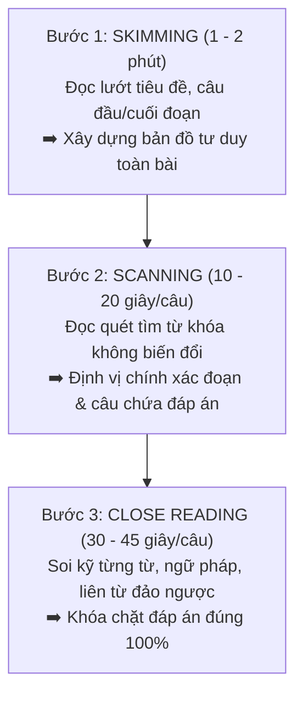
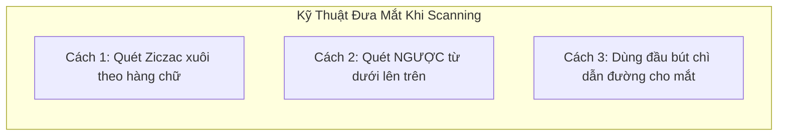

# Bộ Ba Kỹ Năng Cốt Lõi: Skimming – Scanning – Close Reading (Đọc Lướt, Đọc Quét & Đọc Sâu)

Trong bài thi IELTS Reading, bạn phải xử lý gần **3.000 từ vựng học thuật** và trả lời **40 câu hỏi hóc búa** chỉ trong vòng **60 phút**. Nếu bạn đọc theo thói quen thông thường — đọc từng câu từng chữ và cố gắng dịch từng từ sang tiếng Việt — bạn chắc chắn sẽ **cháy giờ ngay từ giữa Passage 2**.

Để làm chủ thời gian và đạt band điểm 7.0+, mọi cao thủ IELTS đều phải phối hợp nhịp nhàng bộ ba kỹ năng: **Skimming** (Đọc lướt lấy đại ý), **Scanning** (Đọc quét định vị thông tin) và **Close Reading** (Đọc sâu phân tích logic).

---

## 1. Kỹ Năng 1: Skimming (Đọc Lướt Lấy Đại Ý)

### Bản chất của Skimming là gì?
Skimming là kỹ thuật **di chuyển mắt cực nhanh** qua văn bản để nắm được bố cục chung, nội dung chính và thông điệp mà tác giả muốn truyền tải mà **không cần đọc hiểu từng từ**. Tốc độ Skimming chuẩn đạt từ **300 – 500 từ/phút** (nhanh gấp 3 – 4 lần tốc độ đọc bình thường).

### Khi nào cần áp dụng Skimming?
1. **Trước khi làm bài (1 – 2 phút đầu):** Đọc lướt tiêu đề chính (**Title**), tiêu đề phụ (**Subtitle** in nghiêng) và các đề mục đoạn văn để nắm bài này nói về chủ đề gì.
2. **Khi làm dạng bài Matching Headings:** Đọc lướt câu đầu (**Topic Sentence**) và câu kết của từng đoạn văn để tóm tắt ý chính của đoạn.
3. **Đọc lướt câu hỏi trước khi quay lại bài đọc:** Giúp não bộ kích hoạt các ngăn nhớ để biết mình sắp đi tìm thông tin gì.

### 4 Nguyên tắc vàng khi Skimming:
- **Nguyên tắc "Nhân tố X" (X-Factor):** Gặp từ mới tuyệt đối không dừng lại, không bận tâm. Hãy xem từ mới đó như một ẩn số $X$ và tiếp tục đọc lướt qua.
- **Tập trung vào Content Words:** Chỉ chú ý vào **Danh từ**, **Động từ chính** và **Tính từ cốt lõi**.
- **Bỏ qua các thành phần phụ trợ (Filler details):**
  1. *Trạng từ chỉ cách thức* (ví dụ: *dramatically, surprisingly, partially*).
  2. *Mệnh đề quan hệ không xác định* nằm giữa 2 dấu phẩy (`..., which was built in 1890, ...`).
  3. *Các ví dụ liệt kê minh họa* đứng sau cụm `for example`, `such as`, `including`.
  4. *Các cụm giới từ giải thích dài dòng*.

### Ví dụ thực hành Skimming:
> **Đoạn văn gốc:**
> *"By asking people about their experiences of boredom, Thomas Goetz and his team at the University of Konstanz in Germany have recently identified five distinct types: indifferent, calibrating, searching, reactant and apathetic."*
> 
> 👉 **Kỹ thuật Skimming lọc bỏ thông tin thừa:**
> - Bỏ cụm giới từ mở đầu: ~~By asking people about their experiences of boredom~~
> - Bỏ cụm địa danh bổ trợ: ~~at the University of Konstanz in Germany~~
> - Bỏ danh sách ví dụ liệt kê dài dòng: ~~indifferent, calibrating, searching, reactant and apathetic~~
> 
> 🎯 **Nội dung cốt lõi đọng lại trong 2 giây:**
> **"Thomas Goetz identified five distinct types of boredom."** (Thomas Goetz đã xác định 5 loại buồn chán khác nhau).

---

## 2. Kỹ Năng 2: Scanning (Đọc Quét Tìm Dữ Kiện Định Vị)

### Bản chất của Scanning là gì?
Scanning là kỹ thuật **tìm kiếm một dữ liệu cụ thể** (tên người, năm tháng, số liệu, địa danh, thuật ngữ) trong một bài đọc mà **hoàn toàn không cần hiểu bài đọc nói gì**. Giống như việc bạn lướt mắt tìm tên bạn bè trong một danh bạ điện thoại dài dằng dặc.

> [!TIP]
> **Mẹo chống bẫy "Bị cuốn vào đọc hiểu" khi Scanning:**
> Khi mắt bạn quét văn bản xuôi từ trái sang phải, não bộ theo phản xạ tự nhiên sẽ tự động đọc hiểu câu chữ, làm giảm tốc độ tìm kiếm. Để quét từ khóa nhanh nhất, hãy **đưa mắt quét ngược từ phải sang trái hoặc từ góc dưới cùng của trang sách quét dần lên trên**! Lúc này, não không thể dịch nghĩa mà chỉ hoạt động như một máy quét (scanner) nhận diện hình ảnh của từ khóa.

### 4 Đối tượng hàng đầu dùng để Scan:
1. **Con số và năm tháng:** `1788`, `2026`, `50%`, `1.5 million`, `$5,000`.
2. **Tên riêng viết hoa:** Tên nhà khoa học (*William Henry Perkin*), tên quốc gia/địa danh (*Australia, Botany Bay*), tên tổ chức (*UNESCO*).
3. **Từ in nghiêng hoặc đặt trong ngoặc kép:** Thuật ngữ chuyên môn (*'quarantine'*, *'cinchona'*).
4. **Từ ghép có gạch ngang:** *well-being*, *high-tech*, *cost-effective*.

---

## 3. Kỹ Năng 3: Close Reading (Đọc Sâu Phân Tích Logic)

### Bản chất của Close Reading là gì?
Sau khi dùng Scanning để xác định được vị trí câu văn chứa từ khóa trong bài đọc, đây là lúc bạn **dừng lại và đọc thật chậm rãi, kỹ lưỡng (Intensive Reading)** để giải mã bản chất câu hỏi. 

Ở bước này, bạn phải dùng "kính lúp" soi từng tiểu tiết nhỏ nhất:
- Mối quan hệ logic (Nguyên nhân - Kết quả, Tương phản, Điều kiện).
- Các từ giới hạn phạm vi và mức độ (Qualifiers).
- Động từ khuyết thiếu (Modal verbs).

### Checklist 4 điểm bắt buộc phải soi khi Close Reading:

| Yếu Tố Cần Soi | Ví Dụ Trong Bài Đọc | Nguy Cơ Mắc Bẫy Nếu Đọc Lướt |
| :--- | :--- | :--- |
| **Liên từ đổi chiều (Contrast)** | *however, but, although, nevertheless, whereas, despite* | Câu trước khẳng định nhưng câu sau có *However* đảo ngược 180 độ ý nghĩa! |
| **Từ chỉ mức độ tuyệt đối (Extremes)** | *all, every, always, solely, exclusively, unique, impossible* | Đề bài dùng *some* (một vài) nhưng bài đọc ghi *all* (tất cả) ➡️ Đáp án là **FALSE**! |
| **Động từ khuyết thiếu (Modality)** | *might, could, may* (khả năng) vs *must, will, proven* (chắc chắn) | Bài đọc nói *"nó có thể xảy ra"* nhưng câu hỏi khẳng định *"nó chắc chắn đã xảy ra"* ➡️ Sai lệch sự thật. |
| **Mối quan hệ nhân quả (Causation)** | *because, lead to, result in, attribute to, stem from* | Bài đọc nói A và B cùng xảy ra (tương quan), câu hỏi nói A gây ra B (nhân quả) ➡️ Bẫy **NOT GIVEN** kinh điển. |

---

## 4. Mô Hình Phối Hợp Thực Chiến 3 Kỹ Năng

Hãy xem cách một thí sinh đạt điểm cao giải quyết một câu hỏi thực tế trong Cambridge IELTS:

> **Câu hỏi trong đề:**
> *"Did Tench draw pictures to illustrate different places during the voyage?"*
> 
> 🔹 **Giai đoạn 1 (Scanning - 10 giây):**
> Dò nhanh tên riêng `Tench`, từ khóa `pictures`, `illustrate`, `voyage`. Mắt quét thấy đoạn văn số 2 có chữ `Tench` và `voyage`.
> 
> 🔹 **Giai đoạn 2 (Close Reading - 35 giây):**
> Đọc kỹ câu văn trong bài: *"Tench kept detailed journals during the voyage, recording their progress and descriptions of the unfamiliar territory, though no sketches or artistic illustrations accompanied his writings."*
> 
> 🔹 **Giai đoạn 3 (Đối chiếu từ vựng):**
> - *draw pictures* được paraphrase thành *sketches or artistic illustrations*.
> - Bài đọc khẳng định: *"no sketches or artistic illustrations accompanied his writings"* (không có bức vẽ nào đi kèm).
> - ➡️ **Kết luận:** Trái ngược hoàn toàn với câu hỏi ➡️ Chọn ngay đáp án **FALSE** / **NO** với độ tự tin 100%!

---

| ← Bài trước | Mục Lục | Bài tiếp theo → |
| :--- | :---: | ---: |
| [1. Tổng Quan Reading & Quy Đổi Điểm](reading-overview-academic-vs-general-conversion.md) | [IELTS Reading Overview](../SUMMARY.md) | [3. Phân Loại Từ Khóa: Locating vs Micro Keywords](reading-keyword-classification-locating-micro.md) |
