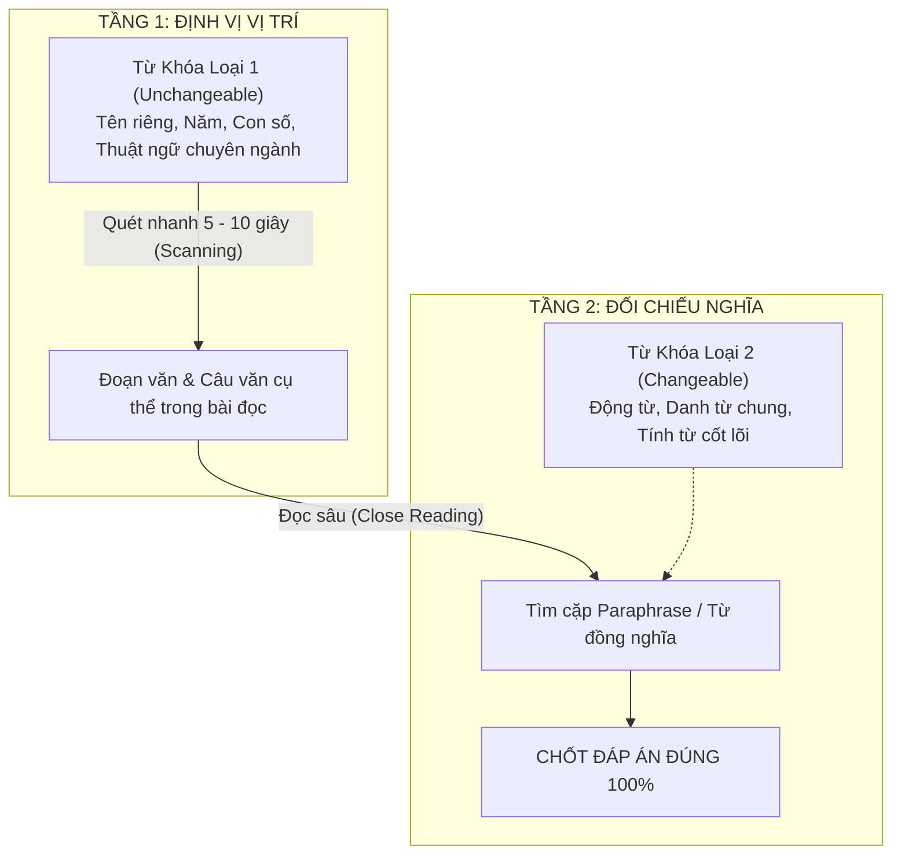

# Chiến Thuật Phân Loại Từ Khóa: Keywords Loại 1 (Định Vị) vs Keywords Loại 2 (Đối Chiếu Nghĩa)

Trong quá trình luyện thi IELTS Reading, hầu hết thí sinh đều được khuyên: *"Hãy gạch chân từ khóa (keywords) trong câu hỏi trước khi đọc bài"*. Tuy nhiên, đa số thí sinh band 4.5 – 6.0 đều gạch chân một cách vô thức, gạch gần như cả câu hỏi mà không hiểu rằng **từ khóa trong IELTS Reading được chia làm hai tầng bậc hoàn toàn khác biệt**.

Hiểu rõ sự khác biệt giữa **Keywords Loại 1 (Unchangeable)** và **Keywords Loại 2 (Changeable)** là chìa khóa giúp bạn tiết kiệm 50% thời gian tìm kiếm thông tin và không bao giờ bị dính bẫy paraphrase của Cambridge.

---

## 1. Phân Loại Chi Tiết Hai Tầng Từ Khóa

### Từ Khóa Loại 1: Từ Khóa Định Vị (Locating / Unchangeable Keywords)
Đây là những từ mang tính nhận diện độc nhất, **gần như 100% không bao giờ bị paraphrase** (viết lại bằng cách khác) giữa câu hỏi và bài đọc.

- **Đặc điểm:** Nổi bật trên trang giấy, bắt mắt ngay lập tức.
- **Bao gồm:**
  1. **Thời gian & Năm tháng:** *1838, the 19th century, in June 1789, ancient times*.
  2. **Tên riêng (Proper Names):** *William Henry Perkin, London, Botany Bay, Thomas Goetz, Oxford University*.
  3. **Thuật ngữ chuyên ngành (Terminology):** *malaria, quinine, synthetic dyes, cinchona bark, biodiversity*.
  4. **Các từ viết hoa, in nghiêng hoặc đặt trong ngoặc kép:** *‘gross national happiness’, DNA, UNESCO*.
- **Mục đích duy nhất:** **Định vị toạ độ**. Bạn dùng Scanning quét thật nhanh xem câu văn liên quan nằm ở dòng nào, đoạn nào trong bài đọc.

### Từ Khóa Loại 2: Từ Khóa Đối Chiếu Nghĩa (Micro / Changeable Keywords)
Đây là những từ mang linh hồn của câu hỏi, chứa đựng thông tin logic mà câu hỏi muốn kiểm tra. Những từ này **chắc chắn sẽ bị thay thế bằng từ đồng nghĩa hoặc cấu trúc tương đương** trong bài đọc.

- **Đặc điểm:** Dễ bị biến đổi ngữ pháp, đổi dạng từ (Word Form), hoặc dùng cụm giải thích.
- **Bao gồm:**
  1. **Động từ chính:** *invented, prompted, discovered, failed, banned, surpass*.
  2. **Danh từ chung:** *supply, demand, assistant, fame and fortune, medical treatment*.
  3. **Tính từ & Trạng từ:** *viable, breakthrough, run-down, functional, popular*.
- **Mục đích:** Sau khi dùng từ khóa loại 1 tìm thấy vị trí câu văn, bạn sẽ đối chiếu các từ khóa loại 2 này với từ ngữ trong bài đọc để xác định câu trả lời đúng/sai/điền từ.

---

## 2. Bảng Ma Trận Phân Biệt & Cách Xử Lý

| Tiêu Chí | Keywords Loại 1 (Unchangeable) | Keywords Loại 2 (Changeable) |
| :--- | :--- | :--- |
| **Bản chất** | Tên riêng, năm tháng, số liệu, thuật ngữ | Động từ hành động, danh từ ý niệm, tính từ |
| **Khả năng bị Paraphrase** | 0% – 5% (Gần như giữ nguyên) | **90% – 95%** (Luôn bị thay bằng từ đồng nghĩa) |
| **Kỹ năng sử dụng** | **Scanning** (Quét mắt nhanh, không đọc hiểu) | **Close Reading** (Soi kỹ ngữ nghĩa và ngữ pháp) |
| **Nhiệm vụ trong bài thi** | Trả lời câu hỏi: *"Thông tin nằm ở đâu?"* | Trả lời câu hỏi: *"Đáp án đúng là gì?"* |
| **Sai lầm thường gặp** | Cố đi tìm từ chung chung không có tính định vị | Tìm từ y xì đúc câu hỏi ➡️ Dính bẫy từ khóa giả (Distractor) |

---

## 3. Phân Tích Ví Dụ Thực Tế Chuẩn Cambridge

Hãy phân tích một trích đoạn kinh điển về **William Henry Perkin** (nhà phát minh ra thuốc nhuộm tổng hợp):

### Đoạn văn trong bài đọc:
> *"William Henry Perkin was born on **March 12, 1838**, in **London, England**. As a boy, Perkin’s curiosity prompted early interests in the arts, sciences, photography, and engineering. But it was a chance stumbling upon a **run-down, yet functional, laboratory** in his late grandfather’s home that solidified the young man’s enthusiasm for chemistry...*
> 
> *At the time, **quinine** was the only **viable medical treatment** for **malaria**. The drug is derived from the bark of the **cinchona tree**, native to South America, and by **1856** demand for the drug was surpassing the available supply."*

### Câu hỏi thi thực chiến:
> **Question 1:** *Before Perkin's breakthrough, **quinine** was the only effective cure for **malaria**.*

👉 **Quy trình áp dụng 2 loại keywords:**
1. **Tìm Keywords Loại 1 (Định vị):**
   - Ta thấy 2 thuật ngữ y học: `quinine` và `malaria`.
   - Dùng Scanning quét nhanh trang giấy ➡️ Tìm thấy ngay ở đoạn 3: *"At the time, **quinine** was the only viable medical treatment for **malaria**."*
2. **Soi Keywords Loại 2 (Đối chiếu):**
   - Câu hỏi có: `effective cure` (phương thuốc điều trị hiệu quả).
   - Đoạn văn có: `viable medical treatment` (phương pháp điều trị y tế khả thi).
   - Cặp paraphrase đối chiếu: **effective cure = viable medical treatment**.
   - Cả hai bên đều khẳng định: *"was the only"* (là phương thuốc duy nhất).
   - ➡️ **Kết luận:** Khẳng định hoàn toàn trùng khớp ➡️ Chọn ngay **TRUE**!

---

## 4. Bẫy "Từ Khóa Giả" (The Literal Keyword Trap)

Nhiều thí sinh band dưới 6.0 có thói quen: thấy câu hỏi có từ gì là lao vào bài đọc tìm đúng từ đó. Các chuyên gia khảo thí Cambridge nắm rất rõ tâm lý này và thường xuyên giăng **bẫy từ khóa giả**:

> [!WARNING]
> **Quy tắc vàng:**
> Trong các câu hỏi khó (đặc biệt là Multiple Choice và TFNG của Passage 2 & 3), **câu nào chứa từ khóa giống hệt 100% từng chữ với bài đọc thường là CÂU BẪY (Distractor)**! Đáp án đúng hầu như luôn được diễn đạt bằng **từ đồng nghĩa (Synonyms)** hoặc **cấu trúc câu đảo ngược (Passive voice, Negation)**.

### Ví dụ cảnh giác:
- **Đề thi nói:** *"The project suffered from a severe lack of financial support."*
- **Bài đọc viết:** *"While the project secured substantial government funds, it was severely hampered by a deficit of skilled personnel."*
- 👉 Nếu chỉ nhìn chữ `severely` hay `project` mà vội vã kết luận là sai ngay, vì bài đọc nói thừa tiền chính phủ (*secured substantial funds*) nhưng thiếu nhân lực!

---

## 5. Công Cụ Đột Phá: Lập Bảng Từ Khóa (Keyword Table)

Mọi cao thủ đạt Reading 8.0 – 9.0 đều duy trì một cuốn sổ tay mang tên **Keyword Table**. Sau mỗi lần giải đề, bạn bắt buộc phải lập bảng này để tích lũy kho từ vựng paraphrase:

| Số Câu | Từ Khóa Trong Câu Hỏi (Question) | Từ Đồng Nghĩa Trong Bài Đọc (Passage) | Ý Nghĩa Tiếng Việt |
| :---: | :--- | :--- | :--- |
| **Q1** | *effective cure* | *viable medical treatment* | Phương pháp chữa trị hiệu quả |
| **Q2** | *prompted early interests* | *fired the young chemist's enthusiasm* | Thổi bùng niềm đam mê, hứng thú |
| **Q3** | *surpassing the supply* | *shortage of supply / in high demand* | Cầu vượt quá cung / khan hiếm |
| **Q4** | *run-down laboratory* | *old, neglected facility* | Phòng thí nghiệm xập xệ, cũ kỹ |
| **Q5** | *financial assistance* | *government subsidy / grants* | Hỗ trợ tài chính / viện trợ |

> [!TIP]
> Kiên trì lập Keyword Table sau 15 – 20 bài đọc Cambridge, bạn sẽ nhận ra một điều kỳ diệu: **các cặp từ paraphrase trong IELTS Reading có xu hướng lặp lại liên tục** qua các năm thi! Khi vốn paraphrase của bạn đạt đến ngưỡng 200 – 300 cụm, tốc độ làm bài của bạn sẽ tự động tăng gấp đôi.

---

| ← Bài trước | Mục Lục | Bài tiếp theo → |
| :--- | :---: | ---: |
| [2. Bộ Ba Kỹ Năng: Skimming - Scanning - Close Reading](reading-core-skills-skimming-scanning-close-reading.md) | [IELTS Reading Overview](../SUMMARY.md) | [4. Chiến thuật Reading Band 4.5 - 5.0](foundation-reading-band4-to-5-strategy.md) |
