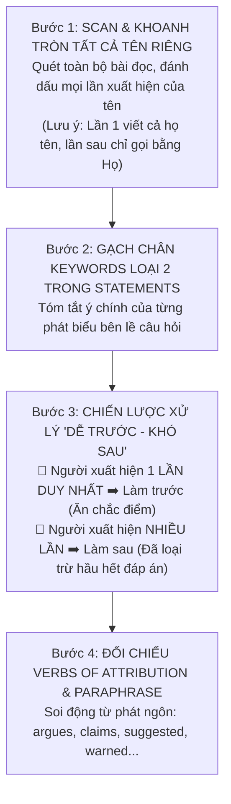

# Tuyệt Chiêu Xử Lý Dạng Bài Matching Names / Researchers & Theories (Nối Tên Học Giả & Quan Điểm)

Dạng bài **Matching Names** (Nối tên chuyên gia, nhà khoa học, nhà nghiên cứu hoặc nhân vật lịch sử với quan điểm, nghiên cứu hay phát hiện của họ) là một trong những dạng câu hỏi xuất hiện với tần suất dày đặc nhất trong **Passage 2 và Passage 3** của các đề thi Cambridge IELTS.

Đặc trưng lớn nhất của dạng bài này là: **Các câu hỏi KHÔNG xuất hiện theo thứ tự bài đọc (Non-order)**. Nếu bạn đọc từ trên xuống dưới theo từng câu hỏi, bạn sẽ phải lật qua lật lại bài đọc hàng chục lần và chắc chắn sẽ bị loạn thông tin.

Áp dụng chiến thuật **"Quét tên toàn bài – Phân loại người 1 lần vs người nhiều lần"** sẽ giúp bạn xử lý dạng bài này trong chưa đầy 6 phút.

---

## 1. Hai Hình Thức Xuất Hiện Của Dạng Bài Matching Names

Trong đề thi IELTS Reading, bạn sẽ gặp một trong hai hình thức trình bày sau:

### Hình thức 1: Danh sách Tên nằm trong khung (Phổ biến nhất)
- Đề bài cho danh sách các chuyên gia: `A. Sophia Murphy`, `B. Shenggen Fan`, `C. Pat Mooney`, `D. Kanayo Nwanze`...
- Các câu hỏi (Questions) là các nhận định/quan điểm. Bạn cần nối ký tự chữ cái của tên vào ô câu hỏi.

### Hình thức 2: Danh sách Nhận định / Phát hiện nằm trong khung
- Đề bài đưa tên các nhà khoa học làm câu hỏi: `Question 22. Simon Blackmore`, `Question 23. Eldert van Henten`...
- Trong khung bên dưới là danh sách phát hiện (`List of Findings: A - H`). Bạn cần nối phát hiện tương ứng với từng nhà khoa học.

---

## 2. Quy Trình 4 Bước Đột Phá Bẻ Khóa Matching Names

### Bước 1: Scan toàn bộ bài đọc và khoanh tròn TẤT CẢ tên riêng
- Trước khi đọc kỹ các câu hỏi, hãy dành **45 – 60 giây** dùng bút chì quét toàn bộ bài đọc từ đầu đến cuối và **khoanh tròn hoặc đóng khung mọi chỗ có tên riêng**.
- **Quy tắc vàng về cách gọi tên trong văn phong học thuật:**
  - Lần đầu xuất hiện: Thường là **đầy đủ Họ và Tên**, kèm chức danh hoặc nơi công tác. (Ví dụ: *"Gregg Murset, CEO of BusyKid"* hoặc *"Professor Simon Blackmore at Harper Adams University"*).
  - Các lần xuất hiện tiếp theo trong bài: Tác giả **chỉ gọi bằng Họ (Surname) hoặc chức danh** (Ví dụ: *"Mr. Murset says..."*, *"Blackmore argued that..."*).
  - Nếu bạn chỉ tìm cả cụm họ tên đầy đủ, bạn sẽ bỏ sót tới 70% các phát ngôn phía sau của nhân vật!

### Bước 2: Gạch chân Keywords Loại 2 & Tóm tắt nhanh ý chính Statements
- Đọc lướt qua danh sách các nhận định.
- Gạch chân các từ khóa cốt lõi (Động từ hành động, tác động, đối tượng bị ảnh hưởng).
- **Ghi chú cực ngắn (1 – 3 từ) bên cạnh statement:**
  - *Statement:* "Financial assistance from the government does not always reach the poorest farmers." ➡️ *Note:* **Tiền chính phủ trợ cấp sai đối tượng**.
  - *Statement:* "Automation might result in severe unemployment in rural areas." ➡️ *Note:* **Máy móc gây mất việc làm**.

### Bước 3: Phân loại "Câu Dễ Trước – Câu Khó Sau"
Đây là bí quyết phân biệt giữa người làm bài thông minh và người làm bài chật vật:

| Nhóm Nhân Vật | Đặc Điểm Nhận Diện | Chiến Thuật Xử Lý |
| :--- | :--- | :--- |
| **Nhóm DỄ (Xuất hiện 1 lần duy nhất)** | Tên chỉ xuất hiện đúng 1 lần trong cả bài đọc, gói gọn trong 1 – 2 câu văn. | **LÀM NGAY LẬP TỨC!** Đọc kỹ 2 câu chứa tên đó, đối chiếu với danh sách nhận định để chốt đáp án. Sau đó gạch bỏ phương án đó khỏi danh sách. |
| **Nhóm KHÓ (Xuất hiện nhiều lần)** | Tên xuất hiện rải rác ở 2 – 3 đoạn văn khác nhau (ví dụ: đoạn B, đoạn E, đoạn G). | **LÀM SAU CÙNG!** Lúc này, nhờ đã giải quyết xong nhóm Dễ, danh sách lựa chọn của bạn chỉ còn lại 1 – 2 phương án, xác suất chọn đúng tăng lên 80% – 100%. |

### Bước 4: Đối chiếu động từ tường thuật & Cặp từ Paraphrase
Khi đọc đoạn văn chứa tên nhân vật, hãy tìm các **động từ chỉ quan điểm/phát ngôn (Verbs of Attribution)** để khoanh vùng chính xác suy nghĩ của họ:
- *claims, argues, asserts, contends* (Khẳng định mạnh mẽ).
- *suggests, hypothesizes, proposes* (Đưa ra giả thuyết/gợi ý).
- *warns, cautions* (Cảnh báo rủi ro).
- *demonstrated, proved, discovered, concluded* (Chứng minh qua dữ liệu thực nghiệm).

---

## 3. Ba Bẫy Kinh Điển Trong Matching Names & Cách Phòng Tránh

### Bẫy 1: Dòng chữ hiểm hóc "NB: You may use any letter more than once"
- Nếu đề bài có ghi dòng chữ: **NB You may use any letter more than once**, điều đó đồng nghĩa với việc **chắc chắn sẽ có MỘT người được sử dụng ít nhất 2 lần**!
- Nhiều thí sinh khi thấy một người đã được chọn cho câu trước liền loại bỏ người đó ở các câu sau. Hậu quả là sai liên hoàn 2 câu!
- *Quy tắc:* Chỉ gạch bỏ tên người nếu đề bài KHÔNG có dòng ghi chú "NB".

### Bẫy 2: Bẫy "Dẫn lời người khác" (Quoting vs Personal View)
- Rất nhiều trường hợp đoạn văn nhắc đến nhà khoa học $A$, nhưng nội dung câu văn lại là:
  > *"Dr. Green argued that previous assumptions made by John Davis were completely flawed."*
  > *(Tiến sĩ Green lập luận rằng các giả định trước đây của John Davis hoàn toàn sai lầm).*
- Nếu câu hỏi hỏi về quan điểm của **John Davis**, nhiều bạn lại lấy quan điểm của **Dr. Green** để ghép vào.
- *Giải pháp:* Soi kỹ chủ ngữ của động từ tường thuật. Ai là người thực sự đưa ra nhận định đó?

### Bẫy 3: Bẫy Trùng từ khóa nhưng Ngược ý (Opposite Idea Trap)
- Nhà nghiên cứu cảnh báo rằng chi phí quá cao: *"New machinery may require more capital than smallholders can afford."*
- Statement đưa ra: *"Modern equipment is financially accessible to all farmers."*
- Thí sinh thấy có từ `machinery/equipment` và `financially/capital` vội vàng nối ngay mà không nhận ra nghĩa hai bên **hoàn toàn trái ngược nhau** (*can afford* vs *cannot afford*).

---

## 4. Bảng Đối Chiếu Paraphrase Điển Hình Cho Matching Names

| Ý Niệm Thường Gặp | Diễn Đạt Trong Statement | Diễn Đạt Tương Đương Trong Bài Đọc |
| :--- | :--- | :--- |
| **Hợp tác nhóm** | *collaborating as a group* | *work collectively / forming cooperatives / joint efforts* |
| **Hỗ trợ tài chính** | *financial assistance / input* | *subsidies / grants / funding / credit facilities* |
| **Ổn định giá cả** | *reduce variation in prices* | *mitigate price volatility / stabilise market prices* |
| **Thay đổi diện mạo** | *change the appearance of farmland* | *alter the agricultural landscape / reshape the countryside* |
| **Thiếu hụt lao động** | *shortage of employees* | *deficit of workforce / labour scarcity / struggle to recruit* |
| **Động lực kinh tế** | *economic factors are the driving force* | *commercial viability / market pressures propel development* |

---

| ← Bài trước | Mục Lục | Bài tiếp theo → |
| :--- | :---: | ---: |
| [8. Tuyệt Chiêu Matching Headings](matching-headings.md) | [IELTS Reading Overview](../SUMMARY.md) | [9. Chiến thuật Multiple Choice](reading-multiple-choice.md) |
