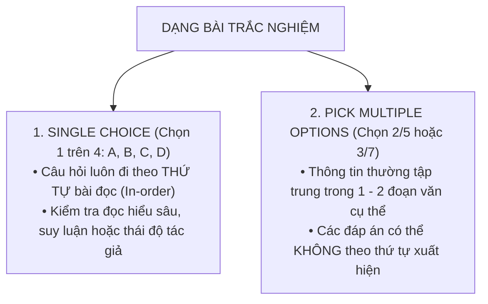
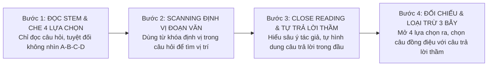

# Tuyệt Chiêu Xử Lý Dạng Bài Multiple Choice & Pick Multiple Options Trong Reading

Trong bài thi IELTS Reading, dạng bài **Trắc nghiệm Nhiều Lựa Chọn (Multiple Choice Questions)** thường xuất hiện ở **Passage 2 và Passage 3**, đóng vai trò như một "thước đo phân loại" trình độ từ **Band 6.5 lên 8.0+**.

Sai lầm tai hại lớn nhất của hầu hết thí sinh là: **lao vào đọc ngay cả 4 phương án A, B, C, D trước khi đọc bài**. Việc này khiến não bộ bị "quá tải thông tin" (Information Overload), rơi vào ma trận từ vựng gây nhiễu và dễ dàng dính phải những bẫy tâm lý tinh vi của ban khảo thí Cambridge.

Áp dụng chiến thuật **"Che phương án – Tự trả lời thầm (Cover & Predict)"** kết hợp **Kỹ thuật loại trừ 4 bẫy nhiễu (Distractor Elimination)** sẽ giúp bạn chọn đúng đáp án với tốc độ nhanh gấp đôi.

---

## 1. Hai Dạng Trắc Nghiệm Phổ Biến

---

## 2. Quy Trình 4 Bước "Che Phương Án – Tự Trả Lời Thầm"

### Tại sao phải "che" các phương án A, B, C, D?
Trong 4 phương án đề cho, có tới **3 phương án là thông tin sai lệch hoặc bẫy (Distractors)**. Nếu bạn đọc chúng trước, bạn đang tự nạp 75% thông tin độc hại vào não, tạo ra ấn tượng sai lệch (Cognitive Bias) khiến bạn bị dẫn dụ vào bẫy khi quay lại đọc bài.

---

## 3. Nhận Diện 4 Loại Bẫy Phương Án Nhiễu (Distractors) Kinh Điển

| Loại Bẫy Nhiễu | Đặc Điểm Nhận Diện | Cách Giám Khảo Giăng Bẫy | Cách Hóa Giải |
| :--- | :--- | :--- | :--- |
| **Bẫy Trùng từ khóa (Literal Match Trap)** | Chứa rất nhiều từ ngữ giống hệt từng chữ với bài đọc | Dụ dỗ thí sinh lười đọc hiểu, chỉ thích "soi chữ". Thực chất ý nghĩa của câu lại nói về vấn đề khác. | Cảnh giác cao độ! Trong Multiple Choice khó, **câu nào giống y đúc câu chữ trong bài thường là CÂU SAI**. |
| **Bẫy Nửa Vời (Half-True Trap)** | Nửa đầu câu hoàn toàn đúng với bài đọc | Nửa sau của câu lại gài thêm một thông tin sai, một chi tiết chưa từng được nhắc đến hoặc nói quá lên. | Đọc kỹ trọn vẹn cả câu từ đầu đến cuối; sai 1 từ cũng là SAI TOÀN BỘ. |
| **Bẫy Từ Tuyệt Đối (Extreme Qualifier)** | Chứa các từ tuyệt đối hóa: *all, every, exclusively, only, completely, impossible* | Bài đọc dùng từ cẩn trọng mang tính xác suất (*often, likely, some*), nhưng phương án lại khẳng định tuyệt đối 100%. | Loại bỏ ngay lập tức trừ khi bài đọc khẳng định chắc chắn 100%. |
| **Bẫy Đảo Ngược (Opposite / Reversed Causality)** | Đảo ngược mối quan hệ Nguyên nhân ➡️ Kết quả | Bài đọc nói: *"A xảy ra do B"*, nhưng phương án lại viết: *"A gây ra B"*. | Soi kỹ chủ ngữ, động từ chỉ hành động và liên từ nhân quả (*because, lead to, result in*). |

---

## 4. Phân Tích Bài Đọc Minh Họa Thực Tế

### Đoạn văn trong bài đọc:
> *"For years, researchers assumed that the introduction of automated machinery in agricultural harvesting would inevitably cause catastrophic unemployment among farm laborers. However, empirical studies conducted across southern Europe have revealed a surprising paradox: while manual field jobs did decline, the overall demand for labor actually increased due to the establishment of local packaging, sorting, and machinery maintenance hubs."*

### Câu hỏi khảo thí:
> **Question:** *What did the empirical studies in southern Europe reveal about agricultural automation?*  
> **A.** It caused severe, long-term unemployment across all farming communities.  
> **B.** It led to an unexpected overall rise in the demand for regional labor.  
> **C.** It eliminated manual harvesting jobs and destroyed local packaging hubs.  
> **D.** Farm laborers unanimously welcomed the introduction of automated machines.

### Phân tích loại trừ từng phương án:
* **Phân tích Phương án A:** Dính **Bẫy từ tuyệt đối (Extreme Qualifier)** — chữ *all farming communities* và *catastrophic unemployment*. Bài đọc nói đây là *assumed* (giả định trước đây của các nhà nghiên cứu), không phải kết quả thực tế ➡️ **LOẠI A**.
* **Phân tích Phương án C:** Dính **Bẫy nửa vời (Half-True Trap)** — Vế đầu *"eliminated manual harvesting jobs"* thì đúng, nhưng vế sau *"destroyed local packaging hubs"* hoàn toàn trái ngược với bài đọc (*due to the establishment of local packaging hubs*) ➡️ **LOẠI C**.
* **Phân tích Phương án D:** Dính **Bẫy không đề cập (Not Mentioned / Irrelevant)** — Bài đọc không hề nói công nhân có hoan nghênh (*unanimously welcomed*) hay không ➡️ **LOẠI D**.
* **Phân tích Phương án B:** Trùng khớp hoàn hảo với câu trả lời thầm:
  * *empirical studies revealed a surprising paradox* = *unexpected*
  * *overall demand for labor actually increased* = *overall rise in the demand for regional labor*
  * ➡️ **ĐÁP ÁN CHÍNH XÁC: B**!

---

## 5. Chiến Thuật Xử Lý Dạng "Pick Multiple Options" (Chọn 2/5 hoặc 3/7)

Khác với trắc nghiệm đơn, dạng chọn 2 trong 5 phương án thường tập trung trong **1 đến 2 đoạn văn cụ thể**:
1. **Ghi nhớ số lượng đáp án cần chọn:** Nếu đề bài yêu cầu *Choose TWO letters*, bạn phải điền 2 chữ cái vào 2 ô riêng biệt trên tờ phiếu trả lời (ví dụ: Câu 14 điền `B`, Câu 15 điền `D`).
2. **Kỹ thuật quét danh sách đối tượng:** Thường các câu hỏi này yêu cầu tìm *Two reasons why...* hoặc *Two problems mentioned by the writer...*. Hãy tìm đoạn văn có các liên từ liệt kê (*First, In addition, Furthermore, Another factor, Finally*) để khoanh vùng các ý.
3. **Thứ tự điền đáp án:** Bạn có thể ghi `B` trước `D` hoặc `D` trước `B` đều được tính điểm như nhau.

---

| ← Bài trước | Mục Lục | Bài tiếp theo → |
| :--- | :---: | ---: |
| [11. Tuyệt Chiêu Matching Headings](matching-headings.md) | [Mục Lục Cẩm Nang](../README.md) | [14. Matching Information & Matching Features](reading-matching-info-features.md) |
