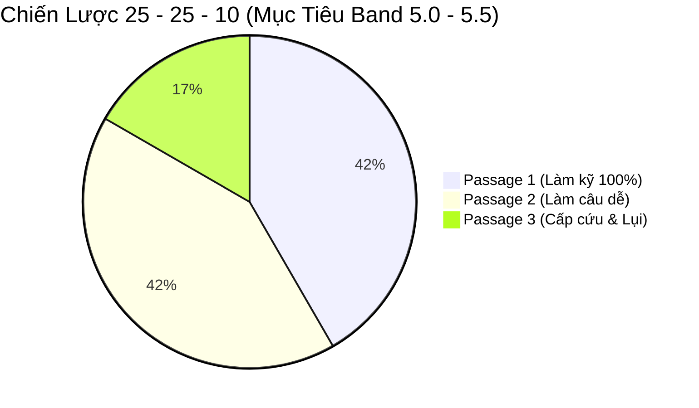

# Chiến Lược Thứ Tự Làm Bài (In-Order vs Out-Of-Order) & 6 Lưu Ý Sống Còn Trong Phòng Thi

Rất nhiều thí sinh bước vào phòng thi IELTS Reading với tâm thế: *"Đề cho câu nào thì làm tuần tự từ câu đó"*. Đây là nguyên nhân hàng đầu khiến bạn bị sa lầy vào những câu hỏi hóc búa, tiêu tốn 5 – 7 phút cho một câu hỏi không đáng có, để rồi hết giờ mà vẫn chưa kịp đọc tới những câu hỏi dễ cho không điểm ở phía sau.

Để tối ưu hóa từng phút giây và bứt phá band điểm, bạn cần nắm vững **Bản đồ thứ tự xuất hiện câu hỏi (Question Order Matrix)** và **6 Lưu ý vàng sống còn** được đúc kết từ kinh nghiệm thực chiến.

---

## 1. Bản Đồ Phân Loại Dạng Bài: In-Order vs Out-Of-Order

Trong 40 câu hỏi IELTS Reading, các dạng bài được chia thành hai nhóm rõ rệt dựa trên cách sắp xếp thông tin:

```mermaid
graph TD
    subgraph NHÓM 1: CÂU HỎI THEO THỨ TỰ (In-Order / Sequential)
        direction TB
        O1["True / False / Not Given & Yes / No / Not Given"]
        O2["Sentence / Notes / Table / Flow-chart Completion"]
        O3["Multiple Choice (Trắc nghiệm đơn lẻ)"]
        O4["Short-Answer Questions (Câu hỏi trả lời ngắn)"]
    end

    subgraph NHÓM 2: CÂU HỎI KHÔNG THEO THỨ TỰ (Out-Of-Order / Global)
        direction TB
        NO1["Matching Headings (Nối tiêu đề đoạn)"]
        NO2["Matching Information to Paragraphs (Thông tin thuộc đoạn nào)"]
        NO3["Matching Names / Researchers (Nối tên học giả)"]
        NO4["Matching Features / Classification (Phân loại đặc điểm)"]
    end
```

### Tại sao sự phân loại này lại mang tính quyết định?

1. **Với nhóm câu hỏi In-Order:**
   - Thông tin trả lời cho câu sau **luôn nằm bên dưới** câu trả lời trước đó trong bài đọc.
   - Nếu bạn đã tìm thấy câu trả lời của Câu 3 ở cuối đoạn 2 và Câu 5 ở đầu đoạn 4, thì **câu trả lời của Câu 4 chắc chắn 100% nằm trong đoạn 3**. Bạn không cần đọc lại đoạn 1 hay đoạn 5!
   
2. **Với nhóm câu hỏi Out-Of-Order:**
   - Câu hỏi 14 có thể nằm ở đoạn cuối cùng (Đoạn G), trong khi câu 15 lại nằm ở đoạn đầu tiên (Đoạn A).
   - Nếu lao vào làm dạng này đầu tiên mà chưa đọc qua bài, bạn sẽ phải đọc đi đọc lại cả bài văn 5 – 6 lần, dẫn đến kiệt sức và cháy giờ.

### Thứ tự làm bài tối ưu trong một Passage:
> [!TIP]
> **Quy tắc làm bài thông minh:**
> Nếu một Passage có cả dạng In-Order (như Điền từ / TFNG) và dạng Out-Of-Order (như Matching Information):
> ➡️ **Hãy làm dạng In-Order TRƯỚC!**
> Quá trình bạn tìm đáp án cho các câu In-Order chính là lúc bạn đã đọc lướt và hiểu được 60% – 70% nội dung của toàn bộ bài đọc. Khi quay lại làm dạng Matching Information / Matching Names, bạn đã biết rõ đoạn nào nói về chủ đề gì, giúp giải quyết các câu hỏi này với tốc độ nhanh gấp 3 lần!

---

## 2. Ba Chiến Lược Phân Bổ Thời Gian Theo Mục Tiêu Band

Mỗi mức điểm mục tiêu đòi hỏi một chiến lược quản trị năng lượng và thời gian hoàn toàn khác nhau:



### 1. Mục tiêu Band 5.0 – 5.5: Chiến lược "25 – 25 – 10"
- **Yêu cầu:** Cần đúng **16 – 22 câu / 40 câu**.
- **Cách phân bổ:**
  - **25 phút cho Passage 1:** Làm thật chậm, đọc kỹ, kiểm tra chính tả từng chữ để đạt **11 – 12/13 câu đúng**.
  - **25 phút cho Passage 2:** Tập trung giải quyết các dạng câu hỏi dễ ăn điểm (Điền từ, Short-answer), đạt khoảng **6 – 8 câu đúng**.
  - **10 phút cuối cho Passage 3:** Tuyệt đối không đọc bài! Chỉ làm 1 – 2 câu điền từ nếu thấy từ khóa nổi bật, toàn bộ các câu trắc nghiệm khoanh duy nhất 1 đáp án (toàn bộ B hoặc toàn bộ C).
  - ➡️ **Tổng điểm:** Đạt 18 – 20 câu đúng ➡️ **Chắc chắn đạt Band 5.0 – 5.5!**

### 2. Mục tiêu Band 6.0 – 7.0: Chiến lược "20 – 20 – 20"
- **Yêu cầu:** Cần đúng **23 – 32 câu / 40 câu** (cần 8 – 11 câu đúng trong mỗi bài đọc).
- **Cách phân bổ:**
  - Dành đều đặn **20 phút cho mỗi Passage**.
  - Đảm bảo đạt tối đa điểm ở Passage 1 (11 – 12 câu đúng), 70% ở Passage 2 (8 – 10 câu đúng) và 50% ở Passage 3 (7 – 8 câu đúng).

### 3. Mục tiêu Band 7.5 – 8.5+: Chiến lược "15 – 20 – 25"
- **Yêu cầu:** Cần đúng **33 – 38+ câu / 40 câu**.
- **Cách phân bổ:**
  - **15 phút cho Passage 1:** Đẩy tốc độ đọc quét lên mức tối đa, giải quyết nhanh các bài đọc nền tảng.
  - **20 phút cho Passage 2:** Xử lý gọn gàng các dạng bài Matching và phân tích quy trình.
  - **25 phút cho Passage 3:** Dành trọn vẹn thời gian nhiều nhất cho bài đọc khó nhất, nơi xuất hiện các luận điểm trừu tượng, ngôn ngữ cẩn trọng (hedging) và câu hỏi trắc nghiệm đa tầng.

---

## 3. Sáu Lưu Ý Sống Còn Trong Phòng Thi

### Lưu ý 1: Tuyệt đối không đọc và dịch từng từ một
- Mỗi đề thi IELTS chứa rất nhiều từ vựng chuyên ngành hiếm gặp (Jargon). Việc cố gắng dịch từng câu từng chữ sang tiếng Việt là **nhiệm vụ bất khả thi**, làm tốc độ đọc giảm 5 lần và gây quá tải cho não bộ.
- Chỉ đọc sâu vào những câu văn **trực tiếp phục vụ việc trả lời câu hỏi**. Mọi mẩu thông tin giải thích bên lề không liên quan hãy mạnh dạn lướt qua.

### Lưu ý 2: Quy tắc 90 giây buông bỏ câu hỏi khó (The Skip Technique)
- Điểm số của một câu hỏi cực dễ ở Passage 1 và một câu hỏi cực khó ở Passage 3 là **hoàn toàn bằng nhau (đều tính 1 điểm)**!
- Nếu bạn đã dành quá **1 phút 30 giây đến 2 phút** cho một câu hỏi mà vẫn chưa tìm thấy đáp án, **hãy khoanh tạm một đáp án khả dĩ, đánh dấu sao bên lề và chuyển sang câu tiếp theo ngay lập tức**.
- Đừng để một câu hỏi 1 điểm cướp mất thời gian của 3 câu hỏi dễ ăn điểm ở phía sau.

### Lưu ý 3: Quản lý thời gian chuyển đáp án vào Answer Sheet
- Hãy nhớ nguyên tắc: **Reading không có 10 phút chép đáp án như Listening**.
- **Chiến thuật an toàn nhất:** Dành ra **1 phút cuối của mỗi Passage** để chuyển toàn bộ đáp án của bài đọc đó vào tờ Answer Sheet. Khi đồng hồ báo còn 5 phút cuối, toàn bộ câu trả lời của bạn phải đã nằm gọn gàng trên phiếu thi.

### Lưu ý 4: Bẫy điền lệch dòng trên phiếu trả lời
- Một tai nạn kinh hoàng rất thường xảy ra khi thí sinh bỏ qua một câu hỏi nhưng quên không cách dòng trên tờ Answer Sheet:
  - Bỏ qua Câu 10.
  - Làm Câu 11 nhưng lại ghi đáp án vào ô số 10.
  - Làm Câu 12 ghi vào ô số 11.
  - ➡️ **Kết quả: Bị sai lệch liên hoàn cả một dải 10 câu hỏi!**
- Khi bỏ qua câu nào, hãy dùng ngón tay trỏ gióng đúng số thứ tự trên tờ Answer Sheet để bảo đảm không ghi đè vào dòng trống.

### Lưu ý 5: Lỗi không đọc kỹ yêu cầu đề bài (True/False vs Yes/No)
- Đề bài yêu cầu: `YES / NO / NOT GIVEN` nhưng thí sinh theo thói quen lại ghi `TRUE / FALSE / NOT GIVEN`.
- Dù ban giám khảo có thể linh động ở một số trường hợp, theo quy chế khảo thí chính thức, đây là **lỗi không tuân thủ hướng dẫn đề bài** và hoàn toàn có thể bị chấm 0 điểm.

### Lưu ý 6: Checklist 30 giây rà soát lỗi chính tả & Ngữ pháp
Trước khi nộp bài, hãy rà soát nhanh 3 điểm chí mạng của dạng câu hỏi điền từ:
1. **Số ít / Số nhiều:** Danh từ trong bài đọc có `-s` hay không?
2. **Lỗi nhân đôi phụ âm:** *accommodation* (2 chữ c, 2 chữ m), *embarrassment* (2 chữ r, 2 chữ s), *millennium* (2 chữ l, 2 chữ n).
3. **Giới hạn số từ:** Câu nào yêu cầu *ONE WORD ONLY* mà mình có lỡ tay ghi 2 từ hay không?

---

| ← Bài trước | Mục Lục | Bài tiếp theo → |
| :--- | :---: | ---: |
| [13. 50 Cặp Từ Paraphrase Cambridge](reading-cambridge-synonym-lexicon.md) | [IELTS Reading Overview](../SUMMARY.md) | [14. Đoán Nghĩa Từ Qua Gốc Từ & Ngữ Cảnh](reading-contextual-guessing-roots.md) |
