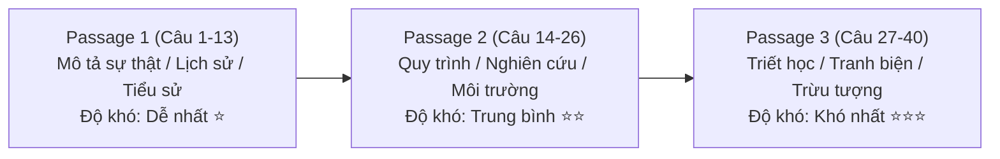

# Tổng Quan Đề Thi IELTS Reading: So Sánh Academic vs General Training & Bảng Quy Đổi Điểm Chuẩn

Để bắt đầu hành trình tự học và chinh phục IELTS Reading, việc đầu tiên người học cần nắm vững là bức tranh toàn cảnh về kỳ thi: bài thi gồm những gì, hai hình thức **Academic** (Học thuật) và **General Training** (Tổng quát) khác nhau ra sao, cách tính điểm cụ thể như thế nào, và những quy tắc sống còn trong phòng thi.

---

## 1. So Sánh Toàn Diện: IELTS Reading Academic vs General Training

Mặc dù cả hai hình thức đều kiểm tra năng lực đọc hiểu tiếng Anh học thuật và đời sống trong thời gian **60 phút** với tổng cộng **40 câu hỏi**, nhưng mục đích, nguồn ngữ liệu và độ khó có sự phân hóa rõ rệt:

```mermaid
mindmap
  root((IELTS Reading))
    Academic - Học Thuật
      Mục đích: Du học ĐH, Thạc sĩ, Nghiên cứu, Định cư diện tay nghề cao
      Nguồn bài: Tạp chí khoa học, sách chuyên ngành, báo cáo nghiên cứu
      Văn phong: Học thuật trang trọng, mật độ từ vựng C1/C2 dày đặc
      Cấu trúc: 3 bài đọc dài (Passage 1, 2, 3) tăng dần độ khó
    General Training - Tổng Quát
      Mục đích: Định cư, lao động phổ thông, học nghề, hoàn thiện visa
      Nguồn bài: Tờ rơi, quảng cáo, cẩm nang công ty, hợp đồng lao động
      Văn phong: Tiếng Anh giao tiếp công sở, thông tin thực tế đời thường
      Cấu trúc: Section 1 (đời thường), Section 2 (nơi làm việc), Section 3 (bài đọc dài)
```

### Bảng đối chiếu chi tiết:

| Tiêu Chí So Sánh | IELTS Reading Academic | IELTS Reading General Training |
| :--- | :--- | :--- |
| **Mục đích sử dụng** | Xét tuyển Đại học, Cao học, Học bổng quốc tế, Chứng chỉ hành nghề y khoa/luật | Xin định cư (PR Canada, Úc, New Zealand), xuất khẩu lao động, học cao đẳng/nghề |
| **Số lượng phần thi** | **3 Passages** (Độ dài mỗi bài 700 – 1.000 từ) | **3 Sections** (Section 1 & 2 gồm nhiều đoạn ngắn; Section 3 là 1 bài dài) |
| **Tổng số lượng từ** | 2.100 – 2.750 từ | 2.000 – 2.500 từ |
| **Chủ đề bài đọc** | Lịch sử nhân loại, thiên văn học, khảo cổ, tâm lý học, sinh học, môi trường, công nghệ | Đời sống thường nhật (tìm nhà, thông báo bảo tàng), quy định làm việc, chế độ nghỉ phép, tiền lương |
| **Độ khó ngôn ngữ** | Cao – Rất nhiều cấu trúc phức, mệnh đề quan hệ lồng ghép, thuật ngữ chuyên ngành | Vừa phải ở Section 1 & 2; Tương đương Passage 2 Academic ở Section 3 |
| **Yêu cầu số câu đúng cùng Band** | Cần **ít câu đúng hơn** để đạt cùng một band điểm (Do đề khó hơn) | Cần **nhiều câu đúng hơn** để đạt cùng một band điểm (Do đề dễ hơn) |

---

## 2. Bảng Quy Đổi Điểm Chuẩn IELTS Reading (Raw Score to Band Score)

Do tính chất độ khó khác nhau giữa hai hình thức, Hội đồng Khảo thí Cambridge, IDP và British Council áp dụng hai thang quy đổi điểm riêng biệt cho 40 câu hỏi:

| Số Câu Trả Lời Đúng (Raw Score / 40) | Band Score Academic | Band Score General Training | Ghi Chú Chiến Lược |
| :---: | :---: | :---: | :--- |
| **39 – 40** | **9.0** | **9.0** (Cần đúng tròn 40/40) | Xuất sắc tuyệt đối, không phạm lỗi chính tả |
| **37 – 38** | **8.5** | **8.5** (39 câu) / **8.0** (38 câu) | Biên độ sai số cực hẹp ở General Training |
| **35 – 36** | **8.0** | **7.5** (36 – 37 câu) | Academic đúng 35 câu đã đạt 8.0 vững vàng |
| **33 – 34** | **7.5** | **7.0** (34 – 35 câu) | Điểm chạm vàng để nộp hồ sơ định cư / du học top |
| **30 – 32** | **7.0** | **6.5** (32 – 33 câu) | **Lưu ý:** Cùng đúng 30 câu: Academic = 7.0, General = 6.0 |
| **27 – 29** | **6.5** | **6.0** (30 – 31 câu) | Mức điểm phổ biến yêu cầu đầu vào Đại học |
| **23 – 26** | **6.0** | **5.5** (27 – 29 câu) | Mức điểm an toàn tốt nghiệp |
| **20 – 22** | **5.5** | **5.0** (23 – 26 câu) | Đã nắm được các dạng bài cơ bản |
| **16 – 19** | **5.0** | **4.5** (19 – 22 câu) | Ăn trọn điểm Passage 1 + một phần Passage 2 |
| **13 – 15** | **4.5** | **4.0** (15 – 18 câu) | Nền tảng ngữ pháp & từ vựng còn yếu |
| **10 – 12** | **4.0** | **3.5** (12 – 14 câu) | Bị mất gốc từ vựng, đọc dịch chậm |
| **6 – 9** | **3.5** | **3.0** (8 – 11 câu) | Đoán mò phần lớn bài thi |

> [!WARNING]
> **Bẫy quy đổi điểm cho thí sinh General Training:**
> Để đạt Band **7.0 Reading**, thí sinh thi Academic chỉ cần đúng **30/40 câu** (được phép sai tới 10 câu). Nhưng thí sinh thi General Training phải đúng tối thiểu **34/40 câu** (chỉ được phép sai tối đa 6 câu)! Vì vậy, khi luyện thi General, bạn tuyệt đối không được để mất điểm ở những câu hỏi dễ thuộc Section 1 và Section 2.

---

## 3. Cấu Trúc Chi Tiết 3 Passages Của Bài Thi Academic

Trong bài thi Academic Reading, 40 câu hỏi được phân bổ thành 3 Passages với nguyên tắc **độ khó tăng dần**:



1. **Passage 1 (Câu 1 – 13):**
   - **Nội dung:** Thường viết về tiểu sử một nhà phát minh, lịch sử phát triển của một đồ vật/phương tiện (như bút chì, xe đạp), hoặc một loài động thực vật.
   - **Đặc điểm:** Văn phong tường thuật, cấu trúc câu rõ ràng, ít thuật ngữ trừu tượng.
   - **Dạng câu hỏi quen thuộc:** Điền từ (Notes/Table/Flow-chart Completion), True/False/Not Given.
   - **Mục tiêu:** Phải hoàn thành trong **15 – 17 phút** và đúng ít nhất **11 – 12/13 câu**.

2. **Passage 2 (Câu 14 – 26):**
   - **Nội dung:** Phân tích một vấn đề xã hội, môi trường, giải pháp công nghệ, hoặc quy trình thí nghiệm thực tế.
   - **Đặc điểm:** Bắt đầu xuất hiện các ý kiến đối lập giữa các nhóm nhà khoa học, có nhiều dữ liệu số và mối quan hệ nhân quả.
   - **Dạng câu hỏi quen thuộc:** Matching Headings, Matching Information to Paragraphs, Matching Names, Summary Completion.
   - **Mục tiêu:** Hoàn thành trong **20 phút**, giải quyết triệt để các câu hỏi theo thứ tự.

3. **Passage 3 (Câu 27 – 40):**
   - **Nội dung:** Thường là bài tiểu luận triết học, tâm lý học nhận thức, ngôn ngữ học hoặc lý thuyết học thuật trừu tượng.
   - **Đặc điểm:** Tác giả sử dụng nhiều cấu trúc câu phức, ngôn ngữ cẩn trọng (hedging), hàm ý ngầm và so sánh tương phản.
   - **Dạng câu hỏi quen thuộc:** Yes/No/Not Given, Multiple Choice khó (4 lựa chọn dài), Summary with a box of options.
   - **Mục tiêu:** Dành trọn vẹn **23 – 25 phút** để đọc sâu và đối chiếu tỉ mỉ từng chi tiết.

---

## 4. Điểm Khác Biệt Sống Còn: Quản Lý Thời Gian & Phiếu Trả Lời (Answer Sheet)

Rất nhiều thí sinh nhầm lẫn quy chế giữa Listening và Reading dẫn đến việc **không kịp ghi đáp án và nhận điểm 0**:

> [!CAUTION]
> **IELTS Reading KHÔNG có 10 phút chuyển đáp án!**
> Trong bài thi Listening trên giấy, bạn có thêm 10 phút sau khi audio kết thúc để chép đáp án từ đề thi sang tờ Answer Sheet. Nhưng trong bài thi **Reading, tổng thời gian làm bài VÀ chuyển đáp án chỉ vỏn vẹn đúng 60 phút**. Khi giám khảo hô *"Stop writing"*, nếu bạn chưa điền vào Answer Sheet thì mọi đáp án bạn khoanh trong đề thi đều **hoàn toàn vô giá trị**!

### Quy tắc điền tờ Answer Sheet chuẩn quốc tế:

1. **Candidate Name (Tên thí sinh):** Viết chữ in hoa toàn bộ, **KHÔNG DẤU** tiếng Việt (Ví dụ: `NGUYEN VAN AN`).
2. **Candidate Number (Số báo danh):** Gồm 6 chữ số, mỗi ô vuông điền chính xác một chữ số theo số báo danh dán trên bàn thi.
3. **Centre Number (Số hiệu trung tâm):** Gồm 5 chữ số do giám khảo viết trên bảng hoặc máy chiếu phòng thi.
4. **Test Module:** Dùng bút chì tô kín vào ô tương ứng (`Academic` hoặc `General Training`).
5. **Điền trực tiếp hoặc sau mỗi Passage:** Luôn chuyển đáp án vào tờ Answer Sheet ngay sau khi làm xong từng Passage (dành 1 phút chuyển đáp án), tuyệt đối không để dồn cả 40 câu đến phút thứ 59 mới cuống cuồng chép sang.

---

| ← Bài trước | Mục Lục | Bài tiếp theo → |
| :--- | :---: | ---: |
| [Mục Lục Cẩm Nang](../README.md) | [IELTS Reading Overview](../SUMMARY.md) | [2. Bộ Ba Kỹ Năng: Skimming - Scanning - Close Reading](reading-core-skills-skimming-scanning-close-reading.md) |
