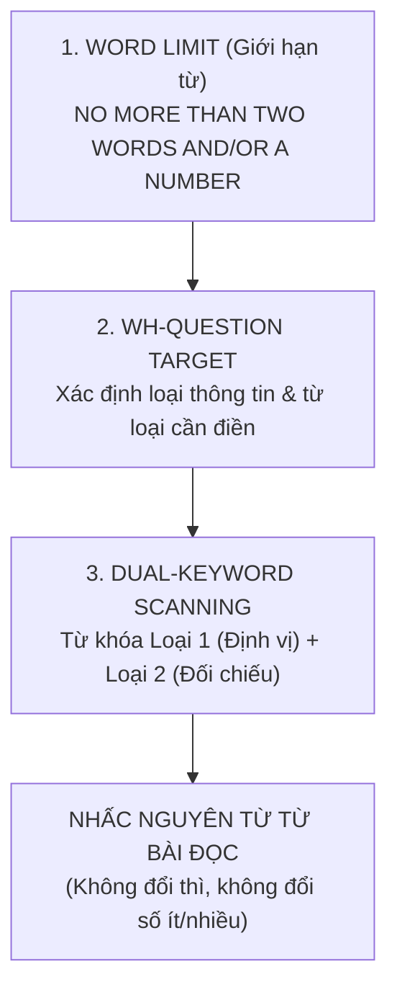

# Tuyệt Chiêu Xử Lý Dạng Bài Short-Answer Questions (Câu Hỏi Trả Lời Ngắn)

Dạng bài **Short-Answer Questions** (Câu hỏi yêu cầu trả lời ngắn gọn bằng các từ lấy trực tiếp từ bài đọc) là dạng bài xuất hiện thường xuyên trong **Passage 1 và Passage 2**.

Mặc dù có hình thức là câu hỏi có từ để hỏi (*Wh-questions*), về bản chất ngữ pháp và chiến thuật làm bài, Short-Answer Questions **gần như tương đồng 100% với dạng Sentence Completion (Điền từ hoàn thành câu)**:

```
Sentence Completion:      [ ..... ] are frequent visitors to stepwells nowadays.
Short-Answer Question:    Who are frequent visitors to stepwells nowadays?
```

Điểm thuận lợi lớn nhất của dạng bài này là: **Các câu hỏi luôn xuất hiện theo trật tự nội dung bài đọc (In-order)**. Câu trả lời cho Câu 2 chắc chắn sẽ nằm sau câu trả lời của Câu 1 và nằm trước câu trả lời của Câu 3!

---

## 1. Phân Tích 3 Yếu Tố Cốt Lõi Trước Khi Đọc Bài

Trước khi bắt tay vào tìm câu trả lời, bạn phải dành 20 giây thực hiện bước **Phân tích 3 yếu tố (Analysing Protocol)**:



### Yếu tố 1: Đọc kỹ giới hạn số từ (Word Limit)
- **"Choose NO MORE THAN TWO WORDS AND/OR A NUMBER from the passage"**:
  - Được phép điền: Tối đa 2 từ và 1 con số, hoặc chỉ 2 từ, hoặc chỉ 1 từ, hoặc 1 con số.
  - Điền 3 từ ➡️ **Bị gạch sai 0 điểm ngay lập tức** dù thông tin hoàn toàn chính xác!
- **"ONE WORD ONLY"**: Chỉ được phép lấy đúng 1 từ duy nhất.

### Yếu tố 2: Giải mã từ để hỏi (Wh-words) để khóa mục tiêu
Từ để hỏi sẽ bật mí chính xác bản chất ngữ nghĩa và từ loại bạn cần tìm kiếm:

| Từ Để Hỏi (Wh-word) | Loại Thông Tin Cần Tìm Kiếm | Ví Dụ Dự Đoán Đáp Án |
| :--- | :--- | :--- |
| **Who / By whom** | Danh từ chỉ người, nhóm người, nghề nghiệp, chức danh | *scientists, local craftsmen, Governor Philip* |
| **Which animals / species** | Danh từ chỉ loài động vật (thường là số nhiều) | *ichthyosaurs, marine mammals, native birds* |
| **How many / How much** | Con số cụ thể, số lượng, tỷ lệ, số tiền | *20 absconders, 15 years, $500* |
| **When / In which year** | Mốc thời gian, tháng, năm, thế kỷ, triều đại | *in June 1789, 1856, the 18th century* |
| **Where / In which place** | Địa danh, vị trí địa lý, công trình kiến trúc | *Botany Bay, Sydney Cove, laboratory* |
| **What was used to [Verb]** | Danh từ chỉ công cụ, phương tiện, vật liệu | *chains, synthetic dyes, cinchona bark* |

### Yếu tố 3: Phân tích cặp Keywords
- **Keywords Loại 1 (Unchangeable):** Tên riêng viết hoa, năm tháng, thuật ngữ lạ ➡️ Dùng để lướt mắt định vị toạ độ đoạn văn.
- **Keywords Loại 2 (Changeable):** Động từ chỉ hành động, tính từ mô tả ➡️ Dùng để đối chiếu xác nhận câu trả lời.

---

## 2. Quy Trình 3 Bước Thực Chiến Đạt Điểm Tuyệt Đối

### Bước 1: Analysing (Phân Tích Câu Hỏi)
- Gạch chân giới hạn từ (*NO MORE THAN TWO WORDS*).
- Gạch chân từ để hỏi và dự đoán loại từ cần tìm (ví dụ: *What was used to control convicts during the voyage?* ➡️ Cần tìm: **Vật dụng/Công cụ dùng để khống chế tù nhân**).
- Gạch chân từ định vị: `convicts`, `voyage`.

### Bước 2: Finding (Định Vị Tọa Độ Trong Đoạn Văn)
- Tận dụng quy tắc **In-order (Theo thứ tự)**:
  - Nếu bạn đã tìm thấy đáp án Câu 7 ở đoạn 1 và Câu 9 ở đoạn 3, thì đáp án Câu 8 **bắt buộc phải nằm ở khoảng giữa đoạn 1 và đoạn 3**.
- Dùng mắt quét nhanh từ khóa `convicts` và `voyage`.

### Bước 3: Answering (Nhấc Nguyên Xi Từ Ngữ Trong Bài)
- Đọc câu văn trong bài đọc:
  > *"Under Tench's authority, he released the convicts' **chains** which were used to control them during the voyage."*
- So khớp đối chiếu:
  - Đề bài: *What was used to control convicts during the voyage?*
  - Bài đọc: *"...released the convicts' **chains** which were used to control them during the voyage."*
- Đối tượng chính xác: **chains** (xiềng xích).
- Kiểm tra số từ: 1 từ ➡️ Thỏa mãn điều kiện *No more than two words*.
- Điền vào Answer Sheet: `chains` (hoặc `iron chains` nếu bài có nhắc).

---

## 3. Bốn Quy Tắc Sống Còn Tránh Mất Điểm Oan Uổng

> [!IMPORTANT]
> **Quy tắc 1: TUYỆT ĐỐI KHÔNG THAY ĐỔI DẠNG TỪ (WORD FORM)**
> Khác với một số bài thi tiếng Anh khác, trong IELTS Reading, bạn **phải nhấc nguyên văn từ gốc trong bài đọc**.
> - Bài đọc viết: `desertification` ➡️ Điền chính xác: `desertification`. Không được tự ý đổi thành tính từ `desertified`!
> - Bài đọc viết danh từ số nhiều `chains` ➡️ Điền chính xác: `chains`. Nếu bỏ chữ "s" thành `chain` là **bị trừ điểm sai ngữ pháp**!

> [!TIP]
> **Quy tắc 2: TỪ GHÉP CÓ DẤU GẠCH NGANG (HYPHENATED WORDS) TÍNH LÀ 1 TỪ**
> - Các từ như: `well-being`, `part-time`, `state-of-the-art`, `second-hand` được máy chấm và giám khảo tính là **DUY NHẤT 1 TỪ** (One word).
> - Nếu đề bài yêu cầu *ONE WORD ONLY*, bạn hoàn toàn có thể điền `run-down` hoặc `well-being`.

> [!WARNING]
> **Quy tắc 3: BẪY MẠO TỪ (A / AN / THE)**
> - Đề bài cho phép *NO MORE THAN TWO WORDS*: Nếu đáp án là `a laboratory` (2 từ) thì hợp lệ.
> - Nhưng nếu đề bài yêu cầu **ONE WORD ONLY**, mà bạn điền `a laboratory` thì sẽ bị tính là 2 từ và **bị loại ngay lập tức**!
> - *Lời khuyên an toàn:* Hãy luôn ưu tiên nhấc **danh từ cốt lõi** (`laboratory`) và bỏ mạo từ đi, trừ khi mạo từ là một phần không thể tách rời của tên riêng.

> [!CAUTION]
> **Quy tắc 4: LỖI CHÍNH TẢ (SPELLING MISTAKE)**
> Do các từ đều có sẵn trong bài đọc, ban giám khảo chấm lỗi chính tả cực kỳ khắt khe:
> - Bài đọc: `accommodation` ➡️ Thí sinh viết: `acommodation` (thiếu 1 chữ c) ➡️ **0 ĐIỂM**.
> - Bài đọc: `environment` ➡️ Thí sinh viết: `enviroment` (thiếu chữ n) ➡️ **0 ĐIỂM**.
> Luôn dành 5 giây kiểm tra từng chữ cái khi chép từ bài đọc vào tờ phiếu trả lời.

---

## 4. Bảng Thực Hành Nhận Diện Cặp Từ Đồng Nghĩa

| Câu Hỏi Thực Tế | Keywords Trong Câu Hỏi | Từ Đồng Nghĩa Tương Đương Trong Bài | Đáp Án Chuẩn Xác |
| :--- | :--- | :--- | :--- |
| *What could be a concrete proof of Tench's good education?* | *concrete proof, good education* | *evidence of his scholarly background, articulate letters* | **articulate letters** |
| *How many years did Tench sign the contract?* | *how many years, signed contract* | *agreed to a term of three years* | **three years / 3 years** |
| *Who gave the order to punish the Aboriginals?* | *who, gave the order, punish* | *instructions issued by Governor Philip to penalise* | **Governor Philip** |
| *In which place did Tench feel unaccustomed?* | *in which place, feel unaccustomed* | *unfamiliar ground, strange environment of Sydney Cove* | **Sydney Cove** |

---

| ← Bài trước | Mục Lục | Bài tiếp theo → |
| :--- | :---: | ---: |
| [12. Diagram & Flow-Chart Labelling](reading-diagram-flowchart.md) | [IELTS Reading Overview](../SUMMARY.md) | [13. 50 Cặp Từ Paraphrase Cambridge](reading-cambridge-synonym-lexicon.md) |
