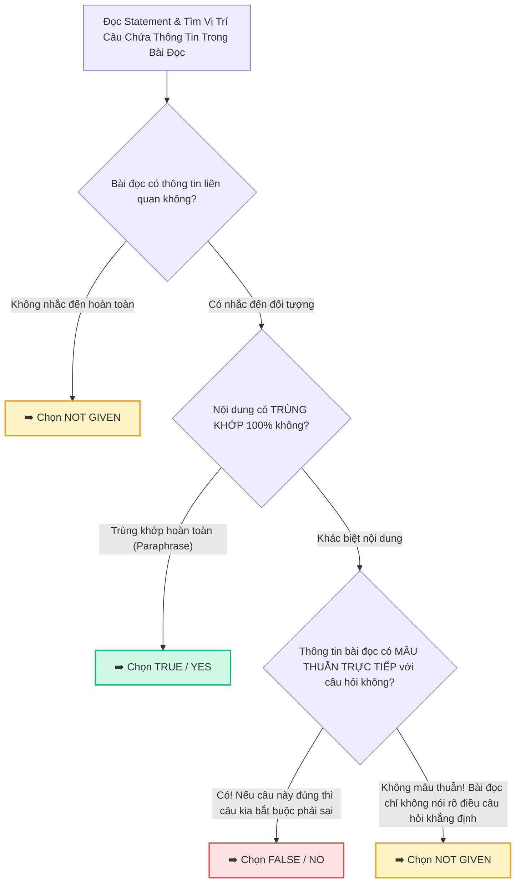

# 🎯 Phá Bẫy True / False / Not Given & Yes / No / Not Given Chuẩn Cambridge

> **Kỹ năng**: READING | **Chuyên mục**: Question Type Strategy  
> **Tóm tắt**: Bí kíp phân biệt ranh giới mong manh giữa False và Not Given với độ chính xác 100%, bóc tách 3 bẫy kinh điển và lưu đồ quyết định đáp án không thể sai lệch.

---

## ⚖️ 1. Bản Chất Khác Biệt Giữa TFNG & YNNG

Rất nhiều thí sinh nhầm lẫn hoặc chủ quan giữa 2 dạng bài này:

- **TRUE / FALSE / NOT GIVEN:** Kiểm tra **Facts (Sự thật khách quan)** trong các bài đọc mang tính khoa học, lịch sử, đời sống.
- **YES / NO / NOT GIVEN:** Kiểm tra **Claims / Opinions (Quan điểm, thái độ, lập luận của tác giả)** trong các bài luận văn, quan điểm xã hội (thường ở Passage 3).

> [!WARNING]
> **Quy định ghi đáp án trong phòng thi:**
> Nếu đề yêu cầu **TRUE / FALSE / NOT GIVEN** mà bạn viết nhầm thành **YES / NO / NOT GIVEN** (hoặc ngược lại), bạn có nguy cơ bị máy chấm hoặc giám khảo tính sai điểm. Hãy luôn nhìn kỹ dòng hướng dẫn của đề bài trước khi ghi đáp án!

---

## 🚦 2. Lưu Đồ Quyết Định 3 Bước (3-Step Decision Flowchart)

Để không bao giờ bị bối rối giữa **FALSE** và **NOT GIVEN**, hãy áp dụng quy tắc vàng sau:

### 🔑 Định nghĩa sống còn:
- **FALSE / NO:** Khi bạn có thể dùng chính thông tin trong bài đọc để **chứng minh câu hỏi sai** (Nghĩa là: $A \neq B$).
- **NOT GIVEN:** Khi bạn **không thể biết câu hỏi đúng hay sai** vì tác giả đơn giản là không cung cấp thông tin so sánh hoặc mức độ đó.

---

## 💣 3. Bóc Tách 3 Bẫy Kinh Điển Trong Đề Thi Cambridge

### 🥊 Bẫy 1: Ranh giới mong manh giữa FALSE và NOT GIVEN
- **Bài đọc (Passage):** *"Dr. Watson completed his medical degree in London before moving to Edinburgh."*
- **Câu hỏi A:** *"Dr. Watson obtained his medical qualification in Edinburgh."*
  - ➡️ **Đáp án: FALSE** (Vì bài đọc nói rõ ông lấy bằng ở London rồi mới chuyển đến Edinburgh. London mâu thuẫn trực tiếp với Edinburgh).
- **Câu hỏi B:** *"Dr. Watson enjoyed living in London more than in Edinburgh."*
  - ➡️ **Đáp án: NOT GIVEN** (Vì bài đọc chỉ nêu sự thật việc ông chuyển đi, hoàn toàn không nói ông *thích nơi nào hơn*).

---

### 🥊 Bẫy 2: Bẫy Từ Hạn Định & Mức Độ Tuyệt Đối (Qualifiers vs Absolutes)
Ban ra đề Cambridge rất thích thay đổi các từ chỉ tần suất hoặc mức độ xác suất:

| Nhóm Từ Trong Bài Đọc (Mức độ vừa phải) | Nhóm Từ Trong Câu Hỏi (Tuyệt đối hóa) | Kết Luận Đáp Án |
| :--- | :--- | :--- |
| *some, many, majority* | *all, every, entirely* | ➡️ **FALSE** |
| *often, frequently, tend to* | *always, permanently* | ➡️ **FALSE** |
| *possible, likely, may* | *definite, proved, must* | ➡️ **FALSE** |
| *suggests, hypothesized* | *confirmed, established as a fact* | ➡️ **FALSE** |

#### Ví dụ thực tế:
- **Bài đọc:** *"Many species of bats rely on echolocation to hunt in total darkness."*
- **Câu hỏi:** *"**All** bats navigate using echolocation."*
  - ➡️ **Đáp án: FALSE** (Vì *many* không đồng nghĩa với *all*).

---

### 🥊 Bẫy 3: Bẫy So Sánh Giả Tạo (The Comparison Trap)
Đây là cái bẫy tinh vi nhất khiến thí sinh mất điểm ở Passage 2 và Passage 3:

> **Bài đọc:** *"Solar power installations grew rapidly throughout 2022. During the same period, wind energy projects also received substantial state funding."*
> 
> **Câu hỏi:** *"Solar energy received **more funding than** wind energy in 2022."*
> 
> 🚨 **Phân tích:** Cả 2 đối tượng *Solar energy* và *Wind energy* đều xuất hiện trong bài đọc. Cả từ *funding* cũng xuất hiện. Tuy nhiên, bài đọc **chỉ liệt kê độc lập 2 sự kiện** chứ không hề có phép so sánh *hơn kém* giữa hai nguồn năng lượng này.
> 
> ➡️ **Đáp án bắt buộc phải là: NOT GIVEN!**

---

## ⚡ 4. Quy Tắc Vàng 30 Giây Trong Phòng Thi
1. **Làm câu hỏi theo đúng thứ tự xuất hiện:** 99% câu hỏi TFNG xuất hiện theo thứ tự diễn tiến từ trên xuống dưới của bài đọc (Order of text). Nếu câu 1 ở đoạn 1, câu 3 ở đoạn 3 thì câu 2 chắc chắn nằm ở đoạn 1 hoặc 2.
2. **Không suy diễn kiến thức ngoài đời:** Chỉ căn cứ vào những gì in trên trang giấy. Dù ngoài đời sự thật đó đúng 100%, nhưng nếu bài đọc không đề cập ➡️ Vẫn là **NOT GIVEN**.
3. **Không để trống:** Nếu phân vân 50/50 ở những giây cuối, hãy chọn đáp án có căn cứ nhất và tiếp tục tiến lên!
