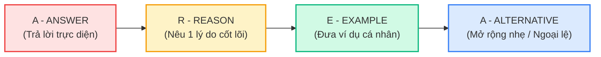

# 🗣️ Khung A.R.E.A - Trả Lời Tự Nhiên & Chuẩn Độ Dài Part 1

> **Kỹ năng**: SPEAKING | **Chuyên mục**: Part 1 Strategy  
> **Tóm tắt**: Bí kíp trả lời tự nhiên từ 2 – 4 câu cho Part 1, không cộc lốc một từ và không lan man lạc đề, kèm 5 bài mẫu thực chiến cho các chủ đề kinh điển.

---

## 🏛️ 1. Bản Chất Tiêu Chí Chấm Điểm Speaking Part 1

Trong **Part 1 (Phỏng vấn cá nhân ngắn)**, giám khảo muốn kiểm tra phản xạ tự nhiên của bạn về các chủ đề đời sống thường ngày. Giám khảo không yêu cầu bạn phải phát biểu như một bài thuyết trình, nhưng:
- ❌ **Trả lời quá ngắn (Dưới 1 câu / 5 giây):** Nói *"Yes, I do"*, *"No, I don't"* khiến giám khảo không đủ dữ liệu để đánh giá độ trôi chảy (Fluency) và ngữ pháp (GRA) ➡️ Điểm bị khóa ở Band 4.5 – 5.0.
- ❌ **Trả lời quá dài (Hơn 40 giây):** Nói lê thê sang chủ đề khác khiến giám khảo phải ngắt lời, làm bạn mất tự tin.

### 📐 Công thức A.R.E.A chuẩn mực (Độ dài lý tưởng: 15 – 25 giây / 2 – 4 câu):

1. **A - Answer:** Trả lời thẳng vào câu hỏi, sử dụng kỹ thuật paraphrase linh hoạt.
2. **R - Reason:** Đưa ra một lý do giải thích cảm xúc hoặc thói quen của bạn.
3. **E - Example:** Đưa ra một ví dụ về một dịp gần đây hoặc thói quen thường làm.
4. **A - Alternative / Afterthought:** Một ngoại lệ nhỏ hoặc câu chốt cảm xúc nhẹ nhàng.

---

## 🔬 2. Năm Bài Mẫu Thực Chiến Đối Chiếu (Band 5.0 vs Band 8.5)

---

### 📌 Chủ đề 1: Hometown (Quê hương)
> **Examiner:** *"What do you like most about your hometown?"*

- ❌ **Band 5.0 (Cộc lốc, từ vựng cơ bản):**  
  *"I like the food most. The food in my city is very delicious and cheap. Many people like eating street food there."*
- ✅ **Band 8.5 (Chuẩn A.R.E.A - Tự nhiên, từ vựng sống động):**  
  - **[A]**: *"Without a doubt, what captivates me most is the **vibrant street culinary scene**."*
  - **[R]**: *"My city has an incredible array of family-run food stalls that serve authentic local delicacies packed with rich flavors."*
  - **[E]**: *"For instance, whenever I return home, I always head straight to a roadside pho vendor near my old high school for a steaming bowl."*
  - **[Alt]**: *"Even though the traffic can be quite hectic at rush hour, the welcoming atmosphere easily makes up for it."*

---

### 📌 Chủ đề 2: Work or Study (Công việc / Học tập)
> **Examiner:** *"Why did you choose your current field of study?"*

- ❌ **Band 5.0 (Nói nông, thiếu liên kết):**  
  *"I study Computer Science because it is easy to find a job and the salary is high. My parents also told me to study it."*
- ✅ **Band 8.5 (Chuẩn A.R.E.A - Tư duy mạch lạc):**  
  - **[A]**: *"To be frank, I was drawn to Computer Science out of a genuine curiosity about how software shapes our daily routines."*
  - **[R]**: *"I've always been fascinated by algorithmic problem-solving and the potential to build tools that automate tedious tasks."*
  - **[E]**: *"Recently, I developed a small productivity app for my study group, and seeing my peers use it effectively was immensely rewarding."*
  - **[Alt]**: *"Of course, debugging code can be mentally exhausting at times, but the satisfaction of cracking a tough bug keeps me motivated."*

---

### 📌 Chủ đề 3: Weather & Seasons (Thời tiết & Mùa)
> **Examiner:** *"What kind of weather do you prefer?"*

- ❌ **Band 5.0 (Lặp từ, câu đơn ngắn):**  
  *"I like sunny weather. Sunny weather makes me feel happy. I can go outside and play sports with my friends."*
- ✅ **Band 8.5 (Chuẩn A.R.E.A - Ngữ điệu & Cấu trúc đa dạng):**  
  - **[A]**: *"I’m definitely much more in my element during **crisp, overcast autumn days**."*
  - **[R]**: *"Mild temperatures allow me to go about my day without feeling completely drained by sweltering tropical heat."*
  - **[E]**: *"On weekends with cool breezes, for example, I love sitting on a quiet balcony reading a good novel with a hot mug of matcha."*
  - **[Alt]**: *"That said, if it turns into a heavy continuous downpour, I’d much rather just curl up under a blanket at home."*

---

### 📌 Chủ đề 4: Hobbies & Leisure (Sở thích & Thời gian rảnh)
> **Examiner:** *"Do you prefer spending your free time indoors or outdoors?"*

- ❌ **Band 5.0 (Thiếu chiều sâu, không có ví dụ):**  
  *"I prefer staying indoors. Because I am lazy and it is very hot outside. I just watch YouTube or sleep."*
- ✅ **Band 8.5 (Chuẩn A.R.E.A - Trôi chảy, biểu cảm):**  
  - **[A]**: *"I’d consider myself predominantly an **indoor enthusiast**."*
  - **[R]**: *"After navigating the hustle and bustle of city commuting all week, I find immense comfort in quiet indoor spaces where I can decompress without sensory overload."*
  - **[E]**: *"Most of my leisure hours are spent trying out new baking recipes or listening to podcasts in my living room."*
  - **[Alt]**: *"Occasionally, though, I do enjoy a gentle afternoon stroll in a nearby botanic garden if the weather is exceptionally pleasant."*

---

### 📌 Chủ đề 5: Technology & Social Media (Công nghệ & Mạng xã hội)
> **Examiner:** *"How often do you use social media apps?"*

- ❌ **Band 5.0 (Liệt kê thô sơ):**  
  *"I use Facebook and TikTok every day. About three or four hours. I chat with friends and watch funny clips."*
- ✅ **Band 8.5 (Chuẩn A.R.E.A - Phản xạ phản biện):**  
  - **[A]**: *"I have to admit, I check social media on a daily basis, probably more frequently than I ought to."*
  - **[R]**: *"It serves as my primary channel not just for staying in touch with distant friends, but also for catching up on breaking news and design inspiration."*
  - **[E]**: *"I usually spend roughly an hour across Instagram and LinkedIn during my lunch break and evening downtime."*
  - **[Alt]**: *"However, to avoid mindless scrolling, I’ve recently set digital wellbeing screen limits to keep my usage in check."*

---

## ⏱️ 3. Quy Tắc Nhịp Độ (Pacing Rules) Trong Phòng Thi
- **Nguyên tắc 15 giây vàng:** Mỗi câu hỏi Part 1 chỉ cần trả lời trong khoảng **15 – 25 giây** (tương đương 2 – 4 câu).
- **Khi giám khảo chuyển câu hỏi:** Nếu giám khảo gật đầu và chuyển câu hỏi tiếp theo trong khi bạn đang nói câu thứ 4, **đừng hoảng hốt!** Đó là tín hiệu giám khảo đã nghe đủ tiêu chí và muốn dành thời gian hỏi thêm câu mới để cho bạn thêm điểm.
- **Nụ cười & Giao tiếp mắt (Eye contact):** Nói với thái độ tự tin, nhìn vào mắt giám khảo thay vì nhìn lên trần nhà hoặc nhìn xuống sàn để giữ vững ấn tượng ban đầu tốt đẹp.
