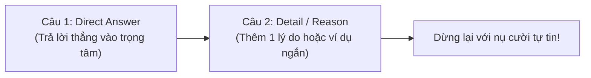

# 🗣️ Luyện Speaking Band 4.0 Lên 5.0: Phá Bỏ Nỗi Sợ Nói & Khung Trả Lời Part 1, Part 2

Thí sinh ở mức **Band 4.0 Speaking** thường gặp phải các vấn đề tâm lý và kỹ thuật sau:
1. **Sợ nói sai nên im lặng (Prolonged silence):** Khi giám khảo hỏi một câu, bạn ngồi suy nghĩ quá lâu (hơn 5 giây) hoặc chỉ trả lời cộc lốc một từ: *"Yes"*, *"No"*, *"I don't know"*.
2. **Nói từ rời rạc không thành câu (Word salad):** Ghép các từ tiếng Anh đơn lẻ mà không có chủ ngữ hoặc động từ chia thì.
3. **Chết lặng ở Part 2:** Khi nhận tờ giấy gợi ý (Cue card), bạn chỉ nói được 30 giây rồi dừng lại nhìn giám khảo, không biết nói gì tiếp theo.

Theo tiêu chuẩn chấm điểm chính thức của Cambridge: Để đạt **Band 5.0 Speaking**, bạn **không cần phát âm như người bản xứ hay dùng từ ngữ hoa mỹ**. Bạn chỉ cần:
- Duy trì được luồng nói, không bị im lặng ngắt quãng quá lâu.
- Trả lời bằng các câu đơn và câu ghép cơ bản (S + V + O).
- Nói được khoảng **1 phút 30 giây đến 2 phút** trong Part 2.

---

## 🎯 1. Công Thức "2 Câu Cứu Sinh" Cho Part 1

Đừng cố nói dài lê thê ở Part 1 để rồi bị vấp ngữ pháp. Quy tắc an toàn nhất để đạt Band 5.0 là **Công thức 2 câu: Trả Lời Trực Tiếp + 1 Chi Tiết / Lý Do Bổ Sung**:



### 💡 Ví dụ áp dụng thực tế:

#### Ví dụ 1:
- **Examiner:** *"Do you work or are you a student?"*
- ❌ *Sai (Band 4.0 - Trả lời cộc lốc)*: *"I am student."*
- ✅ *Đúng (Band 5.0 - Áp dụng công thức 2 câu)*:
  - **Câu 1:** *"Currently, I am a third-year student at Economics University."*
  - **Câu 2:** *"My major is Marketing, and I really enjoy studying it because it is interesting."*

#### Ví dụ 2:
- **Examiner:** *"What is your favorite type of music?"*
- ❌ *Sai (Band 4.0)*: *"Pop music. Because it good."*
- ✅ *Đúng (Band 5.0)*:
  - **Câu 1:** *"Well, I am a big fan of pop music, especially acoustic songs."*
  - **Câu 2:** *"I often listen to it in the evening because it helps me relax after a busy day."*

#### Ví dụ 3:
- **Examiner:** *"Do you like cooking?"*
- ❌ *Sai (Band 4.0)*: *"No, I don't."*
- ✅ *Đúng (Band 5.0)*:
  - **Câu 1:** *"To be honest, I am not really good at cooking."*
  - **Câu 2:** *"My mother usually prepares meals for our family, but sometimes I help her wash the dishes."*

---

## ⏱️ 2. Bí Kíp Part 2: Khung 5W1H Trong 1 Phút Chuẩn Bị (Nói Đủ 2 Phút)

Trong Part 2, giám khảo cho bạn **1 phút chuẩn bị và một mẩu giấy nháp**. Tuyệt đối không ngồi cắm cúi viết thành câu văn hoàn chỉnh, vì 1 phút chỉ đủ viết được 2 dòng!

### Hãy vẽ ngay sơ đồ ngôi sao 5W1H lên giấy nháp:

```text
       [WHAT] (Cái gì / Sự việc gì)
         /    \
[WHO] (Với ai)  [WHERE] (Ở đâu)
         \    /
       [WHEN] (Khi nào)
         |
       [WHY] (Tại sao thích / Cảm xúc thế nào)
```

### Ứng dụng thực tế:
> **Đề bài Part 2:** *Describe a memorable holiday you had.*

**1 phút nháp trên giấy:**
- `Who`: with my high school best friends (Nam, Lan)
- `Where`: Da Nang beach, beautiful resort
- `When`: last summer, after finishing exam
- `What did`: swim in the morning, eat seafood (shrimp, crab), take photos
- `Why memorable`: very fun, relaxed, first time travel without parents

### Cách trình bày khi nói:
Bạn chỉ cần nhìn vào từng từ khóa và nói 2 – 3 câu:
1. *"Today, I would like to talk about a memorable trip to Da Nang last summer..."* (When & Where)
2. *"I went there with my two best friends from high school..."* (Who)
3. *"During the trip, we did many interesting activities. In the morning, we went swimming at My Khe beach. In the evening, we ate delicious seafood like grilled fish and crab..."* (What)
4. *"I remember this holiday because it was so much fun and it helped us relax after a difficult exam..."* (Why)

➡️ **Kết quả:** Bạn nói trôi chảy từ **1 phút 45 giây đến 2 phút** mà không hề bị bí từ!

---

## 🆘 3. Ba Mẫu Câu "Cứu Nguy Hợp Lệ" Khi Không Nghe Rõ Giám Khảo

Nhiều thí sinh khi không hiểu câu hỏi thì cười trừ hoặc đoán mò trả lời bừa, dẫn đến việc bị lạc đề 100%. Quy chế thi IELTS cho phép bạn **hỏi lại giám khảo một cách lịch sự mà hoàn toàn không bị trừ điểm**:

| Tình Huống | ❌ Tuyệt Đối Không Nói | ✅ Câu Cứu Nguy Hợp Lệ Chuẩn Band 5.0+ |
| :--- | :--- | :--- |
| **Bị mất tập trung hoặc giám khảo nói quá nhanh** | *"What?", "Say again?"* | *"Could you please repeat the question?"* |
| **Không hiểu nghĩa của 1 từ trong câu hỏi** | Im lặng ngồi nhìn giám khảo | *"I'm sorry, could you please explain what [Word] means?"* (Chỉ áp dụng trong Part 1 và Part 3) |
| **Cần 2 giây để suy nghĩ ý tưởng** | *"À... Ờ... Em đang nghĩ..."* | *"Well, that's an interesting question. Let me think for a moment..."* |

---

## 📋 4. Checklist Tự Luyện Nói Hàng Ngày Đạt Band 5.0
- [ ] Mỗi ngày chọn 3 câu hỏi Part 1, luyện trả lời theo **Công thức 2 câu**.
- [ ] Dùng điện thoại ghi âm lại giọng nói của mình, nghe lại xem có bị ngắt quãng giữa câu hay không.
- [ ] Luôn chú ý bật âm đuôi cơ bản: `/s/` trong số nhiều (*two books*) và ngôi thứ 3 (*he likes*).
- [ ] Luôn trả lời có chủ ngữ (*"I like..."* thay vì chỉ nói *"Like..."*).

---

> 🚀 **Luyện tập thực chiến trên IELTS Studio:** Mở ứng dụng [IELTS Practice Web](https://ielts-practice-vietnamese.vercel.app/) để thực hành bài tập và nhận đánh giá chi tiết từ AI.

| ⬅️ Bài trước | 📋 Mục Lục | ➡️ Bài tiếp theo |
| :--- | :---: | ---: |
| [20. Bí kíp thi máy (CD-IELTS): Phím tắt, Quản trị màn hình & Phục hồi khi lạc trôi](../listening/listening-cd-ielts-hacks-and-focus.md) | [📋 Mục Lục Cẩm Nang](../README.md) | [2. Khung A.R.E.A - Trả Lời Tự Nhiên Part 1](area-framework-part1.md) |
