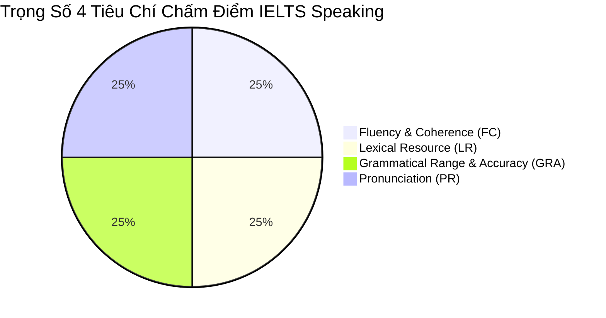
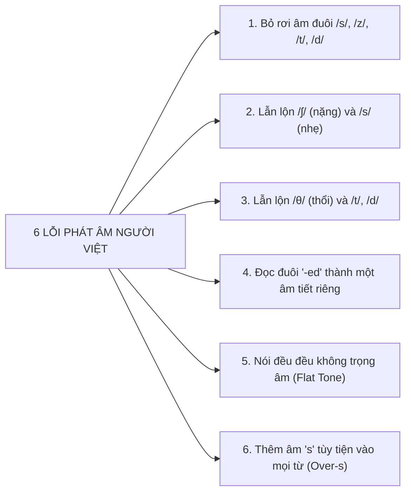

# Bản Đồ 4 Tiêu Chí Chấm Điểm IELTS Speaking & Ma Trận Phân Rã Band 5.0 – 8.5+

> **Kỹ năng**: SPEAKING | **Chuyên mục**: General Strategy  
> **Tóm tắt**: Khảo cứu toàn diện 4 tiêu chí khảo thí chính thức của Cambridge Assessment English (FC, LR, GRA, PR), phân tích ranh giới bứt phá giữa các band điểm, mổ xẻ 6 lỗi phát âm cố hữu của người Việt và công thức tính điểm làm tròn chuẩn quốc tế.

---

## 📌 1. Tổng Quan Về 4 Tiêu Chí Khảo Thí Chính Thức

Điểm số IELTS Speaking là trung bình cộng chuẩn xác của 4 tiêu chí độc lập, mỗi tiêu chí nắm giữ đúng **25% tổng số điểm**:

1. **Fluency & Coherence (FC - Độ trôi chảy & Tính mạch lạc)**: Khả năng duy trì dòng chảy lời nói với tốc độ ổn định (110 - 140 từ/phút), không có khoảng lặng ngập ngừng chết (dead air), sử dụng liên từ và từ đệm tự nhiên.
2. **Lexical Resource (LR - Vốn từ vựng & Thành ngữ)**: Khả năng sử dụng từ ngữ chuẩn xác theo chủ đề, làm chủ các cụm kết hợp từ tự nhiên (Collocations), thành ngữ (Idiomatic language) và kỹ thuật diễn giải thay thế (Paraphrase).
3. **Grammatical Range & Accuracy (GRA - Độ đa dạng & Chuẩn xác của ngữ pháp)**: Khả năng sử dụng linh hoạt các cấu trúc câu phức (mệnh đề phụ thuộc, câu điều kiện, câu chẻ, bị động), tỷ lệ câu nói hoàn toàn không có lỗi sai (Error-free sentences).
4. **Pronunciation (PR - Ngữ âm & Ngữ điệu)**: Khả năng phát âm rõ ràng từng âm đơn, phát âm đầy đủ âm đuôi (ending sounds), kiểm soát trọng âm từ, trọng âm câu và ngữ điệu (intonation) nhịp nhàng chuẩn quốc tế.

---

## 📊 2. Ma Trận So Sánh Chi Tiết 4 Tiêu Chí Từ Band 5.0 Đến Band 8.5+

Dưới đây là bản phân rã chi tiết thang chấm chính thức của Cambridge giúp bạn hiểu rõ giám khảo kỳ vọng điều gì ở từng nấc thang điểm số:

| Tiêu Chí | Band 5.0 (Nền Tảng) | Band 6.0 – 6.5 (Khá) | Band 7.0 – 7.5 (Tốt) | Band 8.0 – 9.0 (Xuất Sắc) |
| :--- | :--- | :--- | :--- | :--- |
| **FC** *(Trôi chảy)* | - Nói chậm, ngắc ngứ thường xuyên. - Hay lặp lại từ hoặc tự sửa lỗi liên tục. - Liên kết ý đơn điệu (*and, but, so*). | - Có thể nói dài nhưng vẫn còn ngập ngừng để tìm từ. - Dùng từ nối đôi khi còn máy móc ở đầu câu. - Tốc độ nói chưa đều khi gặp chủ đề khó. | - Nói trôi chảy, tự nhiên; chỉ ngập ngừng để suy nghĩ ý tưởng (*content hesitation*), không phải vì thiếu từ. - Dùng từ nối và từ đệm (*fillers*) uyển chuyển. | - Dòng chảy lời nói hoàn hảo, tốc độ tự nhiên tuyệt đối. - Phát triển ý tưởng sâu sắc, gắn kết logic không tì vết. - Hoàn toàn không có khoảng lặng ngập ngừng gượng gạo. |
| **LR** *(Từ vựng)* | - Vốn từ giới hạn, hay bí từ khi nói về chủ đề trừu tượng. - Diễn đạt vòng vo, gượng ép. - Dùng sai ngữ cảnh từ vựng. | - Vốn từ đủ để thảo luận chủ đề quen thuộc. - Đã biết dùng một số collocations nhưng đôi khi ghép từ còn vụng. - Paraphrase chưa thực sự mượt mà. | - Vốn từ rộng, có nhiều cụm từ ít phổ biến (*less common & idiomatic vocabulary*). - Hiểu và sử dụng collocations chuẩn xác. - Có khả năng paraphrase linh hoạt mọi câu hỏi. | - Sử dụng từ vựng cực kỳ phong phú và tinh tế theo chuẩn bản ngữ. - Làm chủ sắc thái ngữ nghĩa (*nuances of meaning*). - Dùng thành ngữ tự nhiên, đúng bối cảnh văn hóa. |
| **GRA** *(Ngữ pháp)* | - Chủ yếu dùng câu đơn ngắn. - Câu phức thường xuyên mắc lỗi chia thì, trật tự từ. - Lỗi ngữ pháp gây khó khăn cho người nghe. | - Có kết hợp câu đơn và câu phức. - Các câu phức vẫn còn lỗi nhỏ (mạo từ, chia số nhiều, thì quá khứ) nhưng không làm mất nghĩa câu. | - Sử dụng đa dạng các mẫu câu phức (câu điều kiện, bị động, mệnh đề quan hệ rút gọn). - **Phần lớn các câu (trên 70%) hoàn toàn không có lỗi sai**. | - Kiểm soát ngữ pháp hoàn hảo xuyên suốt cả 3 phần thi. - Sử dụng cấu trúc ngữ pháp nâng cao uyển chuyển. - Chỉ xuất hiện một vài "lỡ lời" (*slips*) cực kỳ hiếm hoi. |
| **PR** *(Phát âm)* | - Phát âm bị ảnh hưởng nặng bởi tiếng mẹ đẻ. - Nuốt mất âm đuôi (*ending sounds*). - Ngữ điệu đều đều, người nghe phải rất tập trung. | - Phát âm nhìn chung dễ hiểu. - Một số từ phát âm sai trọng âm hoặc âm đuôi. - Đã có ngữ điệu nhưng đôi khi còn thiếu tự nhiên hoặc máy móc. | - Phát âm chuẩn xác, rõ ràng mọi âm vị. - Thể hiện tốt các đặc trưng ngữ âm: trọng âm câu, nối âm, ngữ điệu lên xuống biểu cảm. - Người nghe không phải gắng sức. | - Phát âm chuẩn xác tuyệt đối như người bản xứ. - Sử dụng ngữ điệu tinh tế để truyền tải cảm xúc và thái độ. - Tự nhiên làm chủ nối âm, nuốt âm (*connected speech*). |

---

## 🎙️ 3. Mổ Xẻ Chuyên Sâu Tiêu Chí Phát Âm (PR) & 6 Lỗi Chí Mạng Của Người Việt

Phát âm (Pronunciation) là tiêu chí khiến thí sinh Việt Nam mất điểm nhiều nhất do sự khác biệt giữa hệ thống âm học đơn âm tiết (Syllable-timed) của tiếng Việt và trọng âm (Stress-timed) của tiếng Anh.

### A. Bốn Trụ Cột Của Tiêu Chí Pronunciation
1. **Individual Sounds (Âm vị chuẩn xác)**: Phát âm đúng các nguyên âm đơn, nguyên âm đôi và phụ âm đặc thù (/θ/, /ð/, /ʃ/, /ʒ/, /tʃ/, /dʒ/).
2. **Word Stress (Trọng âm của từ)**: Đặt đúng trọng âm để phân biệt từ loại (Ví dụ: `RE-cord` là danh từ vs `re-CORD` là động từ).
3. **Sentence Stress & Rhythm (Trọng âm câu & Nhịp điệu)**: Nhấn vào các từ mang nội dung thông tin (Content words: danh từ, động từ chính, tính từ) và lướt nhẹ các từ chức năng (Function words: mạo từ, giới từ, trợ động từ).
4. **Intonation & Chunking (Ngữ điệu & Ngắt cụm nghĩa)**: Lên giọng ở câu hỏi Yes/No, xuống giọng ở cuối câu khẳng định; ngắt hơi chuẩn xác theo từng cụm ngữ nghĩa (Thought groups).

---

### B. 6 Lỗi Phát Âm Cố Hữu Khiến Người Học Việt Nam "Chôn Chân" Ở Band 5.5 – 6.0

1. **Rơi âm đuôi (Dropping Final Consonants)**:
   - *Thực trạng*: Tiếng Việt không có phụ âm bật hơi cuối câu. Người học thường phát âm từ *like* thành *lai*, *life* thành *lai*, *line* thành *lai*, *light* thành *lai* $\rightarrow$ Giám khảo không thể nhận diện được bạn đang nói từ gì!
   - *Cách sửa*: Luyện bật rõ âm đuôi: `/k/` trong *like*, `/f/` trong *life*, `/n/` trong *line*, `/t/` trong *light*.
2. **Nhầm lẫn giữa âm /ʃ/ (s dài) và /s/ (s ngắn)**:
   - *Ví dụ*: Đọc *she* (/ʃiː/) thành *see* (/siː/), đọc *ship* (/ʃɪp/) thành *sip* (/sɪp/).
3. **Nhầm lẫn âm ma sát răng /θ/ và /ð/**:
   - *Ví dụ*: Đọc *think* (/θɪŋk/) thành *tink* (/tɪŋk/) hoặc *sink* (/sɪŋk/); đọc *this* (/ðɪs/) thành *dít*.
4. **Quy tắc phát âm đuôi '-ed' sai lệch**:
   - Rất nhiều bạn đọc *watched* thành *oát-chịt* (sai hoàn toàn!).
   - *Quy tắc chuẩn*:
     - Đọc là `/ɪd/` khi tận cùng bằng **/t/** hoặc **/d/** (*decided, wanted*).
     - Đọc là `/t/` khi tận cùng bằng âm vô thanh **/p, k, f, s, ʃ, tʃ/** (*watched /wɒtʃt/, laughed /lɑːft/*).
     - Đọc là `/d/` với các âm còn lại (*played /pleɪd/, cleaned /kliːnd/*).
5. **Ngữ điệu đều đều như đọc tụng kinh (Monotone / Flat Intonation)**:
   - Tiếng Anh là ngôn ngữ có sóng âm lên bổng xuống trầm. Hãy nhấn mạnh vào từ quan trọng nhất trong câu để thể hiện sự nhiệt huyết và cảm xúc.
6. **Thêm âm 's' vô tội vạ (Over-s-ing)**:
   - Vì lo lắng thiếu âm đuôi, nhiều thí sinh thêm âm /s/ vào giữa mọi từ: *"I thinks that English is verys importants"* $\rightarrow$ Đây là lỗi cực kỳ phản cảm, kéo tụt điểm GRA và PR xuống Band 5.0.

---

## 🧮 4. Công Thức & Quy Tắc Làm Tròn Điểm Overall Speaking

Điểm Speaking tổng kết của bạn được tính bằng công thức toán học trung bình cộng:

$$\text{Overall Speaking} = \frac{\text{FC} + \text{LR} + \text{GRA} + \text{PR}}{4}$$

### Bảng Quy Tắc Làm Tròn Khảo Thí Quốc Tế:
- Nếu phần lẻ rơi vào **dưới .25** (ví dụ: .125) $\rightarrow$ **Làm tròn xuống `.0`**  
  *(Ví dụ: FC 6.5, LR 6.0, GRA 6.0, PR 6.0 $\rightarrow$ Tổng: 24.5 / 4 = 6.125 $\rightarrow$ Điểm nhận được: **Band 6.0**)*.
- Nếu phần lẻ rơi vào **từ .25 đến dưới .75** (ví dụ: .25, .375, .5, .625) $\rightarrow$ **Làm tròn thành `.5`**  
  *(Ví dụ: FC 7.0, LR 6.5, GRA 6.0, PR 6.0 $\rightarrow$ Tổng: 25.5 / 4 = 6.375 $\rightarrow$ Điểm nhận được: **Band 6.5**)*.
- Nếu phần lẻ rơi vào **từ .75 trở lên** (ví dụ: .75, .875) $\rightarrow$ **Làm tròn lên `.0` kế tiếp**  
  *(Ví dụ: FC 7.0, LR 7.0, GRA 7.0, PR 6.5 $\rightarrow$ Tổng: 27.5 / 4 = 6.875 $\rightarrow$ Điểm nhận được: **Band 7.0**)*.

> [!TIP]
> **Chiến lược tối ưu điểm số:** Chỉ cần kéo **2 tiêu chí lên 7.0** và giữ 2 tiêu chí ở 6.5 (Tổng = 27 / 4 = 6.75), bạn sẽ được làm tròn lên **Band 7.0 tròn trĩnh**! Hãy đầu tư tối đa vào tiêu chí Fluency và Pronunciation vì đây là 2 tiêu chí dễ tạo ấn tượng thiện cảm tức thì nhất với giám khảo.

---

> **Luyện tập thực chiến:** Mở ứng dụng [IELTS Practice Web](https://ielts-practice-vietnamese.vercel.app/) để luyện nói cùng Giám khảo AI mô phỏng Cambridge và nhận phân tích chi tiết từng tiêu chí FC, LR, GRA, PR kèm theo bản đồ nhiệt ngữ âm thời gian thực.

| ← Bài trước | Mục Lục | Bài tiếp theo → |
| :--- | :---: | ---: |
| [4. Lộ trình Speaking từ Band 5.0 lên 7.5+](speaking-progression-50-to-75.md) | [Mục Lục Cẩm Nang](../README.md) | [6. Kỹ Thuật Storytelling Dòng Thời Gian PPF (Part 2)](storytelling-part2.md) |
