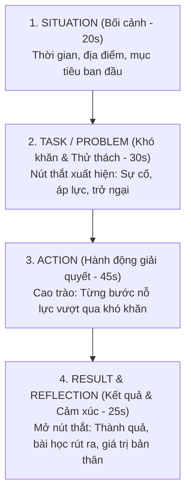

# Khung Kể Chuyện STAR (Situation – Task – Action – Result) Làm Chủ 2 Phút Speaking Part 2

Nỗi sợ lớn nhất của thí sinh trong **IELTS Speaking Part 2** là: **chỉ nói được 45 – 60 giây đã hết ý**, mắt nhìn trân trân vào giám khảo trong sự im lặng ngượng ngùng, hoặc nói lan man không có cấu trúc khiến bài nói bị rời rạc.

Rất nhiều bạn mắc sai lầm là trả lời theo kiểu "gạch đầu dòng" từng câu hỏi gợi ý trên tờ Cue Card (*Where it was, Who you were with, What you did...*). Cách làm này khiến bài nói khô khan như một bản thẩm vấn.

Áp dụng mô hình **STAR (Situation – Task – Action – Result)** — công cụ phỏng vấn kinh điển được chuẩn hóa trong luyện thi IELTS — sẽ giúp bạn biến bài nói 2 phút thành một câu chuyện điện ảnh cuốn hút, có cao trào, có nút thắt và mở nút thắt hoàn hảo.

---

## 1. Bản Đồ Phân Bổ Thời Gian 120 Giây Theo Khung STAR

Trong 1 phút chuẩn bị với tờ giấy nháp, thay vì viết cả câu văn hoàn chỉnh (điều bất khả thi), bạn chỉ cần vẽ nhanh 4 chữ cái **S - T - A - R** và ghi 2 – 3 từ khóa định hướng cho từng phần:

| Thành Phần STAR | Trọng Tâm Trình Bày | Thời Lượng | Mẹo Diễn Đạt Tự Nhiên |
| :--- | :--- | :--- | :--- |
| **S - Situation** *(Bối cảnh)* | Kể về hoàn cảnh bắt đầu: Khi nào, ở đâu, bạn đang có kế hoạch hoặc mong muốn gì. | **15 – 20 giây** | *"I’d like to share an experience that took place a couple of years back..."* |
| **T - Task / Problem** *(Nút thắt)* | Vấn đề phát sinh: Món hàng bị lỗi, áp lực thời gian, dữ liệu quá tải, sự cố máy tính. | **30 – 35 giây** | *"Everything was going smoothly until...", "The biggest obstacle I ran into was..."* |
| **A - Action** *(Hành động)* | Bạn và mọi người đã làm gì cụ thể để xử lý: Tìm kiếm giải pháp, thức trắng đêm, nhờ trợ giúp. | **40 – 45 giây** | *"To tackle this, I had to juggle...", "I decided to take the matter into my own hands..."* |
| **R - Result / Reflection** *(Kết quả)* | Kết quả cuối cùng và cảm xúc, bài học đọng lại: Nhận thức, lòng tự hào, kinh nghiệm sống. | **20 – 25 giây** | *"Looking back, what made this so fulfilling was...", "I learned a valuable lesson that..."* |

---

## 2. Phân Tích Bài Mẫu 1: Trải Nghiệm Giải Quyết Sự Cố Mua Sắm

> **Đề bài Cue Card:**  
> *Describe a problem you had while shopping online or in a store.*  
> *You should say:*  
> *- When it happened*  
> *- What you bought*  
> *- What problems you had while shopping online*  
> *And explain how you felt about it.*

### 1. Dàn ý chuẩn bị 1 phút (STAR Note):
* **S (Situation):** ~10 years ago, loved a specific pair of Adidas leather shoes, discontinued in local stores.
* **T (Problem):** Found on US website, paid expensive international shipping to Australia, arrived 2 weeks later but didn't fit (too tight).
* **A (Action):** Return shipping too pricey to swap ➡️ gave them to younger brother (smaller feet).
* **R (Result):** Utterly disappointed at first, brother wore them all the time (felt jealous), valuable lesson: never buy foreign shoes online.

### 2. Bài mẫu hoàn chỉnh chuẩn Band 7.5 – 8.0:
*"So I’d like to tell you about a time when I had a problem with a pair of shoes that I ordered online. It was quite a few years ago now, maybe around ten years ago I guess. I had been looking for a **specific model** of casual shoes that I’d seen someone wearing, but I couldn’t find them in any local stores. The shop attendant told me that the manufacturer was no longer producing that model, which made them **really unique**. They were brown in color and **made from genuine leather**. 

After hours and hours of searching online, I eventually tracked down a pair on a website based in the US. Even though the overseas shipping was going to cost an arm and a leg, I was willing to pay the extra money because I loved them so much. 

However, the problem arose when the parcel arrived about two weeks later. I excitedly **tried them on, but they didn’t fit at all**. They were painfully tight on my feet, despite being labeled as my regular size. Unfortunately, the cost of sending them back to the US to swap for a larger pair was prohibitively expensive, so I decided to **give up on them**. I **ended up giving them** to my younger brother, who has slightly smaller feet. They **fit him perfectly**, and to be honest, they suited him really well.

At the time, I was **utterly disappointed** because I’d waited so long and spent a considerable amount of money. To make matters worse, my brother wore them virtually every day, which made me quite envious! Nonetheless, I **learned a valuable lesson** never to order footwear online from abroad without trying them on first."*

---

## 3. Phân Tích Bài Mẫu 2: Vượt Qua Nhiệm Vụ Khó Khăn (Difficult Task)

> **Đề bài Cue Card:**  
> *Describe a difficult task that you completed at work or study that you felt proud of.*  
> *You should say:*  
> *- What the task was*  
> *- How you completed it*  
> *- Why it was difficult*  
> *And explain why you felt proud of it.*

### 1. Dàn ý chuẩn bị 1 phút (STAR Note):
* **S (Situation):** Final college project, researching & writing comprehensive paper on climate change & local ecosystems.
* **T (Problem):** Daunting vast amount of info, broad topic, difficult statistical analysis, juggle alongside coursework & part-time job.
* **A (Action):** Gathered reliable data, structured outline coherently, translated complex science into clear language, persevered late nights.
* **R (Result):** High grade, boosted confidence, proud of shedding light on environmental urgency.

### 2. Bài mẫu hoàn chỉnh chuẩn Band 7.5 – 8.0:
*"I’d like to share an experience that I’m exceptionally proud of — completing a challenging capstone research project for my university degree. The task required me to author a **comprehensive paper** examining the local ecological ramifications of climate change.

The project kicked off with selecting a relevant topic, but it soon became intimidating due to the **vast amount of information** available. The biggest hurdle was having to **gather reliable and up-to-date data** from academic journals. Once I accumulated sufficient material, I had to **organize it coherently**, which was no walk in the park given the sheer breadth of environmental science. Furthermore, analyzing the raw statistics was quite daunting; I had to re-evaluate my approach multiple times when the figures didn't match initial hypotheses. On top of that, it was a tough **balancing act** because I had to **juggle the research alongside** my regular exams and a part-time job.

To see the project through, I spent countless late nights outlining, writing, and revising draft after draft to ensure that **complex scientific jargon was translated into clear, accessible prose**. 

What made the final outcome so deeply fulfilling was not merely **overcoming the technical challenges**, but knowing that my findings could help **shed light on the urgency** of environmental protection in our community. When my professor commended the paper and awarded it a top distinction, it genuinely **boosted my confidence** and gave me a profound **sense of accomplishment**."*

---

## 4. Bảng Từ Vựng & Collocations C1/C2 Đắt Giá

| Từ Vựng / Collocation | Phiên Âm & Loại Từ | Ý Nghĩa Tiếng Việt | Ví Dụ Ứng Dụng Trong Part 2 |
| :--- | :--- | :--- | :--- |
| **specific model** | `/spəˈsɪf.ɪk ˈmɒd.əl/` (n) | Mẫu mã cụ thể, chính xác | *I searched everywhere for that specific model.* |
| **utterly disappointed** | `/ˈʌt.əl.i ˌdɪs.əˈpɔɪn.tɪd/` (adj) | Hoàn toàn thất vọng não nề | *I was utterly disappointed when the deal fell through.* |
| **end up doing sth** | `/end ʌp/` (phr.v) | Cuối cùng lại làm việc gì | *We ended up taking a taxi due to the heavy rain.* |
| **make matters worse** | `/meɪk ˈmæt.əz wɜːs/` (idiom) | Khiến tình hình tồi tệ hơn | *To make matters worse, my laptop crashed suddenly.* |
| **juggle alongside** | `/ˈdʒʌɡ.əl əˌlɒŋˈsaɪd/` (v) | Thao tác, gánh vác cùng lúc | *It’s hard to juggle a full-time job alongside studies.* |
| **shed light on** | `/ʃed laɪt ɒn/` (idiom) | Làm sáng tỏ, soi tỏ vấn đề | *The report helped shed light on consumer trends.* |
| **sense of accomplishment** | `/sens əv əˈkʌm.plɪʃ.mənt/` (n) | Cảm giác thành tựu to lớn | *Finishing the marathon gave me a huge sense of accomplishment.* |
| **no walk in the park** | `/nəʊ wɔːk ɪn ðə pɑːk/` (idiom) | Hoàn toàn không dễ dàng gì | *Mastering advanced statistics was no walk in the park.* |

---

| ← Bài trước | Mục Lục | Bài tiếp theo → |
| :--- | :---: | ---: |
| [7. Căn chuẩn nhịp độ 2 phút Pacing](speaking-part2-pacing-timing.md) | [Mục Lục Cẩm Nang](../README.md) | [8. 5 Câu chuyện mẫu vạn năng Part 2](speaking-5-universal-archetypes.md) |
