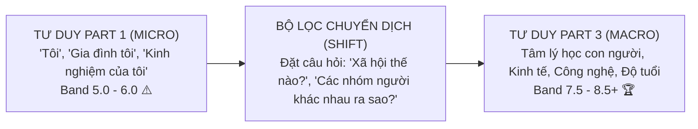

# Chiến Lược Mở Rộng Ý Tưởng Part 3: Kỹ Thuật Chuyển Dịch Từ Cá Nhân Sang Xã Hội (Micro to Macro Shift)

Một trong những sai lầm phổ biến nhất khiến thí sinh bị "giam cầm" ở mức điểm **Band 5.5 – 6.0 Speaking** là: **biến Part 3 thành một phiên bản Part 1 kéo dài**.

Khi giám khảo đặt câu hỏi mang tính xã hội vĩ mô như:  
> *"Why do people often feel proud when they complete a difficult task?"*  
> *(Tại sao con người thường cảm thấy tự hào khi hoàn thành một nhiệm vụ khó khăn?)*

Rất nhiều thí sinh vẫn theo thói quen trả lời hạn hẹp về bản thân mình:  
> ❌ *"Well, because when I finish my homework, I feel very happy and my mom buys me ice cream..."*

Câu trả lời này sẽ ngay lập tức bị giám khảo đánh giá là tư duy non nớt, chưa đáp ứng được yêu cầu của tiêu chí **Fluency & Coherence** và **Lexical Resource** ở cấp độ học thuật (C1/C2).

Để đạt được điểm số từ **Band 7.5 – 8.5+**, bạn bắt buộc phải làm chủ kỹ thuật **Micro to Macro Shift (Chuyển dịch từ Cá nhân sang Xã hội)**: nâng tầm câu trả lời từ trải nghiệm cá nhân hạn hẹp lên góc nhìn đa chiều của cộng đồng, tâm lý học con người và sự vận động của xã hội.

---

## 1. Bốn Lăng Kính Vĩ Mô Mở Rộng Mọi Chủ Đề Part 3

Khi gặp bất kỳ câu hỏi trừu tượng nào trong Part 3, hãy lập tức soi chiếu qua 4 lăng kính vĩ mô sau:

### Lăng Kính 1: Nhân Khẩu Học & Độ Tuổi (Generational Demographics)
Chia đối tượng thành các nhóm tuổi khác nhau để so sánh sự đối lập:
* **Thế hệ trẻ (Young generation / Adolescents):**
  * Đối mặt với: *academic pressures* (áp lực học tập), *job market competitiveness* (cạnh tranh việc làm gay gắt), *mental health concerns* (sức khỏe tinh thần), *navigating the complexities of social media* (thích nghi với mạng xã hội phức tạp).
* **Thế hệ đi trước (Older generation / Seniors):**
  * Đề cao: *traditional values* (giá trị truyền thống), *stability and work-life balance* (sự ổn định), *direct interpersonal communication* (giao tiếp trực tiếp).

### Lăng Kính 2: Bản Tính Con Người & Xã Hội Học (Human Nature & Sociology)
Đưa ra những quy luật tâm lý học phổ quát của nhân loại:
* **"Humans are social creatures"** (Con người vốn là sinh vật có tính xã hội): Luôn khao khát kết nối, chia sẻ cảm xúc và tìm kiếm sự công nhận (*sense of belonging & social validation*).
* **"Resilience and self-worth"** (Khả năng phục hồi và giá trị bản thân): Con người cần vượt qua thử thách qua quá trình *trial and error* (thử và sai) để củng cố lòng tự trọng (*self-esteem*).

### Lăng Kính 3: Công Nghệ & Toàn Cầu Hóa (Technology & Modern Trends)
Nhìn nhận mặt sáng và mặt tối của thời đại số:
* **Tích cực:** Tự do tiếp cận thông tin (*democratization of knowledge*), công cụ cộng tác trực tuyến (*online collaboration*).
* **Mặt trái:** Bùng nổ tin giả và thông tin sai lệch (*misinformation & fake news*), công cụ bắt nạt trực tuyến (*cyberbullying & hate speech*), suy giảm kỹ năng giao tiếp thực tế.

### Lăng Kính 4: Đạo Đức & Trách Nhiệm Xã Hội (Ethics & Civic Responsibility)
Gắn hành vi của cá nhân với lợi ích chung của cộng đồng:
* *Contribute positively to the community* (Đóng góp tích cực cho cộng đồng).
* *Align with societal values and principles* (Phù hợp với các giá trị chuẩn mực xã hội).
* *Address pressing global challenges* (Giải quyết các thách thức toàn cầu cấp bách như biến đổi khí hậu, bất bình đẳng xã hội).

---

## 2. Bảng Đối Chiếu Phân Tích Thực Chiến: Band 5.5 vs Band 8.0

Hãy cùng so sánh cách trả lời của hai mức band điểm trước một câu hỏi Part 3 thực tế:

> **Examiner Question:**  
> *"What challenges do young people face in modern society?"*  
> *(Những thách thức mà giới trẻ phải đối mặt trong xã hội hiện đại là gì?)*

### ❌ Cách trả lời mức Band 5.5 (Cục bộ, vụn vặt, lặp từ):
*"Well, I think young people have many problems. For example, my friends and I have to study too much for exams, and our teachers give a lot of homework. Also, finding a job is very hard, and we don't have enough money to buy things we like. Sometimes we feel sad because we use Facebook too much."*

### ✅ Cách trả lời mức Band 8.0 (Vĩ mô, học thuật, tư duy đa chiều):
*"From a broader perspective, young people today are grappling with a unique set of multifaceted challenges. First and foremost are the intense **academic pressures** and fierce **job market competitiveness**, driven by rapid technological disruption and globalization. Young graduates can no longer rely on a simple degree; they must constantly upskill and learn through **trial and error** to remain employable. 

Furthermore, **navigating the complexities of social media** has precipitated severe **mental health concerns**. Constantly being exposed to curated online lives often erodes their **self-worth** and fuels feelings of inadequacy. On top of that, macro-level crises such as climate change and **socio-economic inequalities** place an unprecedented psychological burden on the shoulders of the younger generation."*

---

## 3. Các Cặp Cụm Từ Vựng Nâng Tầm "Micro to Macro"

| Cụm Từ Ở Tầm Vi mô (Part 1 - Band 5.5) | Cụm Từ Nâng Tầm Vĩ Mô (Part 3 - Band 7.5 – 8.5) |
| :--- | :--- |
| *I feel happy when I finish it* | *elicits a profound sense of accomplishment and self-worth* |
| *People like making friends* | *humans are fundamentally social creatures seeking belonging* |
| *Bad news on Facebook* | *the proliferation of misinformation, fake news, and hate speech* |
| *Hard to get a job* | *heightened job market competitiveness and economic volatility* |
| *Try many times to fix it* | *develop critical problem-solving skills through trial and error* |
| *Help other people* | *contribute positively to the collective well-being of society* |
| *Don't give up* | *demonstrate remarkable resilience and perseverance in the face of adversity* |

---

## 4. Ba Mẫu Câu Mở Đầu Đẳng Cấp Cho Part 3

Để ngay lập tức phát đi tín hiệu cho giám khảo thấy bạn đang tư duy ở cấp độ vĩ mô, hãy sử dụng các mẫu câu định khung (Framing Statements):

1. **Khái quát hóa toàn xã hội:**  
   *"Looking at this from a sociological standpoint, it’s evident that..."*  
   *(Nhìn nhận vấn đề này từ góc độ xã hội học, rõ ràng là...)*

2. **Phân hóa đối tượng đa chiều:**  
   *"I believe the answer varies considerably depending on the demographic cohort in question..."*  
   *(Tôi tin rằng câu trả lời sẽ khác biệt đáng kể tùy thuộc vào nhóm nhân khẩu học đang được nhắc tới...)*

3. **Cân bằng hai mặt đối lập:**  
   *"While on an individual level it might appear beneficial, when viewed as a whole, it exerts a detrimental impact on..."*  
   *(Dù ở cấp độ cá nhân nó có vẻ có lợi, nhưng khi nhìn trên bình diện toàn thể, nó lại tạo ra tác động tiêu cực đến...)*

---

| ← Bài trước | Mục Lục | Bài tiếp theo → |
| :--- | :---: | ---: |
| [12. Tư Duy Phản Biện & Ma Trận PEEL Part 3](critical-thinking-part3.md) | [Mục Lục Cẩm Nang](../README.md) | [13. Khung Trả Lời So Sánh Đa Chiều](speaking-part3-comparison-frameworks.md) |
