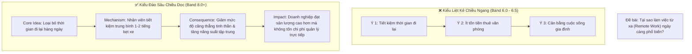

# 🔍 Giải Mã Nhận Xét Của Giám Khảo Cambridge 18-19: Những Lỗi Mất Điểm Band 8.0+

Phân tích các bài viết mẫu kèm nhận xét chính thức của giám khảo khảo thí trong các bộ sách gần đây nhất (**Cambridge IELTS 18 & 19**) cho thấy một sự thay đổi rõ rệt trong tiêu chí đánh giá của giám khảo quốc tế. Các giám khảo ngày càng khắt khe hơn với các bài viết mang tính "văn mẫu học thuộc", lạm dụng từ vựng đao to búa lớn nhưng thiếu chiều sâu lập luận.

Bài viết này tổng hợp những đúc kết mang tính bước ngoặt giúp bạn thoát khỏi bẫy Band 6.5 và vươn tới mốc **Band 8.0 - 8.5 Writing**.

---

## 🚫 1. Cái Chết Của Các "Template Rập Khuôn" (Mechanical Linking)

Nhiều thí sinh được dạy các mẫu câu mở đầu nghe có vẻ "cao cấp" nhưng trong thang chấm chính thức của Cambridge, chúng bị xếp vào nhóm **"Overuse of memorized phrases"** hoặc **"Mechanical cohesion"** (tiêu chí Coherence & Cohesion bị giữ ở mức Band 6.0 hoặc 7.0).

### Bảng đối chiếu những cụm từ sáo rỗng cần loại bỏ ngay lập tức:

| ❌ Cụm Từ Rập Khuôn (Bị trừ điểm) | ✅ Cách Diễn Đạt Tự Nhiên & Học Thuật (Band 8.0+) | Phân Tích Của Giám Khảo |
| :--- | :--- | :--- |
| *"In a nutshell / To put it in a nutshell..."* | *"In conclusion, / To summarize, / Ultimately,..."* | "In a nutshell" là thành ngữ văn nói thân mật (informal idiom), hoàn toàn không phù hợp trong văn phong nghị luận học thuật. |
| *"It is undeniable that / It goes without saying that..."* | *"It is widely argued that / Evidence suggests that..."* | Khẳng định tuyệt đối hóa vi phạm nguyên tắc **Academic Hedging** (sự chừng mực học thuật). Không có vấn đề xã hội nào là tuyệt đối 100%. |
| *"Every coin has two sides..."* | *"While this approach offers discernible benefits, it also entails notable drawbacks."* | Thành ngữ sáo rỗng (cliché) cho thấy vốn từ vựng gượng ép, thiếu linh hoạt. |
| *"A heated debate has been sparked recently..."* | *"Whether [Topic X] is beneficial remains a subject of ongoing controversy."* | Mở bài sáo rỗng khiến bài viết mất đi tính thời sự thực tế và tính cá nhân hóa theo đề bài. |
| *"First and foremost,... Furthermore,... Moreover,... In addition,..."* | Sử dụng **Lexical Cohesion & Referencing Chains** (Đại từ chỉ định, chuỗi danh từ quy chiếu). | Chuỗi từ nối liên tiếp ở đầu câu bị gọi là "Mechanical linking" (liên kết cơ học), ngăn cản bài viết đạt điểm 8 Cohesion. |

---

## 🔗 2. Nghệ Thuật Liên Kết Ẩn (Referencing Chains) Thay Thế Từ Nối

Ở mức **Band 8.0 Coherence & Cohesion (CC)**, giám khảo không tìm kiếm những từ nối bắt đầu câu dài dòng. Thay vào đó, giám khảo tìm kiếm **sự kết dính ý nghĩa tự nhiên giữa các câu**:

### Ví dụ phân tích:
> ❌ **Cách viết cơ học (Band 6.5):**
> *"Governments should invest in public transport. Furthermore, public transport reduces traffic congestion. Moreover, less traffic means lower air pollution levels."*
> *(Lặp từ nối "Furthermore", "Moreover", gây cảm giác liệt kê danh sách).*

> ✅ **Cách viết liên kết ẩn đạt Band 8.5:**
> *"Governments should prioritize investment in public transportation systems. **Such infrastructural upgrades** not only alleviate severe urban traffic congestion but also curtail vehicular emissions. **This environmental dividend**, in turn, directly improves citizens' public health outcomes."*

### Kỹ thuật áp dụng:
1. **Summary Noun Phrase (Cụm danh từ tóm lược):** Biến toàn bộ ý của câu trước thành một danh từ ở câu sau (`investment in public transport` ➡️ `Such infrastructural upgrades`; `curtail vehicular emissions` ➡️ `This environmental dividend`).
2. **Concessive Linking (Liên kết nhượng bộ):** Sử dụng các cấu trúc `Although / While / Despite this` để kết nối hai vế đối lập trong cùng một câu phức.

---

## 📈 3. Phát Triển Ý Theo Chiều Dọc (Vertical Depth) vs Liệt Kê Theo Chiều Ngang (Horizontal Listing)

Một trong những lý do lớn nhất khiến thí sinh có từ vựng tốt vẫn chỉ dừng ở **Band 6.5 - 7.0 Task Response (TR)** là lỗi **"Liệt kê ý tưởng"**: đưa ra quá nhiều lý do nhưng không có lý do nào được giải thích cặn kẽ tới tận cùng.

### Công thức "Why - How - So What":
- **Point (Luận điểm):** Nêu ngắn gọn 1 nguyên nhân cốt lõi.
- **Why / Mechanism (Bản chất):** Cơ chế nào dẫn đến điều đó? Vì sao lại như vậy?
- **Impact / So What (Hệ quả cuối cùng):** Tác động này dẫn đến kết quả gì đối với xã hội, cá nhân hay kinh tế?

---

## 🏆 4. Trích Dẫn Thực Tế Từ Cambridge 18 & 19

### 📝 Nhận xét của Giám khảo về bài viết Band 8.0 (Cambridge 18, Test 2, Task 2):
> *"The candidate has fully addressed all parts of the prompt with well-developed ideas. What distinguishes this response is the natural progression of thought; arguments are not merely asserted but are substantiated through logical causal chains. The lexical choice is precise and academic, with no clumsy attempt to show off rare words."*

**Bài học rút ra:**
1. Giám khảo không bao giờ thưởng điểm cho những từ ngữ "lập dị" dùng sai ngữ cảnh.
2. Từ vựng Band 8.0 nằm ở **độ chuẩn xác của Collocations** (ví dụ: *discernible difference, implement stringent regulations, exacerbate financial burdens*).
3. Luận điểm phải được chứng minh bằng chuỗi nhân quả logic (logical causal chains).
