# 📊 Tiêu Chí Chấm Điểm & Band Descriptors 2026 (Writing)

> **Kỹ năng**: WRITING | **Chuyên mục**: General Strategy  
> **Tóm tắt**: Khảo cứu 4 tiêu chí chính thức của Cambridge Assessment English (TR/TA, CC, LR, GRA), công thức tính điểm toán học và bí quyết bứt phá từng band điểm.

---

## ⚖️ 1. Thang Điểm & Công Thức Tính Điểm Tổng (Overall Writing)

Điểm thi IELTS Writing được cấu thành từ 4 tiêu chí độc lập, mỗi tiêu chí chiếm đúng **25% trọng số**:
1. **TR / TA (Task Response / Task Achievement):** Khả năng trả lời đúng, trúng và phát triển sâu mọi yêu cầu của đề bài.
2. **CC (Coherence & Cohesion):** Tính mạch lạc, tính liên kết logic giữa các câu và các đoạn văn.
3. **LR (Lexical Resource):** Vốn từ vựng, độ chuẩn xác của ngữ cảnh, khả năng paraphrase và kết hợp từ (Collocations).
4. **GRA (Grammatical Range & Accuracy):** Sự đa dạng của cấu trúc ngữ pháp và tỷ lệ câu viết không có lỗi sai.

### 📐 Công thức toán học tính điểm tổng:
Trong bài thi IELTS, **Task 2 chiếm 2/3 tổng số điểm** và **Task 1 chiếm 1/3 tổng số điểm**:

$$\text{Overall Writing} = \frac{\text{Task 1} + (\text{Task 2} \times 2)}{3}$$

### 🔢 Quy tắc làm tròn điểm chính thức của Cambridge:
- Nếu phần thập phân rơi vào **.25** ➡️ Được làm tròn **LÊN .5** (Ví dụ: $(6.0 + 6.5 \times 2)/3 = 6.333$ ➡️ Điểm thành phần được quy đổi làm tròn lên **6.5**).
- Nếu phần thập phân rơi vào **.75** ➡️ Được làm tròn **LÊN 1.0** (Ví dụ: $6.75$ ➡️ Điểm được làm tròn thành **7.0**).
- Nếu phần thập phân dưới **.25** (ví dụ .125) ➡️ Được làm tròn **XUỐNG .0** (Ví dụ: $6.125$ ➡️ **6.0**).

> [!TIP]
> **Hệ quả chiến lược:** Bạn phải đầu tư **tối thiểu 40 phút cho Task 2** vì Task 2 có sức nặng gấp đôi Task 1. Dù Task 1 có viết hay đến mấy mà Task 2 bỏ dở Kết bài thì điểm tổng sẽ bị kéo sụt nghiêm trọng!

---

## 🔍 2. Bảng Ma Trận So Sánh 4 Tiêu Chí Từ Band 5.0 Đến Band 8.5

Dưới đây là bản phân rã chi tiết thang chấm chính thức của Cambridge giúp bạn hiểu giám khảo kỳ vọng điều gì ở từng mức điểm:

| Tiêu Chí | Band 5.0 (Nền Tảng) | Band 6.0 – 6.5 (Khá) | Band 7.5 – 8.5+ (Xuất Sắc) |
| :--- | :--- | :--- | :--- |
| **TR / TA** *(Nội dung)* | - Task 1: Quên Overview hoặc chỉ kể lể số liệu. - Task 2: Luận điểm chung chung, ý tưởng còn mơ hồ, có thể bị lạc đề một phần. | - Task 1: Có Overview nhưng chưa nổi bật. - Task 2: Trả lời đủ các phần của đề bài, nhưng các ý tưởng được mở rộng chưa đều (ý thì viết sâu, ý thì liệt kê nông). | - Task 1: Overview sắc bén, gom nhóm số liệu xuất sắc. - Task 2: Quan điểm (Position) nhất quán từ Mở đến Kết; luận điểm được đào sâu bằng chuỗi nhân quả chặt chẽ. |
| **CC** *(Mạch lạc)* | - Đoạn văn phân chia tùy tiện hoặc không có đoạn. - Dùng từ nối rời rạc hoặc lặp lại (*and, but, so*). | - Có bố cục 4 đoạn rõ ràng. - Có sử dụng từ nối nhưng còn máy móc ở đầu câu (*Firstly, Furthermore, Moreover, In conclusion*). | - Dòng chảy ý tưởng tự nhiên; sử dụng **liên kết ẩn (Lexical Cohesion & Referencing Chains)** thay vì lạm dụng từ nối cơ học. |
| **LR** *(Từ vựng)* | - Vốn từ hạn hẹp, lặp từ nhiều lần. - Lỗi chính tả xuất hiện dày đặc, gây khó hiểu cho người đọc. | - Vốn từ đủ để diễn đạt ý tưởng. - Cố gắng dùng từ vựng nâng cao nhưng đôi khi ghép sai Collocations hoặc sai ngữ cảnh. | - Vốn từ phong phú, chuẩn xác tuyệt đối theo chủ đề. - Sử dụng Collocations tự nhiên, hiếm khi mắc lỗi chính tả hay dùng từ gượng gạo. |
| **GRA** *(Ngữ pháp)* | - Chủ yếu dùng câu đơn ngắn. - Lỗi sai chia thì, lỗi mạo từ (a/an/the) và chia số ít/nhiều ở hầu hết mọi câu. | - Kết hợp được câu đơn và câu phức. - Vẫn còn lỗi ngữ pháp nhỏ nhưng không làm cản trở người đọc hiểu thông điệp. | - Đa dạng cấu trúc (mệnh đề quan hệ rút gọn, câu điều kiện, bị động, đảo ngữ). - Trên **80% số câu hoàn toàn không có lỗi sai**. |

---

## 💡 3. Ví Dụ Minh Họa Trực Tiếp Cho Từng Tiêu Chí

### 1. Về Tiêu chí Coherence & Cohesion (CC):
- ❌ **Band 6.0 (Liên kết cơ học):**  
  *"Firstly, air pollution causes diseases. Furthermore, it damages the environment. In addition, cars emit toxic gases."*  
  *(Mắc lỗi lạm dụng từ nối đầu câu, rời rạc).*
- ✅ **Band 8.0 (Liên kết tự nhiên):**  
  *"Air pollution presents an immediate threat to public respiratory health. **This severe environmental degradation** is primarily driven by unregulated vehicular emissions in dense metropolitan areas."*  
  *(Dùng cụm danh từ tóm lược "This severe environmental degradation" để kết dính 2 câu một cách mượt mà).*

### 2. Về Tiêu chí Grammatical Range & Accuracy (GRA):
- ❌ **Band 5.5 (Câu đơn điệu & sai mạo từ):**  
  *"Government should build more hospital because many poor people cannot pay medical fee."*  
  *(Thiếu mạo từ 'The', sai số nhiều 'hospitals', sai cấu trúc).*
- ✅ **Band 8.0 (Cấu trúc phức & đảo ngữ / điều kiện):**  
  *"Were governments to allocate more fiscal resources to public healthcare infrastructure, vulnerable citizens would enjoy far more equitable access to life-saving treatments."*  
  *(Sử dụng đảo ngữ câu điều kiện loại 2 chuẩn xác và mượt mà).*

---

## ⏱️ 4. Phân Bổ Thời Gian Vàng 60 Phút Thực Chiến

```mermaid
gantt
    title Kế Hoạch 60 Phút Trong Phòng Thi Writing
    dateFormat mm
    axisFormat %M m
    section Task 2 (Chiếm 2/3 điểm)
    Đọc đề & Lập dàn ý Outline (5m) : 00, 05m
    Viết 4 đoạn hoàn chỉnh (28m)    : 05, 33m
    Đọc soát lỗi chính tả & ngữ pháp (4m) : 33, 37m
    section Task 1 (Chiếm 1/3 điểm)
    Phân tích biểu đồ & Tìm Overview (3m) : 37, 40m
    Viết Mở bài + Overview + 2 Thân bài (17m) : 40, 57m
    Rà soát số liệu & Đơn vị đo (3m) : 57, 60m
```

---

## ✅ 5. Bảng Tự Đánh Giá 30 Giây Trước Khi Nộp Bài
- [ ] **Độ dài an toàn:** Task 1 đã trên 150 từ? Task 2 đã trên 250 từ?
- [ ] **Overview Task 1:** Đã có câu nêu xu hướng chung và câu đối tượng nổi bật nhất chưa? Có bị lẫn số liệu cụ thể vào không?
- [ ] **Thesis Statement Task 2:** Người đọc có thấy rõ quan điểm của bạn ngay ở cuối đoạn Mở bài không?
- [ ] **Chia thì:** Nếu biểu đồ có năm trong quá khứ (ví dụ 2010), tất cả động từ đã chia ở quá khứ đơn (increased, fell) chưa?
- [ ] **Dấu câu:** Có câu nào nối tùy tiện bằng dấu phẩy mà thiếu liên từ (Comma Splice) không?

---

> 🚀 **Luyện tập thực chiến trên IELTS Studio:** Mở ứng dụng [IELTS Practice Web](https://ielts-practice-vietnamese.vercel.app/) để thực hành bài tập và nhận đánh giá chi tiết từ AI.

| ⬅️ Bài trước | 📋 Mục Lục | ➡️ Bài tiếp theo |
| :--- | :---: | ---: |
| [5. Lộ trình nâng band Writing 5.0 lên 7.5+](writing-progression-50-to-75.md) | [📋 Mục Lục Cẩm Nang](../README.md) | [7. Master Chiến Lược Toàn Diện Task 1](task1-mastery.md) |
