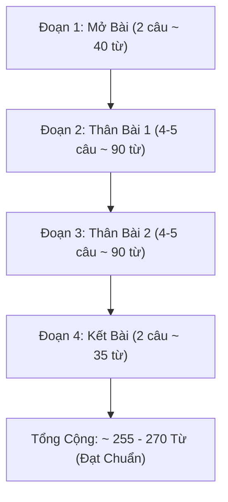

# 🚀 Cẩm Nang Chinh Phục Writing Từ Band 4.0 Lên 5.0 Cho Người Mất Gốc

Đối với người mới bắt đầu hoặc người học bị mất gốc tiếng Anh (đang ở mức **Band 3.5 – 4.0**), bài thi IELTS Writing thường là rào cản đáng sợ nhất. Nhiều bạn lầm tưởng muốn lên điểm phải học từ vựng "khủng" hay ngữ pháp đảo ngữ phức tạp. 

Thực tế theo **IELTS Writing Band Descriptors chính thức của Cambridge**:
- **Band 4.0:** Bài viết bị đứt gãy, nhiều câu què/câu cụt, viết dưới số từ quy định (dưới 150 từ cho Task 1 hoặc dưới 250 từ cho Task 2), lỗi ngữ pháp xuất hiện ở hầu hết mọi câu làm người đọc khó hiểu.
- **Band 5.0:** Bài viết đạt đủ độ dài tối thiểu, có phân chia đoạn văn cơ bản, người đọc có thể hiểu được ý chính dù lỗi ngữ pháp và từ vựng cơ bản vẫn còn xuất hiện thường xuyên.

Cẩm nang này là **phao cứu sinh** giúp bạn vượt qua mốc Band 4.0 để chạm tay vào **Band 5.0 – 5.5** một cách an toàn và thực tế nhất.

---

## 🏗️ 1. Ba Cấu Trúc Câu "Sống Còn" Phải Viết Đúng 100%

Ở mức Band 4.0, lỗi nguy hiểm nhất là **Sentence Fragment (Câu què - thiếu chủ ngữ hoặc vị ngữ)** và **Run-on Sentence (Câu nối tùy tiện bằng dấu phẩy)**. Bạn chỉ cần làm chủ 3 mẫu câu sau:

### Mẫu 1: Câu Đơn (Simple Sentence: S + V + O)
Phải đảm bảo luôn có **1 Chủ ngữ** và **1 Động từ chính** đã được chia thì:
- ❌ *Sai (Band 4.0)*: *In modern society having many cars on the road.* (Câu thiếu động từ chính, dùng "having" vô nghĩa).
- ✅ *Đúng (Band 5.0)*: *There are many cars on the road in modern society.* (S: There, V: are).
- ✅ *Đúng (Band 5.0)*: *Private vehicles cause serious traffic jams.* (S: Private vehicles, V: cause, O: serious traffic jams).

### Mẫu 2: Câu Ghép Dùng Liên Từ Đơn Giản (FANBOYS: and, but, so)
Tuyệt đối không dùng dấu phẩy để nối hai câu độc lập mà không có liên từ:
- ❌ *Sai (Band 4.0)*: *Public transport is cheap, many people use it every day.* (Lỗi Comma Splice).
- ✅ *Đúng (Band 5.0)*: *Public transport is cheap, **so** many people use it every day.*
- ✅ *Đúng (Band 5.0)*: *Cars are convenient, **but** they cause air pollution.*

### Mẫu 3: Câu Phức Dùng "Because" Hoặc "Although"
Lưu ý quy tắc cấm kỵ: **Có Because thì không có So; có Although thì không có But**:
- ❌ *Sai (Band 4.0)*: *Because studying abroad is good, so many students like it.* (Dịch word-by-word từ tiếng Việt "Bởi vì... nên...").
- ✅ *Đúng (Band 5.0)*: *Because studying abroad is beneficial, many students pursue it.*
- ✅ *Đúng (Band 5.0)*: *Although electric cars are expensive, many people want to buy them.*

---

## 📝 2. Bố Cục 4 Đoạn "Chống Liệt" Cho Task 2 (Đảm Bảo > 250 Từ)

Nỗi ám ảnh lớn nhất của thí sinh Band 4.0 là **không viết đủ 250 từ** (viết 210 từ sẽ bị phạt trừ điểm rất nặng vào Task Response). Hãy học thuộc và áp dụng khung sườn 4 đoạn cố định sau:

### 📋 Mẫu dàn ý chi tiết từng câu:

#### 1. Mở bài (Introduction - 2 câu):
- **Câu 1 (Paraphrase đề bài):** *Nowadays, it is true that [chủ đề đề bài].*
- **Câu 2 (Nêu quan điểm):** *In my opinion, I agree with this idea because of several reasons.*

#### 2. Thân bài 1 (Body 1 - Mặt thứ nhất / Lý do 1):
- **Câu 1 (Topic sentence):** *On the one hand, there are several reasons why [ý chính 1].*
- **Câu 2 (Giải thích):** *First, [nêu lý do cụ thể]. This means that [giải thích thêm 1 câu đơn giản].*
- **Câu 3 (Ví dụ):** *For example, in Vietnam, many people [đưa ví dụ đời thường].*
- **Câu 4 (Hệ quả):** *As a result, [kết quả mang lại].*

#### 3. Thân bài 2 (Body 2 - Mặt thứ hai / Lý do 2):
- **Câu 1 (Topic sentence):** *On the other hand, another important point is that [ý chính 2].*
- **Câu 2 (Giải thích):** *Second, [nêu lý do thứ 2]. Because of this, [kết quả].*
- **Câu 3 (Ví dụ):** *For instance, research shows that [ví dụ đơn giản].*
- **Câu 4 (Chốt ý):** *Therefore, this problem should be solved carefully.*

#### 4. Kết bài (Conclusion - 2 câu):
- **Câu 1 (Tóm tắt lại):** *In conclusion, although there are some negative effects, I believe that [nhắc lại quan điểm của bạn].*
- **Câu 2 (Lời khuyên/Dự báo):** *Governments and individuals should work together to improve this situation in the future.*

---

## 📊 3. Khung Viết Task 1 Đạt Chuẩn Band 5.0 (Tối Thiểu 150 Từ)

Rất nhiều bạn thi thử bị điểm Task 1 dưới 4.5 vì **quên viết Overview**. Cambridge quy định: **Không có Overview = Tối đa Band 5.0 Task Achievement**.

### Bộ công thức 3 phần Task 1 cho người mới bắt đầu:

1. **Introduction (1 câu):**
   - *The chart compares the percentage of [đối tượng] in [địa điểm] between [năm X] and [năm Y].*
2. **Overview (2 câu - Cực kỳ quan trọng!):**
   - *Overall, it is clear that the figure for [đối tượng A] increased, while [đối tượng B] decreased over the period.*
   - *In addition, [đối tượng A] was the highest throughout the years.*
3. **Body 1 & Body 2 (Mỗi đoạn 3 - 4 câu mô tả số liệu):**
   - *In [năm đầu], the number of [X] was [số liệu 1].*
   - *After that, it increased significantly to [số liệu 2] in [năm sau].*
   - *By contrast, the figure for [Y] dropped from [số liệu 3] to [số liệu 4].*

---

## ⚠️ 4. Top 10 Từ Hay Sai Chính Tả Nhất Ở Band 4.0 - 5.0

Chỉ cần viết sai 5-7 từ trong bài, điểm Lexical Resource sẽ bị khóa ở Band 4.0. Hãy chép tay và học thuộc 10 từ này:

| ❌ Từ Thường Viết Sai (Band 4.0) | ✅ Từ Đúng 100% | Nghĩa Tiếng Việt |
| :--- | :--- | :--- |
| *goverment* | **government** (có chữ **n**) | chính phủ |
| *enviroment* | **environment** (có chữ **n**) | môi trường |
| *unfortuntely* | **unfortunately** | không may |
| *differnt* | **different** (2 chữ **f**) | khác biệt |
| *alot* | **a lot** (phải viết rời) | nhiều |
| *becuase* | **because** | bởi vì |
| *untill* | **until** (chỉ có 1 chữ **l**) | cho đến khi |
| *succesful* | **successful** (2 chữ **c**, 2 chữ **s**) | thành công |
| *nowaday* | **nowadays** (phải có chữ **s** ở cuối) | ngày nay |
| *oppinion* | **opinion** (chỉ có 1 chữ **p**) | quan điểm |

> [!TIP]
> **Quy tắc vàng lên Band 5.0:**
> "Viết đơn giản nhưng đúng ngữ pháp luôn luôn được điểm cao hơn viết phức tạp mà sai toe toét!"
