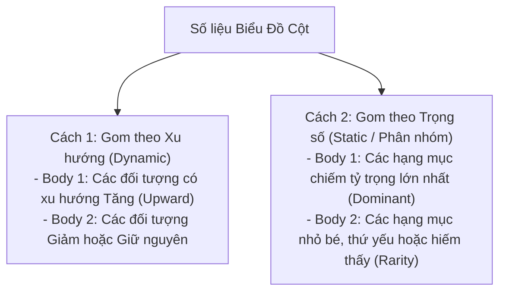

# Task 1: Bar Chart (Biểu Đồ Cột - Dynamic vs Static)

> **Kỹ năng**: WRITING | **Chuyên mục**: Task 1 Strategy  
> **Tóm tắt**: Nhận diện cột theo thời gian (Dynamic) hay so sánh đối tượng độc lập (Static), kỹ thuật gom nhóm thân bài, câu mẫu điểm cao và bài mẫu hoàn chỉnh Band 8.5+ chuẩn Cambridge.

---

### 1. Nhận Diện 3 Dạng Biểu Đồ Cột Phổ Biến Trong Đề Thi Thật

1. **Biểu đồ cột cụm theo thời gian (Clustered Dynamic Bar Chart):**  
   - Có từ 2 mốc thời gian trở lên (ví dụ: chi tiêu các nhóm tuổi năm 2000 vs 2010).  
   - *Chiến lược:* Kết hợp giữa **so sánh tương quan độ cao (Rank)** và **xu hướng biến thiên theo năm (Trend)**.
2. **Biểu đồ cột xếp chồng (Stacked Bar Chart):**  
   - Các thành phần được xếp chồng lên nhau thành tổng thể 100% (ví dụ: thành phần quy mô hộ gia đình 1 đến 6 người năm 1981 và 2001).  
   - *Chiến lược gom nhóm:* Gom nhóm các thành phần có cùng xu hướng tăng vào Body 1 (ví dụ: hộ 1-2 người tăng), và các thành phần có cùng xu hướng giảm vào Body 2 (hộ 3-6 người giảm).
3. **Biểu đồ cột ngang (Horizontal Bar Chart):**  
   - Trục hoành hiển thị phần trăm (%), trục tung hiển thị danh mục khảo sát (ví dụ: các nguồn năng lượng, số giờ làm việc theo ngành).  
   - *Chiến lược:* Đọc số liệu từ trên xuống dưới, làm nổi bật đối tượng dẫn đầu (*top-ranked*) và đối tượng cuối bảng (*least prevalent*).

---

### 2. Chiến Lược Gom Nhóm Thân Bài (Grouping Strategy)

Sai lầm lớn nhất của thí sinh là liệt kê từng cột một cách cơ học từ trái sang phải. Hãy chia 2 đoạn thân bài theo logic sau:

---

### 3. Bảng Mẫu Câu & Cấu Trúc Khảo Thí Đắt Giá (Band 7.5+)

| Cấu Trúc Khảo Thí | Ý Nghĩa Chuyên Sâu | Ví Dụ Ứng Dụng Thực Chiến |
| :--- | :--- | :--- |
| **Held the largest share** | Nắm giữ thị phần / tỷ trọng lớn nhất | *"Classes with 21–25 students **held the largest share** in three out of four states."* |
| **A rarity in [category]** | Là một trường hợp cực kỳ hiếm thấy | *"In stark contrast, classes containing over 30 pupils were **a complete rarity**, accounting for merely 4%."* |
| **The converse was true in the case of** | Điều hoàn toàn ngược lại diễn ra ở trường hợp của... | *"While 2-person households grew, **the converse was true in the case of** large families."* |
| **Distantly followed by** | Theo sau ở một khoảng cách rất xa | *"Germany topped the list at 45%, **distantly followed by** Italy at just 12%."* |
| **Witnessed the same level of decrease** | Chứng kiến mức sụt giảm giống hệt nhau | *"Both 3-person and 4-person households **witnessed the same level of decrease**, falling by exactly 3%."* |
| **A negligible difference was observed in** | Ghi nhận sự khác biệt không đáng kể ở... | *"**A negligible difference was observed in** the proportions of men and women opting for public transit."* |
| **Reached parity with** | Đạt mức cân bằng, ngang ngửa với | *"By 2005, rugby participants plummeted, **reaching parity with** badminton at exactly 50 players."* |

---

### 4. Đề Thi Mẫu Thực Tế (Cambridge Authentic Task 1 Prompt)

> **The bar chart below shows the total number of minutes (in billions) of telephone calls in the UK, divided into three categories, from 1995 to 2002.**  
> *Summarise the information by selecting and reporting the main features, and make comparisons where relevant.*  
> *Write at least 150 words.*

#### Bảng Dữ Liệu Tóm Tắt (Billion Minutes):
- **Local calls (fixed lines)**: Năm 1995 đạt 72 tỷ phút $\rightarrow$ Tăng lên đỉnh 90 tỷ phút năm 1999 $\rightarrow$ Giảm dần xuống còn 72 tỷ phút năm 2002.
- **National and international calls (fixed lines)**: Năm 1995 đạt gần 38 tỷ phút $\rightarrow$ Tăng đều đặn liên tục qua các năm lên 61 tỷ phút năm 2002.
- **Mobile calls**: Năm 1995 chỉ vỏn vẹn khoảng 4 tỷ phút $\rightarrow$ Tăng trưởng bùng nổ gấp hơn 11 lần, đạt 45 tỷ phút vào năm 2002.

#### Chiến Lược Gom Nhóm Dữ Liệu:
- **Overview**: Cuộc gọi cố định nội hạt luôn chiếm ưu thế vượt trội xuyên suốt thời kỳ dù có xu hướng giảm ở cuối kỳ; trong khi đó các cuộc gọi di động chứng kiến sự gia tăng đột phá nhất.
- **Body 1 (Local calls)**: Phân tích đường nội hạt - luôn giữ vị trí số 1, diễn biến tăng rồi hạ về mức xuất phát.
- **Body 2 (National/international & Mobile calls)**: Đối chiếu 2 nhóm cuộc gọi còn lại - cùng có xu hướng tăng liên tục, đặc biệt nhấn mạnh sự bùng nổ của điện thoại di động.

---

### 5. Bài Viết Mẫu Hoàn Chỉnh Band 8.5+ (Full Model Essay)

> The bar chart compares the duration of telephone calls in the United Kingdom, measured in billions of minutes, across three distinct categories between 1995 and 2002.
>
> Overall, it is evident that local-line calls consistently absorbed the highest call volume throughout the surveyed timeframe, despite undergoing a mid-period peak and subsequent decline. Conversely, both national/international and mobile calls recorded uninterrupted upward trends, with mobile call duration experiencing the most dramatic expansion.
>
> In 1995, UK residents devoted approximately 72 billion minutes to local fixed-line calls. This figure climbed steadily to reach a peak of 90 billion minutes in 1999, before dropping back noticeably to conclude the period at its initial level of around 72 billion minutes in 2002.
>
> Regarding the remaining categories, national and international landline calls began at roughly 38 billion minutes in 1995 and exhibited a steady, progressive rise to finish at approximately 61 billion minutes. The most remarkable change occurred in the mobile phone sector; starting from a negligible figure of just under 4 billion minutes in 1995, mobile call time escalated exponentially, surpassing a tenfold increase to reach 45 billion minutes by 2002. *(188 words)*

---

### 6. Phân Tích Chấm Điểm 4 Tiêu Chí (Examiner Feedback)

| Tiêu Chí Khảo Thí | Phân Tích Điểm Sáng Trong Bài Mẫu Band 8.5+ |
| :--- | :--- |
| **Task Achievement (TA)** | - Nêu bật được cả tính năng tổng thể (Local luôn cao nhất) và xu hướng bùng nổ của Mobile. - Số liệu cụ thể được lựa chọn đắt giá (72 tỷ $\rightarrow$ 90 tỷ $\rightarrow$ 72 tỷ; 38 tỷ $\rightarrow$ 61 tỷ; 4 tỷ $\rightarrow$ 45 tỷ). |
| **Coherence & Cohesion (CC)** | - Bố cục tách bạch rõ ràng giữa nhóm số 1 (Local) và nhóm cùng tăng trưởng (National & Mobile). - Sử dụng từ nối mạch lạc: *Conversely, Regarding the remaining categories, The most remarkable change*. |
| **Lexical Resource (LR)** | - Ngôn ngữ mô tả số lượng học thuật: *absorbed the highest call volume, uninterrupted upward trends, dramatic expansion, devoted approximately, progressive rise, negligible figure, escalated exponentially, tenfold increase*. |
| **Grammatical Range & Accuracy (GRA)** | - Cấu trúc câu linh hoạt: *despite undergoing a mid-period peak*, mệnh đề phân từ *surpassing a tenfold increase to reach...*, cấu trúc nhượng bộ và bị động thời quá khứ đơn chuẩn xác 100%. |

---

> **Luyện tập thực chiến:** Mở ứng dụng [IELTS Practice Web](https://ielts-practice-vietnamese.vercel.app/) để thực hành dạng Bar Chart với các bộ đề Cambridge từ 10 đến 19 và nhận phản hồi chi tiết từ Giám khảo AI.

| ← Bài trước | Mục Lục | Bài tiếp theo → |
| :--- | :---: | ---: |
| [8. Task 1: Line Graph (Biểu Đồ Đường)](task1-line-graph.md) | [Mục Lục Cẩm Nang](../README.md) | [10. Task 1: Pie Chart (Biểu Đồ Tròn)](task1-pie-chart.md) |
