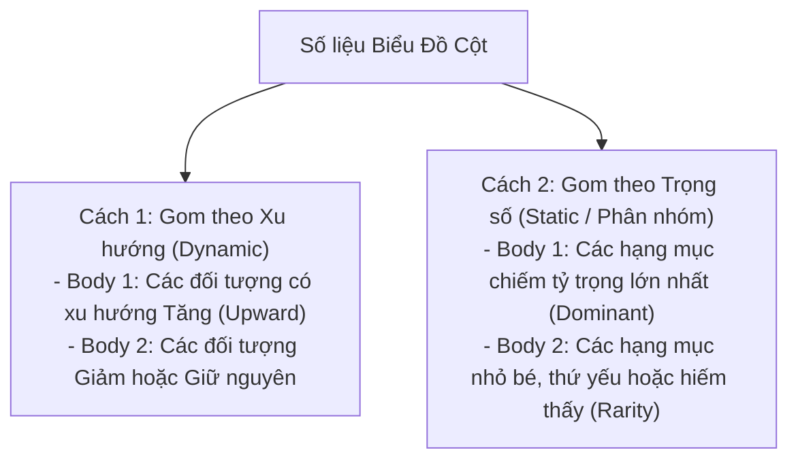

# Task 1: Bar Chart (Biểu Đồ Cột - Dynamic vs Static)

> **Kỹ năng**: WRITING | **Chuyên mục**: task1
> **Tóm tắt**: Nhận diện cột theo thời gian (Dynamic) hay so sánh đối tượng độc lập (Static) và cách gom nhóm.

---

### 1. Nhận Diện 3 Dạng Biểu Đồ Cột Phổ Biến Trong Đề Thi Thật

1. **Biểu đồ cột cụm theo thời gian (Clustered Dynamic Bar Chart):**  
   - Có từ 2 mốc thời gian trở lên (ví dụ: chi tiêu các nhóm tuổi năm 2000 vs 2010).  
   - *Chiến lược:* Kết hợp giữa **so sánh tương quan độ cao (Rank)** và **xu hướng biến thiên theo năm (Trend)**.
2. **Biểu đồ cột xếp chồng (Stacked Bar Chart):**  
   - Các thành phần được xếp chồng lên nhau thành tổng thể 100% (ví dụ: thành phần quy mô hộ gia đình 1 đến 6 người năm 1981 và 2001).  
   - *Chiến lược gom nhóm:* Gom nhóm các thành phần có cùng xu hướng tăng vào Body 1 (ví dụ: hộ 1-2 người tăng), và các thành phần có cùng xu hướng giảm vào Body 2 (hộ 3-6 người giảm).
3. **Biểu đồ cột ngang (Horizontal Bar Chart):**  
   - Trục hoành hiển thị phần trăm (%), trục tung hiển thị danh mục khảo sát (ví dụ: chất lượng không khí, nước, truyền thông).  
   - *Chiến lược:* Đọc số liệu từ trên xuống dưới, làm nổi bật đối tượng dẫn đầu (*top-ranked*) và đối tượng cuối bảng (*least prevalent*).

---

### 2. Chiến Lược Gom Nhóm Thân Bài (Grouping Strategy)

Sai lầm lớn nhất của thí sinh là liệt kê từng cột một cách cơ học từ trái sang phải. Hãy chia 2 đoạn thân bài theo logic sau:

---

### 3. Bảng Mẫu Câu & Cấu Trúc Khảo Thí Đắt Giá (Band 7.5+)

| Cấu Trúc Khảo Thí | Ý Nghĩa Chuyên Sâu | Ví Dụ Ứng Dụng Thực Chiến |
| :--- | :--- | :--- |
| **Held the largest share** | Nắm giữ thị phần / tỷ trọng lớn nhất | *"Classes with 21–25 students **held the largest share** in three out of four states."* |
| **A rarity in [category]** | Là một trường hợp cực kỳ hiếm thấy | *"In stark contrast, classes containing over 30 pupils were **a complete rarity**, accounting for merely 4%."* |
| **The converse was true in the case of** | Điều hoàn toàn ngược lại diễn ra ở trường hợp của... | *"While 2-person households grew, **the converse was true in the case of** large families."* |
| **Distantly followed by** | Theo sau ở một khoảng cách rất xa | *"Germany topped the list at 45%, **distantly followed by** Italy at just 12%."* |
| **Witnessed the same level of decrease** | Chứng kiến mức sụt giảm giống hệt nhau | *"Both 3-person and 4-person households **witnessed the same level of decrease**, falling by exactly 3%."* |
| **A negligible difference was observed in** | Ghi nhận sự khác biệt không đáng kể ở... | *"**A negligible difference was observed in** the proportions of men and women opting for public transit."* |
| **Reached parity with** | Đạt mức cân bằng, ngang ngửa với | *"By 2005, rugby participants plummeted, **reaching parity with** badminton at exactly 50 players."* |

---

### 4. Checklist Tự Soát Lỗi Cho Dạng Bar Chart
- [ ] Nếu là biểu đồ Static (1 năm): Đã đảm bảo không dùng từ `increased, declined, fluctuated` chưa?
- [ ] Đã chỉ ra được khoảng cách chênh lệch (*double that of, threefold, tenfold*) thay vì chỉ chép lại số liệu rời rạc chưa?
- [ ] Đoạn Overview đã nêu được hạng mục cao nhất và xu hướng tổng quát chưa?

---

> **Luyện tập thực chiến:** Mở ứng dụng [IELTS Practice Web](https://ielts-practice-vietnamese.vercel.app/) để thực hành và nhận đánh giá chi tiết từ AI.

| ← Bài trước | Mục Lục | Bài tiếp theo → |
| :--- | :---: | ---: |
| [8. Task 1: Line Graph (Biểu Đồ Đường)](task1-line-graph.md) | [Mục Lục Cẩm Nang](../README.md) | [10. Task 1: Pie Chart (Biểu Đồ Tròn)](task1-pie-chart.md) |
