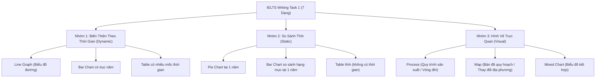
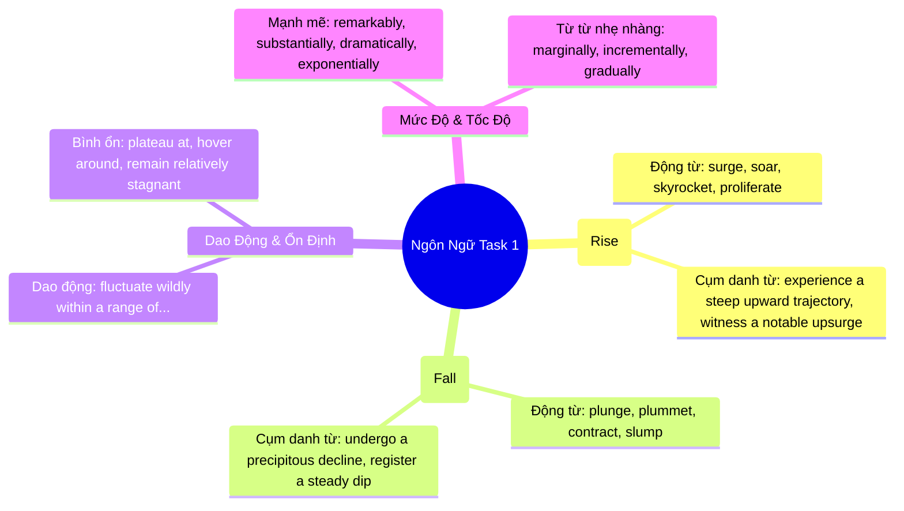

# 📈 Master Chiến Lược Toàn Diện IELTS Writing Task 1

> **Kỹ năng**: WRITING | **Chuyên mục**: Task 1 Master Guide  
> **Tóm tắt**: Cẩm nang bẻ khóa toàn diện tất cả 7 dạng bài biểu đồ và hình vẽ Task 1 đạt chuẩn Band 7.5+, công thức viết Overview bất bại và kỹ thuật gom nhóm số liệu khoa học.

---

## 🗺️ 1. Bản Đồ Phân Loại 7 Dạng Bài Task 1

Task 1 kiểm tra khả năng tóm tắt, miêu tả và so sánh thông tin số liệu trong **tối thiểu 150 từ** (khuyến nghị lý tưởng: **170 – 190 từ**) trong vòng **20 phút**:

---

## 🏆 2. Tuyệt Chiêu Viết Câu Overview "Ăn Điểm Tuyệt Đối"

Theo quy định khảo thí của Cambridge: **Nếu bài viết không có Overview rõ ràng, điểm Task Achievement sẽ bị khóa ở Band 5.0**, bất kể từ vựng hay ngữ pháp có xuất sắc đến đâu.

### 📐 Công thức Overview 2 câu cho từng nhóm dạng bài:

#### Nhóm 1: Biểu đồ biến thiên theo thời gian (Dynamic Charts)
- **Câu 1 (Xu hướng chung):** Đối tượng nào có xu hướng tăng, đối tượng nào giảm hoặc giữ nguyên?
- **Câu 2 (Đối tượng nổi bật):** Đối tượng nào giữ vị trí cao nhất (dominant) xuyên suốt chu kỳ, hoặc đối tượng nào có sự bứt phá mạnh mẽ nhất?

#### Nhóm 2: Biểu đồ so sánh tĩnh tại 1 thời điểm (Static Charts)
- **Câu 1 (Thống trị):** Hạng mục nào chiếm thị phần / tỷ trọng áp đảo nhất?
- **Câu 2 (Ngược lại):** Hạng mục nào chiếm tỷ lệ thấp nhất hoặc có sự tương đồng đáng chú ý?

---

### 🔬 Ví dụ đối chiếu thực tế: Viết Overview cho biểu đồ tiêu thụ năng lượng

> **Đề bài mô phỏng:** *Biểu đồ đường thể hiện mức tiêu thụ than đá (Coal), dầu mỏ (Oil) và năng lượng tái tạo (Renewable Energy) tại Anh từ năm 1980 đến 2025.*

❌ **Overview Band 5.0 (Mắc lỗi kể lể số liệu cụ thể):**
> *"Overall, the figure for Oil started at 45 million tonnes in 1980 and then increased to 60 million in 2025. Coal was 30 million tonnes and renewable energy was only 5 million."*  
> 🚨 **Tại sao bị trừ điểm?** Overview là bức tranh toàn cảnh, việc đưa số liệu chi tiết (`45 million`, `60 million`, `30 million`) vào Overview là sai chức năng, khiến đoạn văn biến thành một đoạn Thân bài rời rạc.

✅ **Overview Band 8.5 (Toàn cảnh, sắc bén, không đưa số liệu rời):**
> *"Overall, it is readily apparent that while the consumption of oil and renewable energy experienced upward trajectories, the opposite was true for coal. In addition, oil remained the primary energy source throughout the examined period, whereas renewable energy recorded the most dramatic growth rate despite starting from the lowest point."*  
> 💡 **Tại sao đạt điểm tối đa?**
> - Câu 1 tổng kết xu hướng tăng/giảm bằng cặp đối lập: *experienced upward trajectories, the opposite was true for coal*.
> - Câu 2 chỉ ra đối tượng cao nhất xuyên suốt (*oil remained the primary energy source*) và đối tượng bứt phá mạnh nhất (*recorded the most dramatic growth rate*).

---

## 📊 3. Kỹ Thuật Gom Nhóm Số Liệu (Data Grouping) Thân Bài 1 & Thân Bài 2

Sai lầm lớn nhất của thí sinh mức điểm 6.0 là **kể lể máy móc theo từng năm** (năm 1980 thế này, năm 1990 thế kia, năm 2000 thế nọ...). Giám khảo tìm kiếm khả năng **so sánh và phân nhóm logic (Categorization)**:

### 2 Phương pháp gom nhóm kinh điển:

| Phương Pháp Gom Nhóm | Cách Triển Khai Cụ Thể | Phù Hợp Cho Dạng Bài |
| :--- | :--- | :--- |
| **Gom nhóm theo xu hướng tương đồng (Trend-based Grouping)** | - **Body 1:** Gom tất cả các đường có xu hướng TĂNG vào mô tả và so sánh với nhau. - **Body 2:** Gom tất cả các đường có xu hướng GIẢM hoặc KHÔNG ĐỔI vào mô tả. | Biểu đồ đường (Line graph), Biểu đồ cột có từ 4 đường/cột trở lên. |
| **Gom nhóm theo mốc thời gian (Chronological Halving)** | - **Body 1:** Miêu tả bức tranh ở năm đầu tiên và các diễn biến chính đến giữa kỳ. - **Body 2:** Miêu tả giai đoạn cuối kỳ, nhấn mạnh vào các điểm giao cắt (Crossovers) và thứ hạng về đích. | Biểu đồ có ít đường (2-3 đường) nhưng biến động phức tạp, nhiều điểm giao nhau. |

---

## 💎 4. Bộ Từ Vựng Học Thuật Miêu Tả Biến Động Số Liệu Chuẩn C1/C2

Thay vì lặp đi lặp lại những từ cơ bản như *"increase"* hay *"decrease"*, hãy sử dụng các cặp Động từ – Trạng từ hoặc Cụm danh từ phong phú sau:

---

## 🚫 5. Ba "Cờ Đỏ" Khiến Thí Sinh Bị Hạ Điểm Oan Trong Task 1

1. **Đưa ý kiến cá nhân (Personal Opinions):** Task 1 là bài báo cáo khách quan. Tuyệt đối không được giải thích lý do tại sao số liệu tăng/giảm nếu biểu đồ không nói (ví dụ: *"Oil increased because people bought more cars"* ➡️ **Bị trừ điểm TR nặng nề vì tự suy diễn**).
2. **Quên đơn vị đo lường (Units):** Biểu đồ đo bằng *nghìn người (thousands)* hay *triệu tấn (million tonnes)* hay *phần trăm (%)*. Nếu viết thiếu đơn vị, số liệu hoàn toàn mất giá trị.
3. **Sai thì thời gian (Tense Inconsistency):** Nếu biểu đồ nói về năm 1990 - 2020, toàn bộ bài phải dùng thì **Quá khứ đơn (Past Simple)**. Chỉ dùng Hiện tại hoàn thành hoặc cấu trúc tương lai (*is projected to, is predicted to*) khi có năm sau thời điểm hiện tại.
