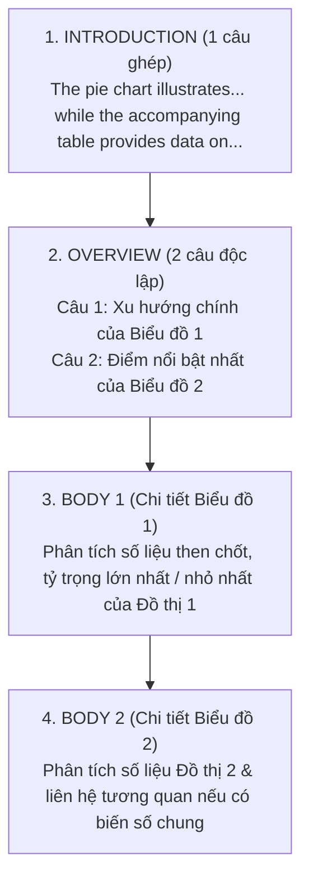

# Task 1: Tuyệt Chiêu Xử Lý Biểu Đồ Kết Hợp (Multiple / Mixed Charts)

Trong bài thi IELTS Writing Task 1, **Biểu đồ kết hợp (Mixed Charts)** là dạng bài xuất hiện 2 đồ thị khác nhau trong cùng một đề thi (Ví dụ: *Biểu đồ tròn + Bảng số liệu*, hoặc *Biểu đồ cột + Biểu đồ đường*).

Rất nhiều thí sinh hoang mang vì nghĩ rằng phải mô tả gấp đôi khối lượng số liệu trong cùng 20 phút. Tuy nhiên, trên thực tế, số liệu trong mỗi biểu đồ đơn của đề Mixed thường **ít hơn và đơn giản hơn** so với đề biểu đồ đơn lẻ!

Nắm vững nguyên tắc **"Tách biệt thân bài – Đồng điệu tổng quan"** sẽ giúp bạn xử lý dạng bài này một cách thanh thoát và chuẩn xác.

---

## 1. Cấu Trúc Bố Cục 4 Đoạn Chuẩn Mực Cho Mixed Charts

### Quy tắc sống còn ở đoạn Overview:
> [!WARNING]
> **Bẫy mất điểm Task Achievement ở Overview:**
> Nếu bạn chỉ viết tổng quan cho Biểu đồ 1 mà quên không tóm tắt đặc điểm nổi bật của Biểu đồ 2, điểm tiêu chí Task Achievement của bạn sẽ **bị khóa trần ở Band 5.0** vì đã bỏ sót một nửa dữ liệu đề bài! Đoạn Overview của đề Mixed bắt buộc phải gồm **2 mệnh đề hoặc 2 câu rõ ràng**, mỗi câu đại diện cho một biểu đồ.

---

## 2. Phân Tích Đề Bài Thực Chiến Chuẩn Cambridge

> **Đề bài thực tế:**  
> *The pie chart below shows the proportion of electricity generated from various energy sources in a European country in 2020.*  
> *The table gives information about the carbon emissions produced by each energy sector in the same year.*

### Dữ liệu tóm tắt:
* **Pie Chart (Cơ cấu nguồn điện 2020):**
  * Hóa thạch (Fossil fuels - Than đá & Khí đốt): Chiếm phần lớn với **60%** (Than đá: 35%, Khí đốt: 25%).
  * Năng lượng tái tạo (Renewables - Gió & Mặt trời): Chiếm **30%**.
  * Hạt nhân (Nuclear): Chiếm **10%**.
* **Table (Lượng khí thải carbon - Triệu tấn):**
  * Than đá (Coal): **120 triệu tấn** (Cao nhất áp đảo).
  * Khí đốt (Gas): **45 triệu tấn**.
  * Tái tạo (Renewables): **Chỉ 2 triệu tấn**.
  * Hạt nhân (Nuclear): **1 triệu tấn**.

---

## 3. Bài Mẫu Hoàn Chỉnh Band 8.0+

The pie chart delineates the proportion of electricity generated from diverse energy sources in a European nation in 2020, while the accompanying table provides a breakdown of the corresponding carbon emissions produced by each sector in the same year.

Overall, fossil fuels were the predominant source of electrical generation, with coal and natural gas collectively accounting for the vast majority of output. Consequently, the energy sectors reliant on fossil fuels were responsible for nearly all carbon dioxide emissions, whereas renewable and nuclear sources contributed negligibly to atmospheric pollution.

Looking first at the distribution of power generation, coal was the single largest contributor, supplying 35% of the total electricity, followed closely by natural gas at 25%. In contrast, renewable alternatives—predominantly wind and solar power—constituted 30% of the aggregate production. Nuclear energy represented the smallest share, generating merely one-tenth of the nation’s electricity.

Turning to the environmental impact, the table reveals a stark disparity in carbon output. Coal-fired stations released by far the highest volume of emissions, generating a staggering 120 million tonnes. Natural gas accounted for the second-largest quantity at 45 million tonnes. Conversely, clean energy sectors exhibited minimal environmental footprints, with renewable facilities and nuclear reactors generating a modest 2 million tonnes and 1 million tonnes of carbon dioxide, respectively.

*(214 words)*

---

## 4. Bảng Phân Tích Từ Vựng & Cấu Trúc Câu Điểm Cao

| Cấu Trúc / Từ Vựng | Ý Nghĩa & Vai Trò | Ví Dụ Trong Bài Mẫu |
| :--- | :--- | :--- |
| **while the accompanying table...** | Mệnh đề liên kết 2 biểu đồ trong Mở bài | *The pie chart illustrates... while the accompanying table provides a breakdown of...* |
| **predominant source** (n) | Nguồn cung chủ đạo, chiếm ưu thế | *Fossil fuels were the predominant source of electrical generation.* |
| **collectively accounting for** | Cùng nhau chiếm tổng cộng bao nhiêu | *...with coal and gas collectively accounting for the vast majority.* |
| **contributed negligibly to** (v) | Đóng góp một lượng không đáng kể | *...contributed negligibly to atmospheric pollution.* |
| **stark disparity** (n) | Sự chênh lệch rõ rệt, một trời một vực | *The table reveals a stark disparity in carbon output.* |
| **minimal environmental footprints** | Dấu chân sinh thái tối thiểu, ít gây hại | *Clean energy sectors exhibited minimal environmental footprints.* |
| **by far the highest volume** | Vượt xa các đối tượng khác ở vị trí dẫn đầu | *Released by far the highest volume of emissions.* |

---

## 5. Checklist Tự Kiểm Tra Khi Làm Dạng Mixed Charts

> [!TIP]
> 1. **Mở bài:** Đã giới thiệu đầy đủ tên gọi và nội dung của **cả 2 biểu đồ** bằng một câu ghép mượt mà chưa?
> 2. **Overview:** Đã chỉ ra xu hướng chủ đạo của Biểu đồ 1 và điểm số liệu ấn tượng nhất của Biểu đồ 2 chưa?
> 3. **Thân bài:** Body 1 viết riêng cho Biểu đồ 1 và Body 2 viết riêng cho Biểu đồ 2 để người đọc không bị rối rắm.
> 4. **Số liệu:** Có nêu đầy đủ số liệu dẫn chứng cụ thể (kèm đơn vị đo `%` và `million tonnes`) không?

---

| ← Bài trước | Mục Lục | Bài tiếp theo → |
| :--- | :---: | ---: |
| [13. Task 1: Map (Bản Đồ)](task1-map.md) | [Mục Lục Cẩm Nang](../README.md) | [15. Task 1: Mặt Bằng Kiến Trúc & Quy Trình Sản Xuất](writing-task1-floor-plans-processes.md) |
