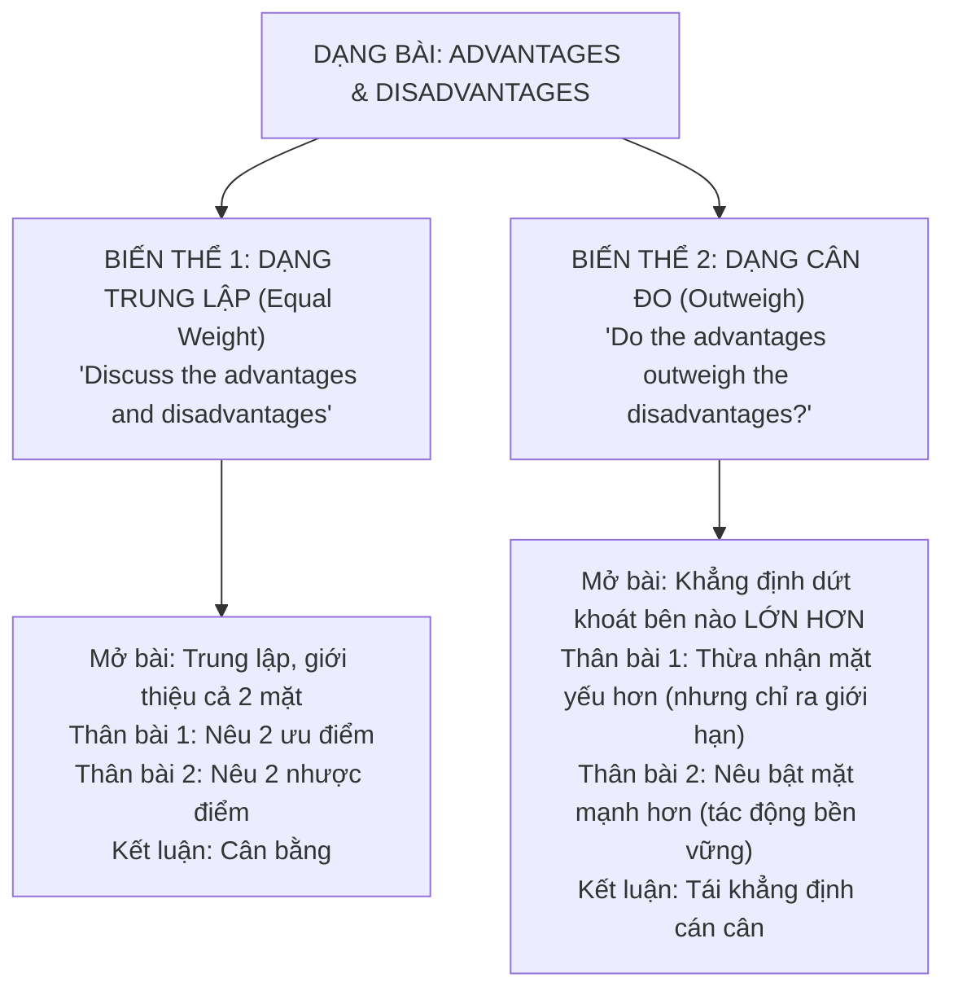

# Task 2: Dạng Bài Advantages and Disadvantages & Bí Kíp Cân Đo "Outweigh"

Trong bài thi IELTS Writing Task 2, dạng bài **Ưu điểm và Nhược điểm (Advantages and Disadvantages)** là một trong những dạng đề xuất hiện thường xuyên nhất. Tuy nhiên, rất nhiều thí sinh mất điểm oan ở tiêu chí **Task Achievement (Trả lời đúng trọng tâm đề bài)** vì không phân biệt được hai biến thể hoàn toàn khác nhau của dạng bài này.

---

## 1. Phân Biệt Hai Biến Thể Đề Bài Cốt Lõi

### Biến thể 1: Dạng trung lập (Không so sánh)
* **Dấu hiệu nhận biết:**  
  * *"Discuss the advantages and disadvantages of this trend."*  
  * *"What are the benefits and drawbacks of living in a large city?"*
* **Yêu cầu:** Bạn chỉ cần phân tích khách quan các mặt lợi và mặt hại với độ dài tương đương nhau, **tuyệt đối không cần đưa ra kết luận bên nào tốt hơn**.

### Biến thể 2: Dạng cân đo ("Outweigh" - Nghiêng hẳn về một bên)
* **Dấu hiệu nhận biết:**  
  * *"Do the advantages outweigh the disadvantages?"*  
  * *"Do you think the benefits surpass the drawbacks?"*
* **Yêu cầu sống còn:** Bạn **bắt buộc phải trả lời dứt khoát bên nào nặng ký hơn ngay tại câu Mở bài (Thesis Statement)** và giữ vững lập trường xuyên suốt toàn bài. Nếu bạn viết một bài trung lập 50/50 cho đề bài dạng "Outweigh", điểm Task Achievement của bạn sẽ bị chặn ở mức **Band 6.0**!

---

## 2. Chiến Thuật "Giảm Thiểu Hóa" (Minimization Technique) Để Viết Bài Outweigh

Để chứng minh rằng **Ưu điểm vượt trội hơn Nhược điểm**, cấu trúc thân bài hoàn hảo nhất là:

1. **Thân bài 1 (Thừa nhận nhược điểm nhưng giảm thiểu hóa):**  
   Nêu ra những bất lợi mà xu hướng này gây ra, nhưng ngay lập tức chứng minh rằng các nhược điểm này chỉ mang tính **ngắn hạn (short-term)**, có thể phòng tránh hoặc khắc phục được bằng chính sách và công nghệ.
2. **Thân bài 2 (Tôn vinh ưu điểm mang tính nền tảng):**  
   Trình bày các lợi ích vượt bậc mang tính **lâu dài (long-term sustainability)**, tác động sâu sắc đến kinh tế, giáo dục hoặc chất lượng sống của toàn xã hội.

---

## 3. Phân Tích Đề Bài Mẫu Chuẩn Cambridge

> **Đề bài thực chiến:**  
> *In many countries, an increasing number of people are choosing to buy goods online instead of going to traditional brick-and-mortar shops.*  
> *Do the advantages of this trend outweigh the disadvantages?*

### 1. Dàn ý chuẩn bị 5 phút:
* **Quan điểm (Position):** Ưu điểm vượt trội hoàn toàn nhược điểm (Advantages outweigh disadvantages).
* **Body 1 (Drawbacks):**
  * *Nhược điểm 1:* Nguy cơ mua phải hàng kém chất lượng, sai kích cỡ do không được kiểm tra trực tiếp (*cannot inspect physical goods*).
  * *Nhược điểm 2:* Đe dọa các cửa hàng truyền thống, gia tăng tỷ lệ thất nghiệp cục bộ.
  * *Giảm thiểu hóa:* Các chính sách đổi trả hàng nghiêm ngặt (*stringent return policies*) và bảo vệ người tiêu dùng số đang dần giải quyết vấn đề này.
* **Body 2 (Benefits):**
  * *Ưu điểm 1:* Tiết kiệm thời gian, công sức và chi phí đi lại; dễ dàng so sánh giá cả (*unrivaled convenience & price transparency*).
  * *Ưu điểm 2:* Mở rộng cơ hội kinh doanh toàn cầu cho các doanh nghiệp vừa và nhỏ, thúc đẩy nền kinh tế số phát triển.

### 2. Bài mẫu hoàn chỉnh Band 8.0+:

In recent years, the rapid proliferation of e-commerce has led to a significant paradigm shift, with consumers increasingly purchasing merchandise online rather than patronizing conventional brick-and-mortar establishments. Although this development brings certain undeniable drawbacks regarding consumer vulnerability and local retail decline, I firmly believe that its multifaceted benefits in terms of convenience and economic efficiency are far more substantial.

On the one hand, critics legitimately raise concerns regarding the pitfalls of virtual transactions. The most conspicuous disadvantage is the inability of shoppers to physically inspect goods prior to payment, which frequently results in discrepancies regarding product quality, fabric texture, or sizing accuracy. Furthermore, the dominance of online retail giants exerts immense competitive pressure on high-street independent stores, inevitably leading to shop closures and localized unemployment among retail staff. Nevertheless, these problems are largely transient and mitigable. With the widespread implementation of stringent consumer protection laws, secure digital payment gateways, and hassle-free return protocols, fraudulent activities and purchasing risks are being curtailed effectively.

On the other hand, the profound merits of online shopping unequivocally eclipse these aforementioned reservations. Chief among these is the unrivaled convenience that digital marketplaces afford modern citizens. Regardless of geographical constraints or operating hours, consumers can acquire necessities and niche items with a few taps on a smartphone, thereby saving substantial commute time and fuel expenditures. Moreover, e-commerce fosters heightened price transparency, empowering buyers to cross-compare quotations across multiple vendors and secure optimal deals. On a macroeconomic scale, digital platforms democratize commerce by lowering overhead costs for small and medium-sized enterprises, enabling entrepreneurial ventures to reach national and international customer bases without the burden of prohibitive physical storefront rents.

In conclusion, while the decline of traditional retail spaces and occasional issues with product expectations cannot be dismissed entirely, they are far outweighed by the extraordinary gains in convenience, market transparency, and entrepreneurial dynamism fostered by the digital revolution.

*(328 words)*

---

## 4. Bảng Phân Tích Từ Vựng & Collocations C1/C2 Đắt Giá

| Từ Vựng / Collocation | Ý Nghĩa Tiếng Việt | Ngữ Cảnh Ứng Dụng Trong Task 2 |
| :--- | :--- | :--- |
| **paradigm shift** (n) | Sự chuyển dịch mô hình mang tính bước ngoặt | Dùng để mở bài mô tả các xu hướng lớn của thời đại. |
| **brick-and-mortar establishments** | Các cửa hàng truyền thống ngoài đời thực | Thay thế tự nhiên cho cụm *traditional shops*. |
| **discrepancies regarding quality** | Sự sai lệch, khác biệt về chất lượng | Diễn tả việc hàng nhận được khác với hình ảnh trên mạng. |
| **transient and mitigable** (adj) | Tạm thời và có thể giảm thiểu/khắc phục được | Cụm từ "thần thánh" dùng để giảm thiểu hóa nhược điểm ở Body 1. |
| **stringent consumer protection** | Các quy định bảo vệ người tiêu dùng nghiêm ngặt | Dẫn chứng chính sách của chính phủ. |
| **unrivaled convenience** (n) | Sự tiện lợi vô song, không gì sánh bằng | Điểm nhấn vượt trội để tôn vinh ưu điểm ở Body 2. |
| **democratize commerce** (v) | Bình đẳng hóa hoạt động thương mại | Mở ra cơ hội kinh doanh cho mọi tầng lớp xã hội. |
| **prohibitive storefront rents** | Tiền thuê mặt bằng đắt đỏ không kham nổi | Phân tích gánh nặng chi phí của cửa hàng truyền thống. |

---

## 5. Checklist Tự Kiểm Tra Bài Viết Dạng Outweigh

> [!IMPORTANT]
> Trước khi nộp bài, hãy tự rà soát 4 câu hỏi kiểm tra tính sống còn:
> 1. **Thesis Statement:** Mở bài đã khẳng định dứt khoát bên nào nặng hơn chưa? (Có dùng các từ như *far outweigh, substantially eclipse, exceed* không?)
> 2. **Cấu trúc đoạn:** Body 1 đã giải thích nhược điểm nhưng có câu "hóa giải" (*Nevertheless, this is mitigable*) chưa?
> 3. **Độ sâu Body 2:** Đoạn về ưu điểm có dài hơn, lập luận vững chắc và sâu sắc hơn đoạn nhược điểm không?
> 4. **Kết bài:** Kết luận có nhắc lại sự chênh lệch cán cân một cách nhất quán không?

---

| ← Bài trước | Mục Lục | Bài tiếp theo → |
| :--- | :---: | ---: |
| [20. Task 2: Discuss Both Views](task2-discussion.md) | [Mục Lục Cẩm Nang](../README.md) | [22. Task 2: Problem & Solution](task2-problem-solution.md) |
