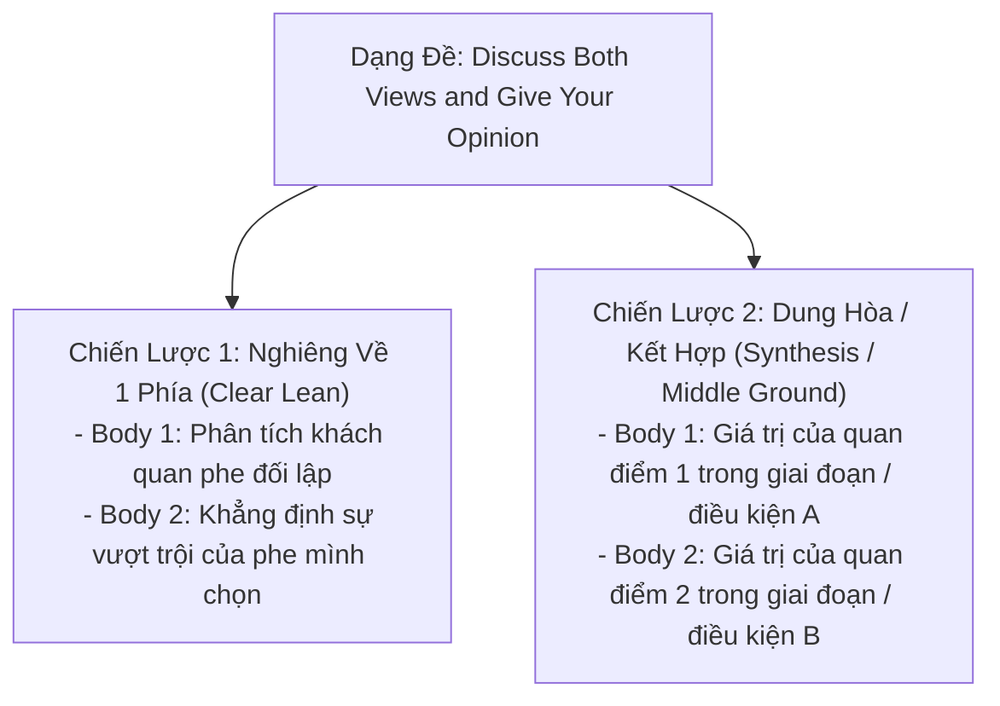

# Task 2: Discussion (Discuss Both Views and Give Your Opinion)

> **Kỹ năng**: WRITING | **Chuyên mục**: task2
> **Tóm tắt**: Cân đối phân tích cả 2 góc nhìn khách quan và lồng ghép quan điểm cá nhân hợp lý.

---

### 1. Điểm Khác Biệt Sống Còn Với Dạng Opinion
Dạng đề: *"Discuss both views and give your opinion."*
- **Bắt buộc**: Phải thảo luận cả 2 quan điểm một cách công bằng về dung lượng (độ dài tương đương nhau). Nếu bạn viết đoạn 1 chỉ 3 câu hời hợt và đoạn 2 tới 8 câu, bạn sẽ bị giám khảo trừ điểm tiêu chí **Task Response** vì phát triển ý không đồng đều.
- **Vị trí của Opinion**: Ý kiến của bạn phải xuất hiện rõ ràng ở 3 vị trí: Mở bài (Thesis Statement), Thân bài mà bạn ủng hộ, và Kết bài (Conclusion).

---

### 2. Hai Hướng Tiếp Cận Lập Trường Trong Dạng Discussion

#### Hướng A: Nghiêng hẳn về một phía (Clear Lean - Khuyên Dùng Cho Mọi Band)
- **Thân bài 1 (Phe bạn không đồng tình):** Dùng giọng văn khách quan phân tích lý do tại sao một số người lại có quan điểm đó:  
  👉 *"On the one hand, proponents of [View A] argue that..."*
- **Thân bài 2 (Phe bạn đồng tình):** Đưa quan điểm cá nhân trực tiếp vào câu mở đoạn và giải thích tính ưu việt:  
  👉 *"On the other hand, I side with those who claim that [View B] yields more profound benefits..."*

#### Hướng B: Dung hòa cả hai quan điểm (Middle Ground / Synthesis - Đạt Band 8.0+)
- **Ví dụ đề thi:** *Some people believe teenagers should focus on all subjects equally, whereas others think they should concentrate on subjects they are interested in.*
- **Lập luận dung hòa:**
  - *Body 1:* Thừa nhận nền giáo dục đa diện (*a broad curriculum / well-rounded education*) là tối quan trọng ở cấp đầu phổ thông để giúp học sinh khám phá tiềm năng và xây dựng tư duy đa chiều.
  - *Body 2:* Tuy nhiên, ở giai đoạn cuối cấp và hướng nghiệp, việc chuyên môn hóa (*specialized focus based on innate abilities*) là cần thiết để giúp học sinh bứt phá trong sự nghiệp tương lai.
- **Mẫu câu Thesis dung hòa:**  
  > *"While both viewpoints hold undeniable validity, I would argue that a phased approach—initially providing a broad-based education before gradually transitioning to focused specialization—represents the most prudent path forward."*

---

### 3. Bảng Mẫu Câu Dẫn Ý Chuẩn Xác Cho Dạng Discussion

| Chức Năng Câu | Mẫu Câu Học Thuật Đạt Điểm Cao |
| :--- | :--- |
| **Mở đoạn Body 1 (Phe đối lập)** | *"On the one hand, it is understandable why some people contend that..."* |
| **Giải thích cơ chế phe đối lập** | *"The primary rationale behind this thinking is that..."* |
| **Mở đoạn Body 2 (Phe ủng hộ)** | *"On the other hand, I firmly align myself with those who assert that..."* |
| **Dẫn chứng minh họa** | *"A notable case in point can be observed in [Country/Industry], where..."* |
| **Kết bài chốt hạ lập trường** | *"In conclusion, while there are valid justifications for [View A], I am convinced that [View B] holds far greater weight in the long term."* |

---

> **Luyện tập thực chiến:** Mở ứng dụng [IELTS Practice Web](https://ielts-practice-vietnamese.vercel.app/) để thực hành và nhận đánh giá chi tiết từ AI.

| ← Bài trước | Mục Lục | Bài tiếp theo → |
| :--- | :---: | ---: |
| [19. Task 2: Agree / Disagree](task2-opinion.md) | [Mục Lục Cẩm Nang](../README.md) | [21. Task 2: Advantages vs Disadvantages](task2-advantages-disadvantages.md) |
