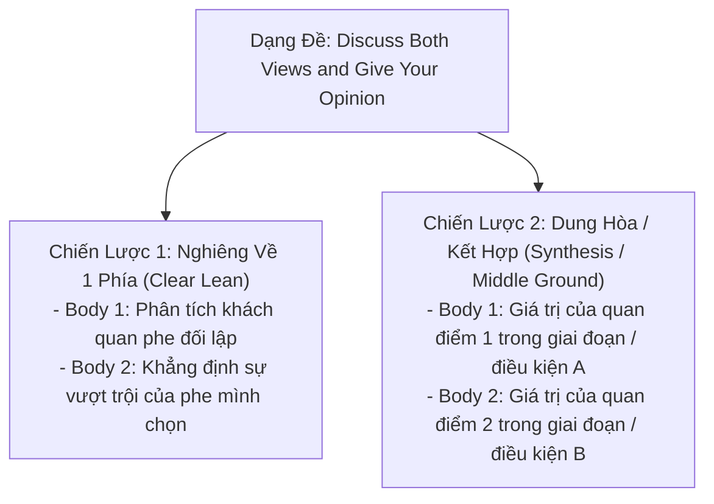

# Task 2: Discussion (Discuss Both Views and Give Your Opinion)

> **Kỹ năng**: WRITING | **Chuyên mục**: Task 2 Strategy  
> **Tóm tắt**: Cân đối phân tích cả 2 góc nhìn khách quan, kỹ thuật lồng ghép quan điểm cá nhân hợp lý, tránh lỗi lệch trọng số và bài mẫu hoàn chỉnh Band 8.5+ chuẩn Cambridge.

---

### 1. Điểm Khác Biệt Sống Còn Với Dạng Opinion

Dạng đề: *"Discuss both views and give your opinion."*
- **Bắt buộc**: Phải thảo luận cả 2 quan điểm một cách công bằng về dung lượng (độ dài tương đương nhau). Nếu bạn viết đoạn 1 chỉ 3 câu hời hợt và đoạn 2 tới 8 câu, bạn sẽ bị giám khảo trừ điểm tiêu chí **Task Response** vì phát triển ý không đồng đều.
- **Vị trí của Opinion**: Ý kiến của bạn phải xuất hiện rõ ràng ở 3 vị trí: Mở bài (Thesis Statement), Thân bài mà bạn ủng hộ, và Kết bài (Conclusion).

---

### 2. Hai Hướng Tiếp Cận Lập Trường Trong Dạng Discussion

#### Hướng A: Nghiêng hẳn về một phía (Clear Lean - Khuyên Dùng Cho Mọi Band)
- **Thân bài 1 (Phe bạn không đồng tình):** Dùng giọng văn khách quan phân tích lý do tại sao một số người lại có quan điểm đó:  
  👉 *"On the one hand, proponents of [View A] argue that..."*
- **Thân bài 2 (Phe bạn đồng tình):** Đưa quan điểm cá nhân trực tiếp vào câu mở đoạn và giải thích tính ưu việt:  
  👉 *"On the other hand, I side with those who claim that [View B] yields more profound benefits..."*

#### Hướng B: Dung hòa cả hai quan điểm (Middle Ground / Synthesis - Đạt Band 8.0+)
- Thừa nhận tính hợp lý của cả hai mặt và đề xuất giải pháp dung hòa cân bằng.

---

### 3. Đề Thi Mẫu Thực Tế (Cambridge Authentic Task 2 Prompt)

> **Some people think that universities should provide graduates with the knowledge and skills needed in the workplace. Others think that the true function of a university should be to give access to knowledge for its own sake, regardless of whether the course is useful to an employer.**  
> *Discuss both views and give your opinion.*  
> *Write at least 250 words.*

#### Dàn Ý Chuẩn Bị:
- **Mở bài**: Giới thiệu cuộc tranh luận về mục tiêu cốt lõi của giáo dục đại học (đào tạo nghề nghiệp thực dụng vs theo đuổi tri thức hàn lâm thuần túy) $\rightarrow$ Đưa ra quan điểm cá nhân: Giáo dục nghề nghiệp là thực tế cấp bách, nhưng nghiên cứu lý thuyết thuần túy mới là nền tảng cho sự đột phá lâu dài.
- **Body 1 (View 1 - Kỹ năng nghề nghiệp & Cơ hội việc làm)**: 
  - Học phí đại học ngày càng đắt đỏ, sinh viên cần kỹ năng thực chiến để tìm được việc làm và trả nợ học phí (*vocational skills, employability, return on educational investment*).
  - Doanh nghiệp đòi hỏi sinh viên tốt nghiệp có thể làm việc ngay mà không mất thời gian đào tạo lại.
- **Body 2 (View 2 & Opinion - Giá trị của tri thức hàn lâm & Nghiên cứu lý thuyết)**: 
  - Trường đại học không phải là trường dạy nghề đơn thuần (*universities are not mere vocational colleges*). Nếu chỉ tập trung vào thị trường lao động ngắn hạn, xã hội sẽ đánh mất những nghiên cứu lý thuyết mang tính cách mạng (triết học, toán lý thuyết, lịch sử, thiên văn học).
  - Tri thức nền tảng rèn luyện tư duy phản biện (*critical inquiry*) và khả năng thích ứng lâu dài khi công nghệ thay đổi.
- **Kết bài**: Khẳng định sự dung hòa: Đại học cần cân bằng cả hai, nhưng việc bảo tồn không gian theo đuổi tri thức tự do là giá trị bất khả xâm phạm.

---

### 4. Bài Viết Mẫu Hoàn Chỉnh Band 8.5+ (Full Model Essay)

> While some individuals argue that higher education institutions should tailor their curricula exclusively toward pragmatic vocational skills for the modern job market, others contend that universities ought to remain bastions of pure academic inquiry, unfettered by commercial utility. While I acknowledge the imperative of graduate employability, I firmly believe that the primary ethos of tertiary education must remain the pursuit of knowledge for its own sake.
>
> On the one hand, the argument for career-oriented education is compelling in an increasingly competitive global economy. With escalating tuition fees and the burden of student debt, prospective undergraduates legitimately view their academic degrees as financial investments. Consequently, institutions that emphasize marketable competencies—such as computer programming, accounting protocols, or project management—empower graduates to transition seamlessly into the workforce and secure viable livelihoods. Furthermore, from an economic standpoint, when universities align their course offerings with corporate labor demands, they mitigate skill mismatches and stimulate national productivity.
>
> On the other hand, reducing universities to mere vocational training centers undermines their historic mission as catalysts for human intellectual advancement. Groundbreaking discoveries in theoretical physics, philosophy, and history rarely demonstrate immediate commercial viability; however, they constitute the foundational bedrock upon which technological and societal innovations ultimately rest. Without dedicated academic freedom and theoretical research, civilizations risk stifling transformative breakthroughs that take decades to materialize. Moreover, immersion in abstract disciplines fosters critical thinking, intellectual curiosity, and cognitive agility—attributes that paradoxically equip individuals to navigate volatile job markets far better than hyper-specialized training that quickly becomes obsolete.
>
> In conclusion, although preparing students for professional employment is undeniably a vital auxiliary function, I maintain that universities must preserve their core mandate: fostering intellectual curiosity and advancing human knowledge without constraint. *(289 words)*

---

### 5. Phân Tích Chấm Điểm 4 Tiêu Chí (Examiner Feedback)

| Tiêu Chí Khảo Thí | Phân Tích Điểm Sáng Trong Bài Mẫu Band 8.5+ |
| :--- | :--- |
| **Task Response (TR)** | - Thảo luận công bằng, sâu sắc cả 2 góc nhìn (độ dài 2 thân bài cân bằng nhau tuyệt đối). - Quan điểm của tác giả rõ ràng ở Mở bài, lồng ghép sắc sảo ở Thân bài 2 và chốt hạ kiên định ở Kết bài. - Các lý lẽ phân tích sâu ở tầng vĩ mô và triết lý giáo dục. |
| **Coherence & Cohesion (CC)** | - Bố cục 4 đoạn hoàn hảo. - Sử dụng cấu trúc nối mạch lạc không bị rập khuôn: *On the one hand, Consequently, Furthermore, On the other hand, Groundbreaking discoveries, Moreover, In conclusion*. |
| **Lexical Resource (LR)** | - Vốn từ vựng C1/C2 học thuật xuất sắc: *tailor curricula exclusively, pragmatic vocational skills, bastions of pure academic inquiry, unfettered by commercial utility, marketable competencies, transition seamlessly, corporate labor demands, mitigate skill mismatches, mere vocational training centers, intellectual advancement, foundational bedrock, cognitive agility, volatile job markets*. |
| **Grammatical Range & Accuracy (GRA)** | - Đa dạng câu phức và mệnh đề phụ thuộc: Mệnh đề nhượng bộ (*While some individuals argue..., although preparing students...*), mệnh đề quan hệ hạn chế và không hạn chế, câu ghép đẳng lập và cấu trúc song hành chuẩn xác 100%. |

---

> **Luyện tập thực chiến:** Mở ứng dụng [IELTS Practice Web](https://ielts-practice-vietnamese.vercel.app/) để luyện viết dạng bài Discussion với kho đề thi Cambridge chọn lọc và nhận gợi ý ý tưởng đa chiều từ AI.

| ← Bài trước | Mục Lục | Bài tiếp theo → |
| :--- | :---: | ---: |
| [19. Task 2: Agree / Disagree](task2-opinion.md) | [Mục Lục Cẩm Nang](../README.md) | [21. Task 2: Advantages vs Disadvantages](task2-advantages-disadvantages.md) |
