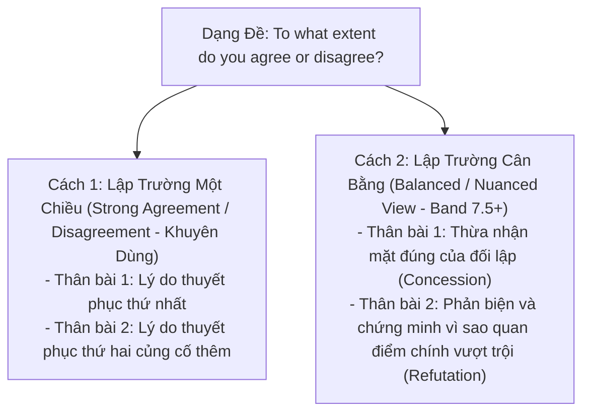

# Task 2: Opinion / Agree or Disagree

> **Kỹ năng**: WRITING | **Chuyên mục**: Task 2 Strategy  
> **Tóm tắt**: Lựa chọn lập trường 1 chiều (Strong) hay 2 chiều (Balanced), công thức Thesis Statement dứt khoát, kỹ thuật triển khai đoạn PEEL và bài mẫu hoàn chỉnh Band 8.5+ chuẩn Cambridge.

---

### 1. Nhận Diện Dạng Đề & Yêu Cầu Khảo Thí

- **Đề bài thường gặp**: *"To what extent do you agree or disagree?"* hoặc *"Do you agree or disagree with this statement?"*
- **Yêu cầu sống còn (Task Response)**: Giám khảo muốn thấy một **lập trường rõ ràng, nhất quán (Clear position throughout the response)** từ Mở bài, Thân bài cho đến Kết bài.
- **Lỗi mất điểm thường gặp**: Mở bài nói đồng ý, thân bài lại viết lung tung cả 2 chiều, kết bài nói "tùy trường hợp" $\rightarrow$ Thí sinh bị trừ điểm nặng ở tiêu chí Task Response (bị giới hạn ở Band 6.0).

---

### 2. Hai Hướng Tiếp Cận Lập Trường Trong Dạng Opinion

#### Hướng 1: Lập trường một chiều (Strong Opinion - Dễ viết, an toàn nhất)
- Chọn đồng ý 100% hoặc phản đối 100%.
- Cả 2 đoạn thân bài đều tập trung bảo vệ lập trường của bạn.
- *Ví dụ Thesis*: *"I completely agree with this view, as [Reason A], and [Reason B]."*

#### Hướng 2: Lập trường cân bằng (Balanced Opinion - Đòi hỏi tư duy phản biện cao)
- Dành cho các đề bài có tính tuyệt đối cực đoan (như *"The ONLY way to solve X is Y"* hoặc *"All citizens should be required to Z"*).
- *Ví dụ Thesis*: *"While I concede that [Opposing argument holds merit], I firmly contend that [Primary perspective is ultimately more crucial]."*

---

### 3. Cấu Trúc Đoạn Thân Bài Chuẩn PEEL (Point - Explanation - Example - Link)

- **P (Point - Luận điểm)**: Câu chủ đề nêu bật luận cứ chính.
- **E (Explanation - Diễn giải cơ chế)**: Phân tích sâu chuỗi nhân quả (Nếu A xảy ra $\rightarrow$ dẫn tới B $\rightarrow$ hệ quả là C).
- **E (Example - Dẫn chứng cụ thể)**: Minh họa bằng thực tế số liệu, chính sách quốc gia hoặc trường hợp điển hình.
- **L (Link - Câu kết đoạn)**: Chốt hạ luận điểm và liên kết trực tiếp trở lại quan điểm của đề bài.

---

### 4. Đề Thi Mẫu Thực Tế (Cambridge Authentic Task 2 Prompt)

> **Some people believe that unpaid community service should be a compulsory part of high school programmes (for example working for a charity, improving the neighbourhood or teaching sports to younger children).**  
> *To what extent do you agree or disagree?*  
> *Write at least 250 words.*

#### Dàn Ý Chuẩn Bị (Lập Trường: Hoàn Toàn Đồng Ý - Strong Agreement):
- **Mở bài**: Paraphrase việc bắt buộc học sinh tham gia lao động công ích không lương $\rightarrow$ Khẳng định hoàn toàn đồng tình vì chính sách này trang bị kỹ năng sống thiết yếu và bồi dưỡng ý thức trách nhiệm công dân.
- **Body 1 (Kỹ năng mềm & Trải nghiệm thực tế)**: Lao động công ích giúp học sinh thoát khỏi áp lực thi cử sách vở, rèn luyện kỹ năng giao tiếp, làm việc nhóm và giải quyết vấn đề thực tế (*interpersonal skills, problem-solving, empathy*).
- **Body 2 (Trách nhiệm xã hội & Giảm tệ nạn thanh thiếu niên)**: Việc cống hiến cho cộng đồng xây dựng lòng trắc ẩn, gắn kết các tầng lớp xã hội và ngăn ngừa các hành vi lệch chuẩn do nhàn rỗi (*civic consciousness, social cohesion, delinquency prevention*).
- **Kết bài**: Tái khẳng định lập trường ủng hộ tuyệt đối và khuyến nghị đưa vào chương trình giáo dục toàn diện.

---

### 5. Bài Viết Mẫu Hoàn Chỉnh Band 8.5+ (Full Model Essay)

> It is frequently asserted that high school curricula should incorporate mandatory unpaid voluntary work, such as supporting charitable organizations, neighborhood revitalization, or coaching sports for younger children. I wholeheartedly subscribe to this perspective, as such initiatives cultivate indispensable interpersonal capabilities and foster a robust sense of civic responsibility among adolescents.
>
> First and foremost, engaging in structured community service equips pupils with practical competencies that cannot be acquired solely through textbook pedagogy. Modern education often prioritizes rote academic memorization, leaving graduates ill-prepared for real-world collaborative dynamics. By actively participating in volunteer initiatives—whether that involves organizing food drives or tutoring underprivileged children—adolescents are compelled to navigate complex interpersonal situations, refine their communication aptitudes, and develop emotional resilience. These formative experiences not only augment their emotional intelligence and empathy, but also bolster their subsequent university and employment applications by demonstrating well-rounded character.
>
> Furthermore, mandatory civic engagement serves as an effective mechanism for nurturing civic consciousness and social cohesion. When adolescents are immersed in service initiatives alongside peers from diverse socioeconomic backgrounds, they gain invaluable exposure to societal disparities and the daily hardships endured by marginalized demographics. This first-hand exposure dismantles adolescent self-centeredness, fostering profound altruism and gratitude. Moreover, constructively channeling youths' surplus energy into communal improvement drastically diminishes the likelihood of anti-social behavior and delinquency, thereby contributing to a safer and more harmonious social fabric.
>
> In conclusion, I unequivocally support the institutionalization of mandatory community service in secondary schooling. Far from being an undue academic burden, this policy represents a transformative educational investment that shapes empathetic, socially conscious, and pragmatic citizens. *(267 words)*

---

### 6. Phân Tích Chấm Điểm 4 Tiêu Chí (Examiner Feedback)

| Tiêu Chí Khảo Thí | Phân Tích Điểm Sáng Trong Bài Mẫu Band 8.5+ |
| :--- | :--- |
| **Task Response (TR)** | - Lập trường nhất quán tuyệt đối xuyên suốt bài: Mở bài (*I wholeheartedly subscribe to this perspective*), Thân bài 1 (*equips pupils with practical competencies*), Thân bài 2 (*nurturing civic consciousness*), Kết bài (*I unequivocally support...*). - Phát triển ý tưởng sâu sắc qua chuỗi nhân quả chặt chẽ, không bị liệt kê nông cạn. |
| **Coherence & Cohesion (CC)** | - Bố cục chuẩn PEEL ở cả 2 đoạn thân bài. - Sử dụng các phương thức liên kết mạch lạc và liên kết ẩn: *First and foremost, By actively participating, Furthermore, This first-hand exposure, In conclusion*. |
| **Lexical Resource (LR)** | - Vốn từ vựng C1/C2 học thuật phong phú: *incorporate mandatory unpaid voluntary work, cultivate indispensable interpersonal capabilities, civic responsibility, collaborative dynamics, underprivileged children, emotional resilience, socioeconomic backgrounds, societal disparities, marginalized demographics, anti-social behavior, transformative educational investment*. |
| **Grammatical Range & Accuracy (GRA)** | - Kết hợp đa dạng câu phức: Mệnh đề quan hệ rút gọn (*leaving graduates ill-prepared...*), mệnh đề phân từ (*whether that involves...*), cấu trúc nhấn mạnh và bị động học thuật (*It is frequently asserted that...*). 100% không mắc lỗi ngữ pháp hay chấm câu. |

---

> **Luyện tập thực chiến:** Mở ứng dụng [IELTS Practice Web](https://ielts-practice-vietnamese.vercel.app/) để thực hành viết dạng đề Opinion với công cụ phân tích Bản đồ nhiệt cấu trúc câu (GRA Heatmap) thời gian thực.

| ← Bài trước | Mục Lục | Bài tiếp theo → |
| :--- | :---: | ---: |
| [18. Task 2: 3 Công thức Paraphrase Mở bài & Thesis](writing-paraphrase-thesis-intro.md) | [Mục Lục Cẩm Nang](../README.md) | [20. Task 2: Discuss Both Views](task2-discussion.md) |
