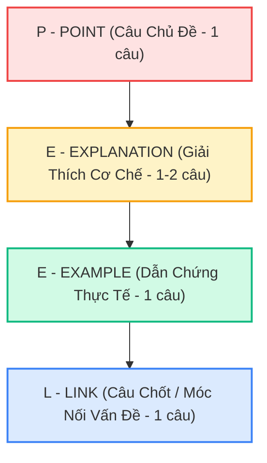

# 🧱 Cấu Trúc Đoạn Văn PEEL & Dàn Bài Toàn Diện Task 2

> **Kỹ năng**: WRITING | **Chuyên mục**: Task 2 Master Guide  
> **Tóm tắt**: Bí quyết xây dựng thân bài lập luận chặt chẽ đạt điểm tuyệt đối cho hai tiêu chí Task Response và Coherence & Cohesion bằng mô hình chuẩn học thuật PEEL.

---

## 🏛️ 1. Mô Hình PEEL Là Gì & Tại Sao Giám Khảo Đánh Giá Cao?

Trong văn học thuật phương Tây, **PEEL** là tiêu chuẩn vàng giúp đoạn văn có cấu trúc lập luận mạch lạc, chặt chẽ và không thể phản bác. Nó giải quyết triệt để lỗi "nói suông" hoặc "liệt kê nông" mà hầu hết thí sinh Việt Nam hay mắc phải.

### Chi tiết 4 thành phần của đoạn văn PEEL:

1. **P - Point (Câu chủ đề - Topic Sentence):**
   - Nêu trực tiếp 1 luận điểm cốt lõi của đoạn văn. Trả lời trực tiếp cho câu hỏi: *"Đoạn văn này nói về mặt tích cực hay tiêu cực? Lý do chính là gì?"*.
2. **E - Explanation (Giải thích cơ chế sâu sắc):**
   - Trả lời câu hỏi: *"Tại sao lại như vậy? Cơ chế nào dẫn đến điều đó? Điều đó tác động thế nào đến con người/xã hội?"*. Đây là phần thể hiện chiều sâu tư duy (Vertical Depth) giúp bạn lấy điểm Band 8.0 Task Response.
3. **E - Example (Dẫn chứng cụ thể):**
   - Đưa ra một ví dụ đời thực, một xu hướng công nghệ hoặc một chính sách xã hội có thật để chứng minh lập luận không phải là lý thuyết suông.
4. **L - Link (Câu chốt kết nối):**
   - Tóm lại tác động của luận điểm và móc nối trực tiếp trở lại với câu hỏi của đề bài, tạo nên một vòng khép kín logic hoàn hảo.

---

## 🔬 2. Mẫu Phân Rã Chi Tiết Từng Câu Trong Thân Bài Chuẩn PEEL

### 📌 Đề bài mẫu:
> *"Some people think that university students should pay the full cost of their studies. To what extent do you agree or disagree?"*

### 📝 Đoạn văn hoàn chỉnh áp dụng PEEL (Bảo vệ quan điểm: Nhà nước nên hỗ trợ học phí):

> 🔴 **[POINT - Câu chủ đề]:**  
> *"First and foremost, government subsidization of higher education is essential to ensure equal educational opportunities for students from underprivileged socio-economic backgrounds."*
> 
> 🟡 **[EXPLANATION - Giải thích cơ chế]:**  
> *"If tertiary institutions were to impose the entirety of academic expenses onto learners, tuition fees would become prohibitively expensive for low-income households. Consequently, countless intellectually gifted individuals would be deterred from pursuing university degrees, thereby reinforcing social stratification and stifling upward social mobility."*
> 
> 🟢 **[EXAMPLE - Dẫn chứng thực tế]:**  
> *"A pertinent example can be observed in Scandinavian nations such as Norway and Finland, where fully state-funded higher education systems have fostered remarkably high rates of workforce productivity and social equity."*
> 
> 🔵 **[LINK - Câu chốt móc nối]:**  
> *"Therefore, relieving students from exorbitant academic debt directly serves the long-term economic prosperity and social cohesion of the nation."*

---

## ⚖️ 3. So Sánh Đối Chiếu: Đoạn Văn Thất Bại vs Đoạn Văn PEEL Chuẩn

| Yếu Tố | ❌ Đoạn Văn Lỗi (Band 5.5 - 6.0) | ✅ Đoạn Văn PEEL Chuẩn (Band 8.0+) |
| :--- | :--- | :--- |
| **Cấu trúc** | Nhảy cóc ý, đưa ví dụ quá sớm khi chưa kịp giải thích nguyên nhân. | Đi tuần tự: Luận điểm ➡️ Bản chất cơ chế ➡️ Minh chứng ➡️ Đúc kết hệ quả. |
| **Mạch lạc** | Dùng từ nối liệt kê đơn điệu: *"Firstly,... Also,... For example,... So..."*. | Sử dụng liên kết ngữ nghĩa: *"prohibitively expensive ➡️ Consequently ➡️ thereby reinforcing... ➡️ Therefore"*. |
| **Độ sâu** | Nói nông: *"Học phí đắt thì người nghèo không đi học được, nên chính phủ phải giúp"*. | Đào sâu tác động vĩ mô: *"stifling upward social mobility", "reinforcing social stratification", "long-term economic prosperity"*. |

---

## 📋 4. Bố Cục Toàn Diện 4 Đoạn Bài Task 2 (250 – 290 Từ / 40 Phút)

Để đạt điểm cao nhất, toàn bài Essay nên gồm đúng **4 đoạn văn cân đối**:

1. **Đoạn 1: Mở bài (Introduction - 2 câu ~ 45 từ):**
   - *Câu 1:* Paraphrase đề bài bằng cấu trúc câu phức.
   - *Câu 2 (Thesis Statement):* Tuyên ngôn quan điểm rõ ràng của bạn (Đồng ý, Không đồng ý, hay Phân tích cả hai mặt).
2. **Đoạn 2: Thân bài 1 (Body 1 theo PEEL ~ 90 từ):**
   - Triển khai trọn vẹn Luận điểm thứ nhất theo công thức P-E-E-L.
3. **Đoạn 3: Thân bài 2 (Body 2 theo PEEL ~ 90 từ):**
   - Triển khai trọn vẹn Luận điểm thứ hai (hoặc Đoạn phản biện - Counter-argument) theo công thức P-E-E-L.
4. **Đoạn 4: Kết bài (Conclusion - 2 câu ~ 35 từ):**
   - *Câu 1:* Khẳng định lại Thesis Statement bằng từ ngữ khác (không dùng lại từ ở Mở bài).
   - *Câu 2:* Nêu một đề xuất hoặc dự báo tương lai ngắn gọn. *(Tuyệt đối không đưa luận điểm mới vào Kết bài!)*.
