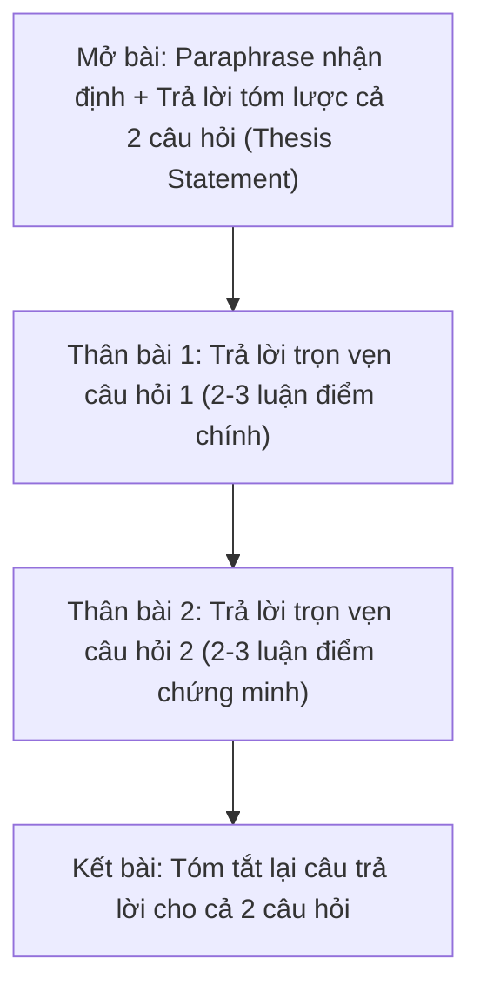

# Task 2: Two-Part / Double Question

> **Kỹ năng**: WRITING | **Chuyên mục**: task2
> **Tóm tắt**: Phân bổ tỷ trọng đồng đều cho cả 2 câu hỏi, tránh trả lời lệch tủ.

---

### 1. Bản Chất Dạng Bài Two-Part Question
Đề bài đưa ra một nhận định xã hội và đặt ra **hai câu hỏi hoàn toàn độc lập**, ví dụ:
- *Cặp câu hỏi 1 (Causes + Evaluation):* *"Why do people want to look younger? Is this a positive or negative development?"*
- *Cặp câu hỏi 2 (Causes + Solutions):* *"Why do students find it harder to study at university than at school? What can be done to solve the problem?"*
- *Cặp câu hỏi 3 (Direct Categorization + Outweigh):* *"What types of old buildings should be preserved? Do you think the advantages of preserving old buildings outweigh the disadvantages?"*

---

### 2. Chiến Lược Phân Bổ Bố Cục Thân Bài Chuẩn Mực

#### Phân bổ tỷ lệ 50 - 50:
- **Sai lầm mất điểm:** Thí sinh bị cuốn vào câu hỏi 1 (viết 150 từ cho nguyên nhân) và chỉ còn 5 phút viết 40 từ qua loa cho câu hỏi 2. Điều này dẫn đến sự mất cân bằng nghiêm trọng và bị trừ điểm **Task Response**.
- **Độ dài lý tưởng:** 
  - Mở bài: 35 – 45 từ.
  - Thân bài 1: 100 – 120 từ.
  - Thân bài 2: 100 – 120 từ.
  - Kết bài: 30 – 40 từ.  
  👉 Tổng độ dài: 280 – 320 từ.

---

### 3. Phân Rã Cấu Trúc Trả Lời Cặp Đề Điển Hình (Trích Đề Thi Thật)

#### Đề bài: "Trì hoãn sinh con" (Delayed Parenthood)
> *In many countries, people decide to have their first child when they are older. What are the reasons? Do you think the advantages of this outweigh the disadvantages?*

- **Thân bài 1 (Reasons - Tại sao có con muộn?):**
  - *Luận điểm 1:* Ưu tiên phát triển sự nghiệp cá nhân (*career advancement and professional fulfillment*).
  - *Luận điểm 2:* Chi phí sinh hoạt leo thang (*escalating cost of living*), giới trẻ cần đạt sự ổn định tài chính (*financial stability*) trước khi gánh vác trách nhiệm nuôi dạy một đứa trẻ.
- **Thân bài 2 (Outweigh - Bất lợi lấn át lợi thế):**
  - *Thừa nhận lợi thế:* Cha mẹ lớn tuổi có nhiều kinh nghiệm sống và tâm lý vững vàng (*emotional maturity*).
  - *Khẳng định bất lợi lớn hơn:* Rủi ro biến chứng thai sản gia tăng (*heightened medical risks / genetic disorders*), đồng thời tạo ra khoảng cách thế hệ lớn (*generational gap*), cản trở việc thấu hiểu và gắn kết gia đình.

---

### 4. Mẫu Câu Nối Chuyển Đoạn Tự Nhiên Giữa 2 Câu Hỏi
- **Chuyển từ Câu hỏi 1 sang Câu hỏi 2 (Đầu Body 2):**
  - *"Turning to the question of whether this trend is beneficial or detrimental, I firmly contend that..."*
  - *"In assessing the overall repercussions of this shift, I am convinced that the drawbacks significantly outweigh any perceived advantages."*
  - *"To address these underlying causes, collaborative initiatives between [Entity A] and [Entity B] are imperative."*

---

> **Luyện tập thực chiến:** Mở ứng dụng [IELTS Practice Web](https://ielts-practice-vietnamese.vercel.app/) để thực hành và nhận đánh giá chi tiết từ AI.

| ← Bài trước | Mục Lục | Bài tiếp theo → |
| :--- | :---: | ---: |
| [23. Task 2: Problem & Solution](task2-problem-solution.md) | [Mục Lục Cẩm Nang](../README.md) | [25. Task 2: Bẻ Bẫy Đề So Sánh & So Sánh Nhất](writing-task2-comparative-superlative-traps.md) |
