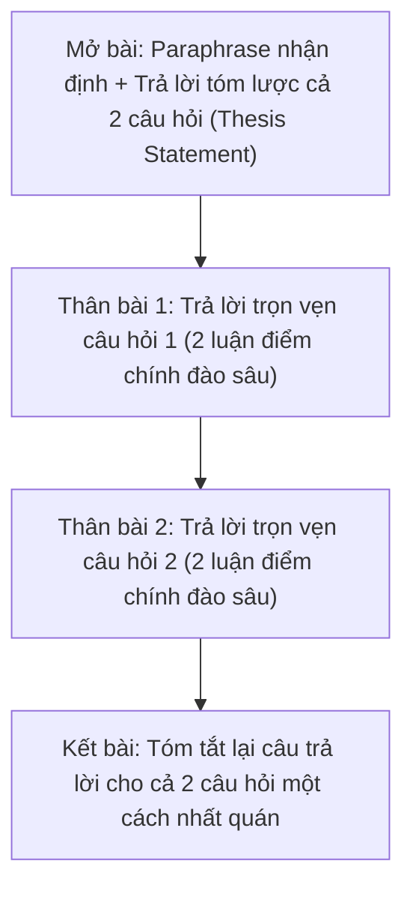

# Task 2: Two-Part / Double Question (Câu Hỏi Kép Trực Tiếp)

> **Kỹ năng**: WRITING | **Chuyên mục**: Task 2 Strategy  
> **Tóm tắt**: Phân bổ tỷ trọng đồng đều cho cả 2 câu hỏi, tránh trả lời lệch tủ, mẫu câu chuyển tiếp tự nhiên giữa hai vế và bài mẫu hoàn chỉnh Band 8.5+ chuẩn Cambridge.

---

### 1. Bản Chất Dạng Bài Two-Part Question

Đề bài đưa ra một hiện tượng xã hội và đặt ra **hai câu hỏi hoàn toàn độc lập**, ví dụ:
- *Cặp câu hỏi 1 (Causes + Evaluation):* *"Why do people want to look younger? Is this a positive or negative development?"*
- *Cặp câu hỏi 2 (Causes + Solutions):* *"Why do students find it harder to study at university than at school? What can be done to solve the problem?"*
- *Cặp câu hỏi 3 (Direct Categorization + Outweigh):* *"In many countries, people decide to have their first child when they are older. What are the reasons? Do you think the advantages of this outweigh the disadvantages?"*

---

### 2. Chiến Lược Phân Bổ Bố Cục Thân Bài Chuẩn Mực

#### Phân bổ tỷ lệ 50 - 50:
- **Sai lầm mất điểm:** Thí sinh bị cuốn vào câu hỏi 1 (viết 150 từ cho nguyên nhân) và chỉ còn 5 phút viết 40 từ qua loa cho câu hỏi 2. Điều này dẫn đến sự mất cân bằng nghiêm trọng và bị trừ điểm **Task Response**.
- **Độ dài lý tưởng:** 
  - Mở bài: 35 – 45 từ (trả lời ngắn gọn cả 2 câu hỏi).
  - Thân bài 1: 100 – 115 từ (giải quyết câu hỏi 1).
  - Thân bài 2: 100 – 115 từ (giải quyết câu hỏi 2).
  - Kết bài: 30 – 40 từ.  
  👉 Tổng độ dài: 270 – 310 từ.

---

### 3. Đề Thi Mẫu Thực Tế (Cambridge Authentic Task 2 Prompt)

> **In many countries, people decide to have their first child when they are older.**  
> *What are the reasons for this? Do you think the advantages of this trend outweigh the disadvantages?*  
> *Write at least 250 words.*

#### Dàn Ý Chuẩn Bị (Lập Trường: Bất lợi vượt trội hơn):
- **Mở bài**: Paraphrase xu hướng sinh con muộn $\rightarrow$ Trả lời trực diện cả 2 vế: Xu hướng này xuất phát từ áp lực sự nghiệp và chi phí sinh hoạt leo thang; tuy nhiên, những rủi ro sức khỏe sinh sản và khoảng cách thế hệ lớn khiến bất lợi vượt trội hơn lợi ích.
- **Thân bài 1 (Reasons - Tại sao có con muộn?):**
  - *Luận điểm 1:* Ưu tiên phát triển sự nghiệp cá nhân (*career advancement and professional fulfillment*), đặc biệt là phụ nữ trong thị trường lao động cạnh tranh.
  - *Luận điểm 2:* Chi phí sinh hoạt và nuôi dạy con leo thang (*escalating child-rearing expenses*), đòi hỏi các cặp đôi phải tích lũy tài chính vững vàng trước khi lập gia đình.
- **Thân bài 2 (Outweigh - Bất lợi lấn át lợi thế):**
  - *Thừa nhận lợi thế:* Cha mẹ lớn tuổi thường có sự nghiệp ổn định và tâm lý chín chắn (*financial security & emotional maturity*).
  - *Khẳng định bất lợi lớn hơn:* Rủi ro biến chứng sản khoa và sức khỏe sinh sản tăng vọt (*heightened obstetric complications & genetic anomalies*); đồng thời tạo ra khoảng cách thế hệ sâu sắc (*pronounced generational gap*), ảnh hưởng đến sự gắn kết gia đình và gánh nặng già hóa dân số.
- **Kết bài**: Tái khẳng định nguyên nhân kinh tế - sự nghiệp và nhấn mạnh hệ lụy sức khỏe lâu dài lấn át lợi ích tài chính.

---

### 4. Bài Viết Mẫu Hoàn Chỉnh Band 8.5+ (Full Model Essay)

> In contemporary society, an increasing proportion of adults across numerous nations are postponing parenthood until their thirties or forties. This demographic shift is primarily propelled by career ambitions and escalating living costs; however, despite certain socioeconomic advantages, I firmly contend that the medical and familial drawbacks of delayed childbearing are far more profound.
>
> The tendency to defer childbirth stems predominantly from modern socioeconomic realities. First and foremost, young adults in competitive labor markets increasingly prioritize professional advancement. Establishing a solid career trajectory frequently demands prolonged tertiary education, intense working hours, and geographical mobility throughout one’s twenties, leaving little bandwidth for domestic commitments. Furthermore, the prohibitive expense of raising children—encompassing soaring housing costs, private healthcare, and educational tuition—compels prospective parents to achieve financial solvency before starting a family. Consequently, couples intentionally delay reproduction until their household savings and employment stability can adequately support a child's upbringing.
>
> Turning to the implications of this phenomenon, the disadvantages unequivocally surpass any perceived merits. Admittedly, mature parents often possess greater emotional maturity and substantial financial resources, which can afford their offspring a nurturing and well-funded environment. Nevertheless, these advantages are heavily overshadowed by acute physiological and familial repercussions. Biologically, advanced maternal and paternal age correlates directly with diminished fertility, heightened risks of pregnancy complications, and an elevated incidence of genetic anomalies like Down syndrome. On a relational level, substantial age disparities between generations frequently engender communication barriers and disparate cultural values. Moreover, aging parents may lack the physical stamina to actively engage with adolescent children, while potentially facing retirement precisely when university fees become most burdensome.
>
> In conclusion, while career aspirations and economic pressures legitimately explain the postponement of parenthood, the tangible health risks and intergenerational challenges ensure that the disadvantages of this trend far outweigh its benefits. *(303 words)*

---

### 5. Phân Tích Chấm Điểm 4 Tiêu Chí (Examiner Feedback)

| Tiêu Chí Khảo Thí | Phân Tích Điểm Sáng Trong Bài Mẫu Band 8.5+ |
| :--- | :--- |
| **Task Response (TR)** | - Trả lời trọn vẹn, đồng đều cả 2 câu hỏi: Thân bài 1 giải quyết triệt để *reasons* (sự nghiệp + chi phí); Thân bài 2 giải quyết dứt khoát *outweigh* (bất lợi lấn át lợi thế). - Lập trường xuyên suốt bài: Mở bài (*drawbacks are far more profound*), Thân bài 2 (*unequivocally surpass*), Kết bài (*disadvantages far outweigh*). |
| **Coherence & Cohesion (CC)** | - Bố cục phân đoạn 50/50 hoàn hảo. - Sử dụng các cụm chuyển tiếp uyển chuyển giữa 2 câu hỏi: *First and foremost, Furthermore, Consequently, Turning to the implications of this phenomenon, Admittedly, Nevertheless, Moreover, In conclusion*. |
| **Lexical Resource (LR)** | - Vốn từ vựng xã hội và nhân khẩu học C1/C2: *postponing parenthood, demographic shift, professional advancement, prolonged tertiary education, domestic commitments, prohibitive expense of raising children, financial solvency, delayed childbearing, acute physiological repercussions, obstetric complications, genetic anomalies, intergenerational challenges*. |
| **Grammatical Range & Accuracy (GRA)** | - Kết hợp đa dạng câu phức, mệnh đề phân từ (*encompassing soaring housing costs, leaving little bandwidth...*), cấu trúc nhượng bộ (*Admittedly... Nevertheless...*). 100% chính xác về ngữ pháp, chia thì và trật tự từ. |

---

### 6. Mẫu Câu Nối Chuyển Đoạn Tự Nhiên Giữa 2 Câu Hỏi

- **Chuyển từ Câu hỏi 1 sang Câu hỏi 2 (Đầu Body 2):**
  - *"Turning to the question of whether this trend is beneficial or detrimental, I firmly contend that..."*
  - *"In assessing the overall repercussions of this shift, I am convinced that the drawbacks significantly outweigh any perceived advantages."*
  - *"To address these underlying causes, collaborative initiatives between municipal authorities and private corporations are imperative."*

---

> **Luyện tập thực chiến:** Mở ứng dụng [IELTS Practice Web](https://ielts-practice-vietnamese.vercel.app/) để thực hành viết dạng Two-Part Question và nhận đánh giá chuyên sâu theo từng câu hỏi từ Giám khảo AI.

| ← Bài trước | Mục Lục | Bài tiếp theo → |
| :--- | :---: | ---: |
| [23. Task 2: Problem & Solution](task2-problem-solution.md) | [Mục Lục Cẩm Nang](../README.md) | [25. Task 2: Bẻ Bẫy Đề So Sánh & So Sánh Nhất](writing-task2-comparative-superlative-traps.md) |
