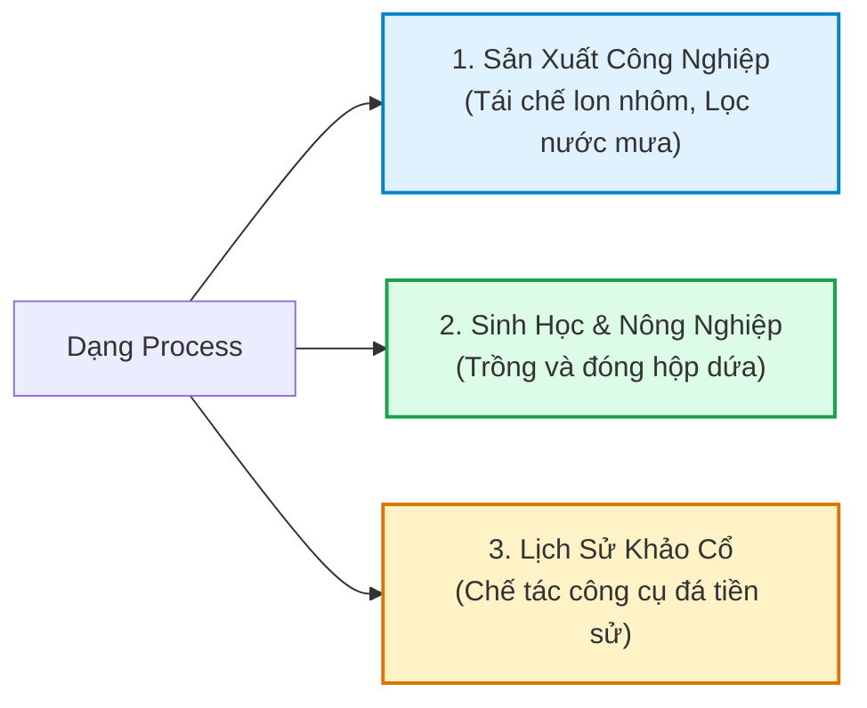

# Khai Thác Toàn Diện Mặt Bằng Kiến Trúc (Floor Plans) & Quy Trình Sản Xuất (Complex Processes)

> **Kỹ năng**: WRITING | **Chuyên mục**: Task 1 Advanced Strategy  
> **Tóm tắt**: Bí kíp làm chủ các đề thi Task 1 gai góc nhất: Sơ đồ mặt bằng tòa nhà (Floor Plans / Office Layouts) và Quy trình sản xuất phức tạp (Industrial & Historic Processes). Tổng hợp quy tắc thì, cấu trúc bị động và từ vựng khảo thí chuẩn Cambridge 2023 - 2026.

---

## 1. Dạng Sơ Đồ Mặt Bằng Tòa Nhà & Bố Cục Không Gian (Floor Plans / Layouts)

Trong các năm gần đây, hội đồng thi Cambridge và IDP ngày càng đưa ra nhiều đề bài liên quan đến **sơ đồ mặt bằng bên trong tòa nhà (Indoor Layout / Floor Plan)** thay vì chỉ là bản đồ ngoài trời (Outdoor City Map):
- *Sự thay đổi công năng mặt bằng nhà hát (Theatre Floor Plan 2010 vs 2012)*
- *Sự phát triển của một tòa nhà qua 3 thời kỳ: Văn phòng (1958) $\rightarrow$ Căn hộ (1985) $\rightarrow$ Tiệm hoa (2001 - nay)*
- *So sánh bố cục văn phòng kiểu Nhật (Communal/Hierarchical) vs kiểu Mỹ (Individual rows/Privacy)*
- *Quy hoạch khuôn viên trường học (School campus 1985 vs Present)*

### Quy Tắc Ngữ Pháp Sống Còn Cho Dạng Floor Plan:

1. **Phối hợp thì Quá khứ đơn và Quá khứ hoàn thành:**
   - Với mốc thời gian bắt đầu hoặc sự việc diễn ra tại một năm cụ thể: Sử dụng thì **Quá khứ đơn (Past Simple)** đi cùng giới từ `in + [year]`.  
     *Ví dụ:* *"In 2010, there was a dressing room situated to the north of the stage."*
   - Với mốc thời gian kết thúc hoặc khi miêu tả kết quả đã hoàn tất trước một thời điểm: Bắt buộc dùng thì **Quá khứ hoàn thành (Past Perfect)** đi cùng giới từ `by + [year]`.  
     *Ví dụ:* *"By 2012, the dressing room **had been converted** into a corridor, and the foyer **had been extended** to the left."*
2. **Cấu trúc câu chuyển đổi công năng (Repurposing Structures):**
   - *Thay đổi mục đích sử dụng:* `[Object] was repurposed into [New facility]` hoặc `was transformed into`.
   - *Dỡ bỏ để nhường chỗ:* `[Old facility] was removed / demolished to make way for [New facility]`.
   - *Dựng lên tại vị trí cũ:* `[New facility] was erected in its place / in their place`.
   - *Chiếm một phần diện tích:* `[New area] was enlarged, overtaking half of the space previously occupied by [Old room]`.
3. **Từ vựng định vị không gian kiến trúc:**
   - `flanking the stage`: nằm ở hai bên cánh sân khấu.
   - `at the rear of the building`: nằm ở phía sau của tòa nhà.
   - `adjacent to / in close proximity to`: nằm sát cạnh, kề bên.
   - `arranged in rows`: được xếp thành từng hàng riêng lẻ.

---

## 2. Dạng Quy Trình Sản Xuất & Chế Tác Phức Tạp (Complex Processes)

Quy trình trong IELTS Writing Task 1 chia làm 3 phân nhóm rõ rệt:

### Case Study 1: Quy trình sản xuất tự nhiên kết hợp nhân tạo (Trồng & Chế biến Dứa)
- **Giai đoạn trồng trọt (Agricultural phase):**
  - Cự ly và điều kiện: *"Pineapples are grown in fields with crowns spaced 26 cm apart, thriving in tropical temperatures ranging from 23°C to 30°C."*
  - Tác động hóa sinh: *"After seven months, the crops are sprayed with ethylene to accelerate flowering, before being harvested after five additional months at a standard height of 30 cm and weight of 2 kg."*
- **Giai đoạn chế biến công nghiệp (Manufacturing phase):**
  - Rửa và phân loại kích cỡ: *"The harvested pineapples are washed prior to being **graded according to size**."*
  - Phân luồng sản phẩm:
    * *Dứa nhỏ:* Cho vào máy ép (*extractor*) để đóng chai nước ép.
    * *Dứa vừa:* Gọt vỏ và cắt phần đỉnh (*have their tops removed and rinds peeled*), thái lát (*cut into slices or smaller chunks*) để đóng hộp.
    * *Dứa lớn:* Phủ sáp bảo quản (*coated in wax*) và đóng thùng gỗ (*placed in crates*) để xuất khẩu tươi ra nước ngoài.

---

### Case Study 2: Quy trình chế tác công cụ tiền sử (Stone Cutting Tools Evolution)
Đề thi so sánh công cụ cắt đá giữa hai thời kỳ: 1.4 triệu năm trước (Tool A) và 800,000 năm trước (Tool B):
- **Overview xuất sắc:**
  - *"Overall, there were noticeable differences in craftsmanship between the two eras, with the tool from 0.8 million years ago displaying greater dimensions, less rugged surfaces, and far more uniform edges than its primitive predecessor."*
- **Ngôn ngữ hình học & bề mặt đắt giá:**
  - `primitive artifact`: cổ vật sơ khai.
  - `tapering toward the top`: thuôn nhọn dần về phía đỉnh.
  - `jagged edges`: các cạnh răng cưa lởm chởm.
  - `teardrop refined appearance`: diện mạo tinh xảo hình giọt nước.
  - `crafted through the technique of chipping away small fragments of stone`: được đục đẽo thông qua kỹ thuật gọt tỉa từng mảnh vụn đá nhỏ.

---

### Case Study 3: Quy trình lọc nước mưa sinh hoạt (Rainwater Purification System)
- **Bộ ba thành phần lọc tự nhiên:**
  - *"The rainwater runs into gutters and flows down drainage pipes into a filtration barrel containing successive layers of sand, charcoal, and gravel."*
- **Xử lý hóa chất & cấp nước uống:**
  - *"The filtered water is subsequently transferred to a treatment tank where chemicals are introduced to eliminate pathogens, yielding drinkable / potable water accessible via household taps."*

---

## 3. Bảng Tổng Hợp Từ Vựng Đắt Giá Cho Floor Plans & Processes

| Nhóm Từ Vựng | Thuật Ngữ C1/C2 | Nghĩa Học Thuật & Ngữ Cảnh |
| :--- | :--- | :--- |
| **Mặt bằng** | **Repurposed into** | Tái cấu trúc công năng sử dụng cho mục đích mới |
| **Mặt bằng** | **Erected in its place** | Được xây dựng thế chỗ cho công trình cũ vừa bị phá dỡ |
| **Mặt bằng** | **Lay adjacent to** | Nằm kề sát ngay bên cạnh |
| **Mặt bằng** | **Enlarged in a northerly direction** | Được mở rộng về phía bắc |
| **Quy trình** | **Graded according to size** | Được phân loại và xếp hạng theo kích cỡ |
| **Quy trình** | **Solidified and flattened** | Được làm đông đặc và cán mỏng thành cuộn tấm |
| **Quy trình** | **Range in thickness from [X] to [Y]** | Có độ dày dao động trong khoảng từ X đến Y |
| **Quy trình** | **Potable / drinkable water** | Nước sạch đạt tiêu chuẩn uống trực tiếp |
| **Quy trình** | **Taper toward the apex / top** | Vuốt thon gọn dần về phía đầu chóp |

---

> **Luyện tập thực chiến:** Mở ứng dụng [IELTS Practice Web](https://ielts-practice-vietnamese.vercel.app/) để thực hành và nhận đánh giá chi tiết từ AI.

| ← Bài trước | Mục Lục | Bài tiếp theo → |
| :--- | :---: | ---: |
| [14. Task 1: Mixed Chart (Biểu Đồ Kết Hợp)](task1-mixed.md) | [Mục Lục Cẩm Nang](../README.md) | [15. Task 1: Ngôn ngữ biến động số liệu & Tỷ lệ xấp xỉ](writing-task1-data-proportions.md) |
