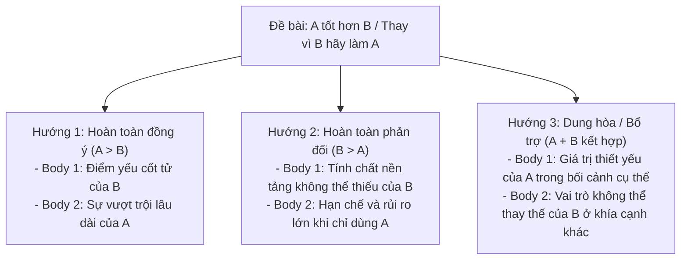

# Tuyệt Kỹ Xử Lý Dạng Đề So Sánh (Comparative) & So Sánh Nhất ("The Best Way") Trong Task 2

> **Kỹ năng**: WRITING | **Chuyên mục**: Task 2 Advanced Strategy  
> **Tóm tắt**: Giải mã bẫy Task Response kinh điển trong đề thi IELTS Writing Task 2 khi gặp dạng đề so sánh 2 yếu tố ("A rather than B", "A is as... as B") và yếu tố so sánh nhất ("The best way to..."). Hướng dẫn lập dàn ý ma trận quyết định (Decision Tree) và bài mẫu chuẩn Band 7.5 - 8.5+.

---

## 1. Bẫy Task Response Chí Mạng Trong Dạng Đề So Sánh 2 Yếu Tố

Trong các kỳ thi IELTS Writing Task 2 thực chiến, giám khảo Cambridge rất chuộng các đề bài đặt hai đối tượng lên bàn cân so sánh, ví dụ:
- *"Rich countries should give other types of help to poorer countries **rather than** financial aid."*
- *"Video records are a **better way** to learn about the world **rather than** written documents."*
- *"Some people think that employers should not care about the way their employees dress, **because what matters is the quality of their work**."*
- *"The use of mobile phones is **as antisocial as** smoking. Smoking is banned in certain places so mobile phones should be banned like smoking."*

### Sai lầm mất điểm nghiêm trọng (The Fatal Flaw):
Rất nhiều thí sinh chỉ tập trung viết về một vế (ví dụ: chỉ ca ngợi lợi ích của việc viện trợ giáo dục/công nghệ mà quên phân tích mặt hại/hạn chế của viện trợ tài chính, hoặc chỉ nói về video mà không nhắc gì đến tài liệu viết). 
- **Hậu quả**: Giám khảo sẽ đánh giá bạn chưa trả lời trọn vẹn đề bài (*address all parts of the task*). Điểm tiêu chí **Task Response (TR) sẽ bị giới hạn ở mức Band 5.0 - 6.0**.

### Nguyên tắc sống còn khi làm bài so sánh:
> [!IMPORTANT]
> **Nguyên tắc vàng:** Bạn luôn luôn phải **so sánh tương quan (comparative correlation)** giữa hai yếu tố trong từng luận điểm hoặc thiết lập sự cân đối giữa 2 đoạn thân bài.

---

## 2. Giải Mã Đề Bài Có Yếu Tố So Sánh Nhất ("The Best Way")

Một cái bẫy tinh vi khác thường xuất hiện trong đề thi là các từ chỉ tính tuyệt đối: **"the best way"**, **"the only solution"**, **"most effective approach"**:
- *"The best way to teach children to cooperate is through team sports at school."*
- *"The best way for a country to prepare for the future is to invest resources in its young people."*
- *"The best way to solve traffic and transportation problems is to encourage people to live in cities rather than suburbs."*

### Bẫy tư duy của thí sinh:
Nhiều bạn đồng ý với đề bài và dành toàn bộ bài viết để ca ngợi thể thao đồng đội hoặc việc đầu tư vào thanh thiếu niên. Tuy nhiên, bài viết đó chỉ chứng minh đây là **"a good way"** (một cách tốt), chứ hoàn toàn **chưa chứng minh được nó là "the best way"** (cách tốt nhất vượt qua mọi cách khác)!

### 3 Hướng giải quyết chuẩn khảo thí Cambridge:

#### Cách 1: Phản đối yếu tố so sánh nhất (Disagree with the superlative - Khuyên Dùng)
- **Luận điểm:** Khẳng định giải pháp này tuy tốt nhưng **không phải là cách duy nhất hay tốt nhất**, bởi vì mỗi đối tượng có đặc điểm riêng hoặc còn tồn tại những giải pháp toàn diện hơn.
- **Khung câu Thesis:**
  > *"While engaging in [A] certainly offers substantial merits, I contend that it is fundamentally flawed to label it as the singular best approach, as superior alternatives and diverse personal needs must be taken into account."*

#### Cách 2: Tiếp cận theo hướng đa diện (Multifaceted / Holistic Approach)
- **Body 1:** Thừa nhận giá trị to lớn của giải pháp được đề cập.
- **Body 2:** Phân tích rằng một bài toán phức tạp (như nạn kẹt xe, béo phì, hay sự phát triển tương lai của đất nước) luôn đòi hỏi một **chiến lược tổng hòa (comprehensive / two-pronged strategy)** kết hợp nhiều trụ cột chứ không thể chỉ dựa vào một giải pháp đơn lẻ.

---

## 3. Case Study Thực Chiến Đối Chiếu (Trích Từ Đề Thi Thật)

### Case Study 1: Đề bài so sánh viện trợ tài chính vs viện trợ phi tài chính
> **Topic:** *Rich countries often give money to poorer countries, but it does not solve poverty. Therefore, developed countries should give other types of help to poorer countries rather than financial aid. To what extent do you agree or disagree?*

#### Dàn bài mẫu đối chiếu 2 góc nhìn (Band 7.5+):

| Hướng Triển Khai | Thân Bài 1 | Thân Bài 2 |
| :--- | :--- | :--- |
| **Góc nhìn A (Agree - Viện trợ khác tốt hơn)** | **Hỗ trợ giáo dục & vệ sinh phòng ngừa:** Giúp người dân nghèo tự lập, nâng cao hiểu biết về sức khỏe (*preventable disease and infection*), canh tác nông nghiệp tự chủ để diệt tận gốc nạn đói. | **Chuyển giao công nghệ & máy móc:** Giúp các nước nghèo tự khai thác tài nguyên (*fossil fuels, minerals*) thay vì chỉ nhận tiền mặt ít ỏi và bị phụ thuộc vào nước giàu (*paying them a fraction of their worth*). |
| **Góc nhìn B (Disagree - Tiền mặt vẫn là cốt lõi)** | **Mọi biện pháp đều cần chi phí cơ bản:** Giáo dục hay công nghệ đều vô nghĩa nếu người dân thiếu nước sạch (*sanitary living conditions*) hay dinh dưỡng cơ bản (*bound to remain destitute*). | **Động lực nội tại & tính tự quyết:** Tiền mặt giúp xây dựng hạ tầng khẩn cấp; sự thịnh vượng đến từ nỗ lực và sự kiên cường của chính người dân (*hard work and resilience of its citizens*). |

---

### Case Study 2: Đề bài so sánh đánh đồng (Equating Two Distinct Issues)
> **Topic:** *The use of mobile phones is as antisocial as smoking. Smoking is banned in certain places so mobile phones should be banned like smoking. To what extent do you agree or disagree?*

#### Phân tích phản biện sắc bén (Band 8.0+):
- **Luận điểm nhượng bộ (Concession):** Đúng là việc lạm dụng điện thoại nơi công cộng có thể gây mất tập trung, thiếu tương tác trực tiếp (*hinder genuine face-to-face interactions*) và làm giảm tính kết nối xã hội.
- **Luận điểm phản đòn (Refutation):** Tuy nhiên, việc đánh đồng điện thoại với hút thuốc lá là một **sự phóng đại thiếu căn cứ (an overstatement / fundamentally flawed analogy)**:
  1. Hút thuốc gây tổn hại thể chất trực tiếp (*direct physical hazard*) qua khói thuốc thụ động (*secondhand smoke*), dẫn đến các bệnh nan y như ung thư phổi.
  2. Điện thoại di động thuần túy là vấn đề về **quy tắc ứng xử văn minh (social etiquette / behavioral issue)** chứ không hủy hoại sức khỏe người xung quanh.
  3. Điện thoại là **công cụ thiết yếu (indispensable tool)** cho công việc, định vị và cấp cứu khẩn cấp, do đó việc cấm hoàn toàn (*an outright ban*) là phi thực tế và vô lý (*impractical and unjustified*).

---

## 4. Bảng Từ Vựng Học Thuật C1/C2 Chuyên Dùng Cho Dạng So Sánh & Phản Biện

| Thuật Ngữ / Collocation | Ý Nghĩa Học Thuật | Ví Dụ Ứng Dụng Trong Bài Viết |
| :--- | :--- | :--- |
| **Hold an equally valuable place** | Giữ vị trí có giá trị tương đương | *"Written documents hold an equally valuable place alongside modern digital media."* |
| **Pale in comparison with** | Trở nên nhạt nhòa khi so sánh với | *"The immediate economic gains pale in comparison with the catastrophic environmental costs."* |
| **Take a back seat to** | Đứng ở vị trí thứ yếu so với | *"Personal ambitions should never take a back seat to basic familial welfare."* |
| **Financial disincentive** | Yếu tố ngăn cản về mặt tài chính | *"Levying higher excise taxes creates a financial disincentive against consuming sugary snacks."* |
| **Two-tiered system** | Hệ thống hai tầng lớp phân hóa | *"Unregulated private healthcare risks creating a two-tiered system that marginalizes low-income families."* |
| **A double-edged sword** | Con dao hai lưỡi | *"While automation accelerates manufacturing efficiency, it proves to be a double-edged sword for blue-collar employment."* |
| **A multifaceted approach** | Phương pháp tiếp cận đa diện | *"Tackling juvenile crime necessitates a multifaceted approach encompassing education, family counseling, and strict law enforcement."* |
| **Act in concert with** | Phối hợp đồng bộ với | *"Local communities must act in concert with governmental agencies to preserve urban green spaces."* |

---

> **Luyện tập thực chiến:** Mở ứng dụng [IELTS Practice Web](https://ielts-practice-vietnamese.vercel.app/) để thực hành và nhận đánh giá chi tiết từ AI.

| ← Bài trước | Mục Lục | Bài tiếp theo → |
| :--- | :---: | ---: |
| [23. Task 2: Two-Part Question](task2-two-part.md) | [Mục Lục Cẩm Nang](../README.md) | [24. Bí quyết bứt phá từ Band 6.0 lên Band 7.5+](band-7plus-secrets.md) |
